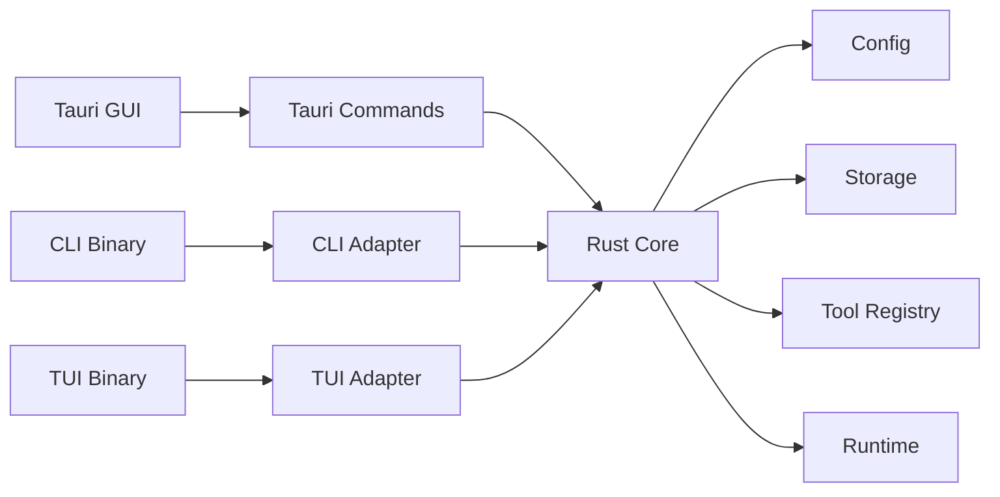

# Agent App Architecture

## Purpose

`agent-app` is a Rust-core application with multiple entrypoints. The business behavior is implemented once in the Rust core and exposed through Tauri GUI, CLI, and TUI adapters.

## Layers

## Ownership

- `core` owns conversations, messages, skills, configuration, storage, runtime status, and domain errors.
- `tauri` owns window lifecycle, command serialization, and frontend state projection.
- `cli` owns argument parsing, terminal output, and shell-friendly exit behavior.
- `tui` owns terminal rendering, key handling, and status refresh.

Entry layers must not implement independent business branches. If a new user-facing behavior is needed, update the spec first, extend `core`, then expose it through the relevant entrypoints.

## Initial Scope

The first implementation provides a local deterministic agent runtime:

- Send a message and persist it in a conversation.
- Return a deterministic assistant response.
- List built-in skills.
- List, inspect, and clear conversations.
- Report runtime status.

LLM provider integration is intentionally outside the first Rust core milestone. The core API is shaped so a provider-backed runtime can replace the deterministic runtime later without changing entrypoint ownership.
