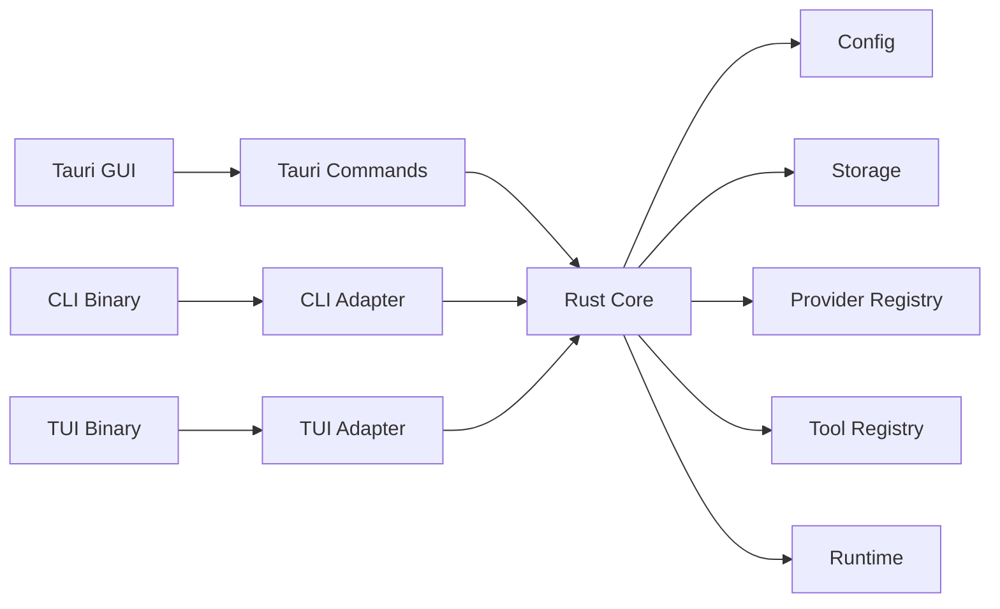

# Agent App Architecture

## Purpose

`agent-app` is a Rust-core application with multiple entrypoints. The business behavior is implemented once in the Rust core and exposed through Tauri GUI, CLI, and TUI adapters.

## Layers

## Ownership

- `core` owns conversations, messages, skills, configuration, storage, runtime status, and domain errors.
- `tauri` owns window lifecycle, command serialization, and frontend state projection.
- `cli` owns argument parsing, terminal output, and shell-friendly exit behavior.
- `tui` owns terminal rendering, key handling, and status refresh.

Entry layers must not implement independent business branches. If a new user-facing behavior is needed, update the spec first, extend `core`, then expose it through the relevant entrypoints.

## Initial Scope

The first implementation provides a local deterministic agent runtime:

- Send a message and persist it in a conversation.
- Return a deterministic assistant response.
- List built-in skills.
- List, inspect, and clear conversations.
- Report runtime status.

LLM provider integration is intentionally outside the first Rust core milestone. The core API is shaped so a provider-backed runtime can replace the deterministic runtime later without changing entrypoint ownership.

## Neuron Bootstrap

Startup neuron readiness (`create_neuron` + `assistant_select_neuron`) is documented in [neuron-init.md](./neuron-init.md), including mermaid flowcharts for sync assembly, async bootstrap, candidate fill, and lazy `ensure_system_neuron`. API contract: `docs/specs/2026-08-01_02-40_neuron-manager-api.md`.

## Concurrency & Locking

GUI 卡死 / 系统「无响应」的根因与目标契约见正式 spec：[`docs/specs/2026-08-01_12-07_gateway-lock-unfreeze.md`](../specs/2026-08-01_12-07_gateway-lock-unfreeze.md)。

硬规则（实现必须遵守）：

1. **Never hold Gateway / Meta / 域锁 across network I/O**（bootstrap、converse、`call_model`、ensure 补齐）。
2. **Clone-out then await**：短临界区 `Arc::clone` → drop → 再跑长任务。
3. **禁止** sync Tauri command 对可能被长任务占用的锁使用 `blocking_lock` 死等；读路径用 `async` + 短 `.lock().await` 或只碰已 clone 的域 State。
4. 跨域加锁顺序固定：`meta → topic → neuron`（→ `engine` 若需要）。

说明：前端 `Promise.all(invoke…)` **不阻塞** JS 渲染线程；系统「无响应」来自原生侧线程被堵。首屏 Loading / `ready` 门闩是产品状态机，与渲染线程无关。

实现态（2026-08-01）：Tauri 分域 `manage` — `Arc<NeuronManager>`、`Arc<Mutex<TopicStore>>`、`Arc<AssistantMode>`、`Arc<Mutex<Poller>>`、`SessionTracker`、`ProviderRegistry`、`ConversationStore`，以及可 `Clone` 的 `Gateway`（内层 `current_conversation_id: Arc<Mutex<String>>`，**无**外层 `Mutex<Gateway>`）。命令按域取 State；bootstrap spawn 只 clone `NeuronManager`，不持任何 Gateway 锁跨网络。

社区对照（详见 spec「Community Survey」）：优先 **放锁再 await（A）+ 分域 State（C）**；避免 **tokio Mutex 持锁跨网络（B）** 当默认；全量 **Actor（D）** 过重本期不做；**emit 进度（E）** 可选增强。

## Runtime Logging

Rolling files, GUI Logs panel, filters, and verbosity controls are documented in [logging.md](./logging.md).

## Model Calling

The first LLM integration adds a stateless model call path:

- `list_providers`: returns known OpenAI/OpenAI-compatible service providers.
- `list_models`: returns a static model registry, optionally filtered by provider.
- `call_model`: sends explicit provider, model, and messages to the configured provider.

`call_model` does not read or write local sessions. Session-based chat is a higher-level workflow that may translate persisted messages into model messages before calling this lower-level API.
