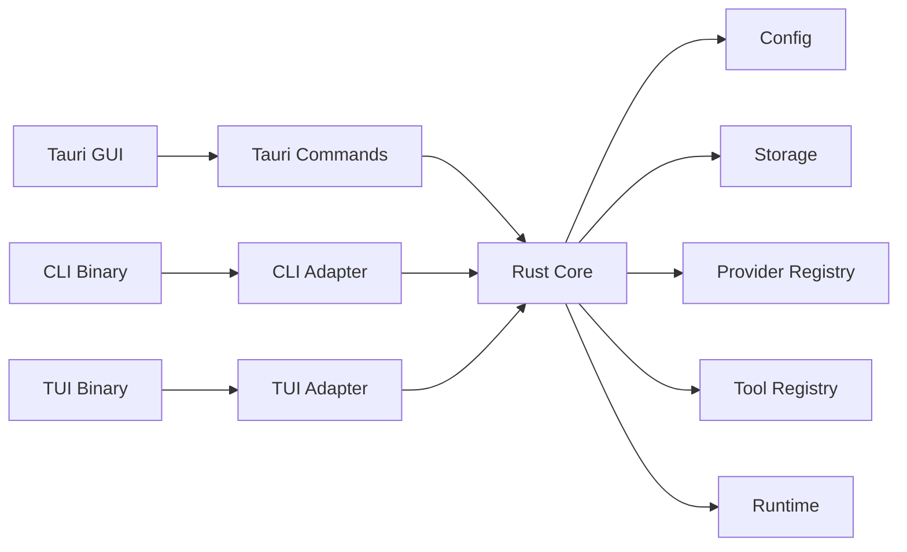

# Agent App Architecture

## Purpose

`agent-app` is a Rust-core application with multiple entrypoints. The business behavior is implemented once in the Rust core and exposed through Tauri GUI, CLI, and TUI adapters.

## Layers

## Ownership

- `core` owns conversations, messages, skills, configuration, storage, runtime status, and domain errors.
- `tauri` owns window lifecycle, command serialization, and frontend state projection.
- `cli` owns argument parsing, terminal output, and shell-friendly exit behavior.
- `tui` owns terminal rendering, key handling, and status refresh.

Entry layers must not implement independent business branches. If a new user-facing behavior is needed, update the spec first, extend `core`, then expose it through the relevant entrypoints.

## Initial Scope

The first implementation provides a local deterministic agent runtime:

- Send a message and persist it in a conversation.
- Return a deterministic assistant response.
- List built-in skills.
- List, inspect, and clear conversations.
- Report runtime status.

LLM provider integration is intentionally outside the first Rust core milestone. The core API is shaped so a provider-backed runtime can replace the deterministic runtime later without changing entrypoint ownership.

## Neuron Bootstrap

Startup neuron readiness (`create_neuron` + `assistant_select_neuron`) is documented in [neuron-init.md](./neuron-init.md), including mermaid flowcharts for sync assembly, async bootstrap, candidate fill, and lazy `ensure_system_neuron`.

## Runtime Logging

Rolling files, GUI Logs panel, filters, and verbosity controls are documented in [logging.md](./logging.md).

## Model Calling

The first LLM integration adds a stateless model call path:

- `list_providers`: returns known OpenAI/OpenAI-compatible service providers.
- `list_models`: returns a static model registry, optionally filtered by provider.
- `call_model`: sends explicit provider, model, and messages to the configured provider.

`call_model` does not read or write local sessions. Session-based chat is a higher-level workflow that may translate persisted messages into model messages before calling this lower-level API.
