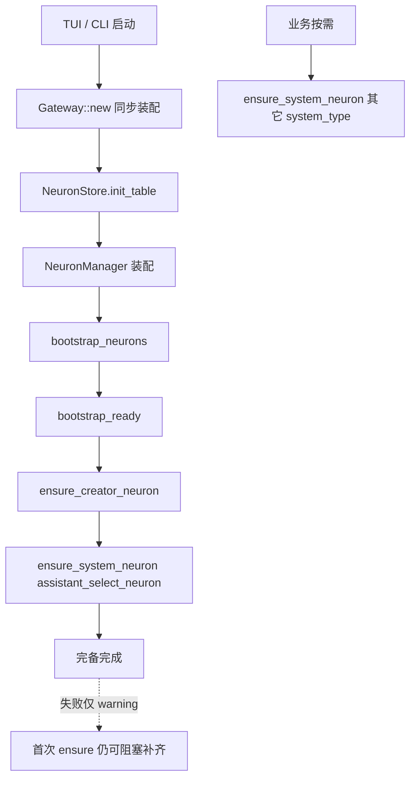
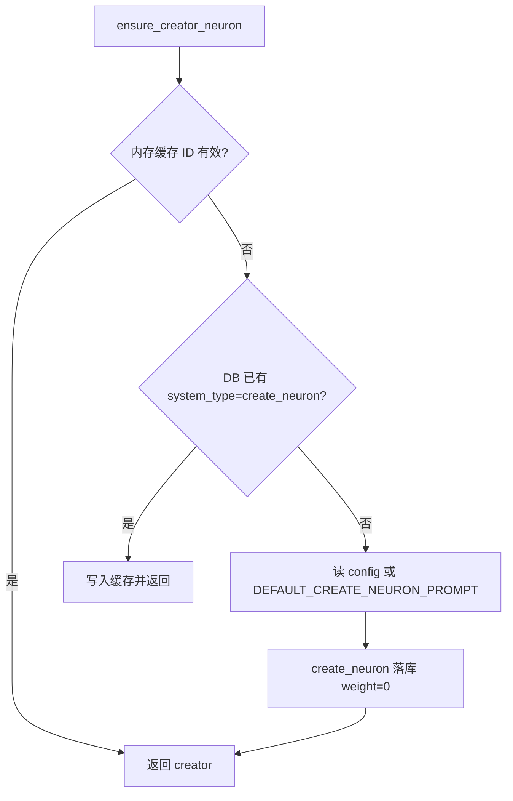
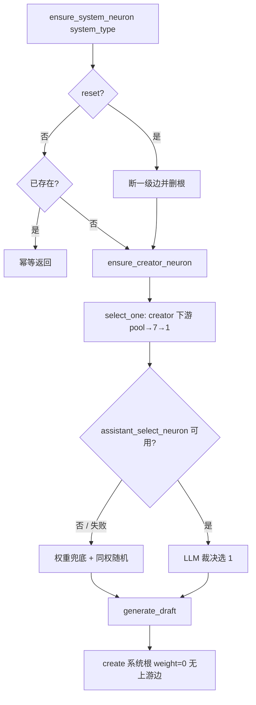
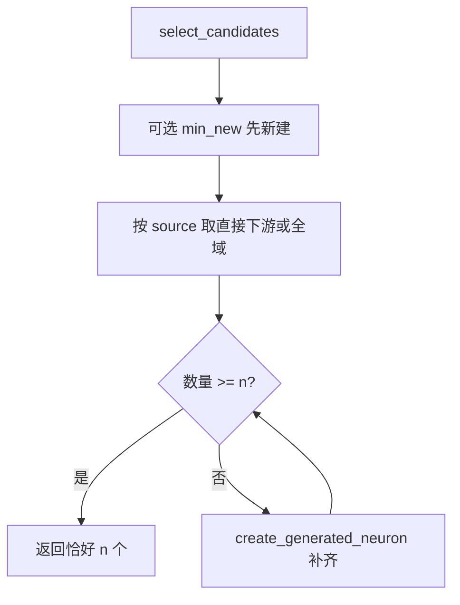

# 神经元初始化流程

本文描述 agent-app 启动时与首次按需补齐时的神经元初始化路径。实现真相源：`NeuronManager` / `Gateway`；相关迭代见 `docs/sdd-lab/2026-07-28_23-43_neuron-bootstrap/`、`2026-07-29_22-50_neuron-system-prompt-ready/`、`2026-08-01_00-31_neuron-create-weight-zero/`。

诊断时请打开 GUI 底部 **Logs**，或查看 `{storage}/logs/agent-app.log`；字段与过滤说明见 [logging.md](./logging.md)。

## 总览

初始化分两段：

1. **同步装配**（`Gateway::new`）：建库、装配 `NeuronManager`，不创建业务神经元。
2. **异步完备**（`Gateway::bootstrap_neurons` → `bootstrap_ready`）：保证 `create_neuron` 与 `assistant_select_neuron` 可用。

其它 `assistant_*` 系统提示词**不在启动时批量创建**，由业务调用 `ensure_system_neuron` 懒补齐。

## 1. 同步装配：`Gateway::new`

| 步骤 | 行为 |
| --- | --- |
| 打开 `app.db` | 共享 SQLite 连接 |
| `NeuronStore::init_table` | 建表 / 迁移（含 `system_type`、`tool_ids`） |
| 构造 `NeuronManager` | Store + `DefaultNeuronModelCaller` + `NeuronConfigReader` |
| 注册工具 / Assistant / Poller | 只挂服务，不写神经元业务数据 |

此时库中可能仍无任何神经元。

## 2. 异步完备：`bootstrap_ready`

入口：`agent-app-tui` / `agent-app-cli` 在 `Gateway::default()` 之后 `await bootstrap_neurons()`。失败打 warning，不阻断启动。

顺序固定：

1. `ensure_creator_neuron()` → `system_type = create_neuron`
2. `ensure_system_neuron("assistant_select_neuron", false)`

也可手动：`/neuron bootstrap`。

### 2.1 `ensure_creator_neuron`（不调模型）

- 种子文案：`.agent-app/config.json` → `neurons.bootstrap.create_neuron_prompt`；缺失用代码默认。
- 创建时节点权重强制为 `0`（无上游边）。

### 2.2 `ensure_system_neuron`（可能调模型）

用于 `assistant_select_neuron` 及后续其它系统根。

要点：

- 候选池：`select_candidates(n=7, source_id=creator.id, min_new=0)`。
- 下游不足时逐个 `create_generated_neuron`（调模型，挂到 creator 下，节点/边权重均为 `0`）。
- 冷启动第一次 ensure selector 时，往往先补齐一批子节点，再生成系统根。
- 尚无裁决提示词时，选一走权重兜底（新节点权重皆为 0 时等价同权随机）。

## 3. 候选补齐：`select_candidates`

- 有 `source_id`：只取直接下游，不递归。
- 无来源：全域候选（含系统节点）。
- 排序：`weight DESC, RANDOM()`；创建权重恒为 0，差异来自后续评价 delta。

## 4. 启动后懒加载

| 时机 | 行为 |
| --- | --- |
| 启动 bootstrap | 只保证 `create_neuron` + `assistant_select_neuron` |
| Assistant / Hook 需要其它系统提示词 | `ensure_system_neuron(system_type)` |
| 运维 | `/neuron ensure <type>`、`/neuron reset-system <type>` |

## 5. 权重规则（创建）

与初始化强相关：

- 新建节点权重 = `0`
- 新建边权重 = `0`
- 忽略模型 JSON / 创建参数中的权重
- 之后仅通过 `adjust_weight` / `adjust_connection_weight`（评价、Hook、人工）增减

详见 `docs/sdd-lab/2026-08-01_00-31_neuron-create-weight-zero/`。

## 6. 关键常量

| 常量 | 含义 |
| --- | --- |
| `create_neuron` | 创建器系统根；种子不调模型 |
| `assistant_select_neuron` | 7 选 1 裁决提示词根；bootstrap 必保 |
| `DEFAULT_SELECT_N = 7` | 候选池默认大小 |
