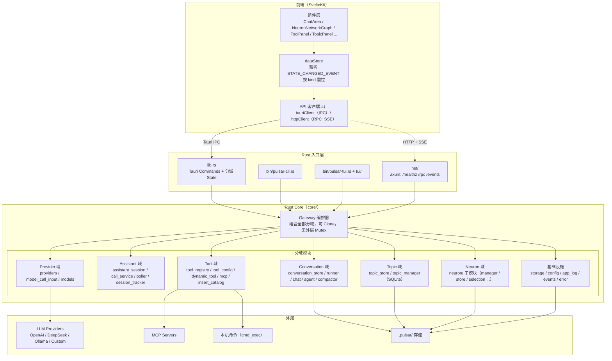
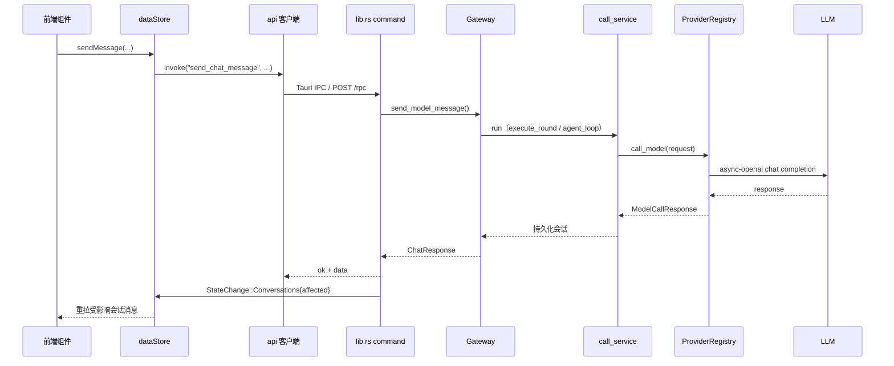

# Pulsar 架构（pulsar-app）

## 概览

`pulsar-app` 是一个 **Rust 核心 + 多入口** 应用：业务逻辑在 Rust core 中实现一次，通过
Tauri GUI（默认）、CLI、TUI 三种入口暴露；另可选启动内嵌 HTTP 服务（远程模式），让浏览器前端
通过 RPC + SSE 复用同一套 core。

技术栈：

- **Rust core**：Tauri v2、tokio、axum、rusqlite（SQLite）、async-openai（LLM 调用）、rust-embed（inserts）
- **前端**：SvelteKit + TypeScript + Vite（仅 GUI 入口使用）

## 总体分层



## 入口层

| 入口 | 位置 | 说明 |
|------|------|------|
| Tauri GUI | `src-tauri/src/lib.rs` | 默认入口；命令适配 + 分域 State 管理 + 启动装配/引导 |
| CLI | `src-tauri/src/bin/pulsar-cli.rs` | 参数解析、终端输出、shell 友好退出码 |
| TUI | `src-tauri/src/bin/pulsar-tui.rs` + `src-tauri/src/tui/` | 交互式终端会话，斜杠命令映射共享命令模型 |
| 远程模式 | `src-tauri/src/net/` | 内嵌 axum server，RPC 暴露命令集，SSE 推送状态变更 |

入口层只做适配，不实现独立业务分支。新功能先改 spec、扩展 core，再在各入口暴露。

## Rust Core 分域

`src-tauri/src/core/` 按业务能力分域，模块与职责：

### Gateway（编排器）

- 文件：`core/gateway.rs`
- 组合全部领域组件（store / providers / tool_registry / neuron_manager / chat / agent / assistant / poller / session_tracker），对外提供统一入口（`send_model_message` / `start_session` / `list_*` / `save_*` 等）。
- **可 Clone**：内层 `current_conversation_id: Arc<Mutex<String>>`，无外层 `Mutex<Gateway>`，可安全跨 Tauri State / 后台 task 共享，不持锁跨网络。

### Conversation 域

| 模块 | 职责 |
|------|------|
| `conversation_store.rs` | 会话/消息的 JSON 持久化（`sessions/<id>.json`） |
| `conversation_runner.rs` | 单轮会话执行引擎（`execute_round` / `agent_loop`），不持有 store |
| `chat_session.rs` | Chat 模式业务接入 |
| `agent_session.rs` | Agent 模式（tool loop）业务接入 |
| `compactor.rs` | 手动压缩（`/compact`），自动压缩随 Engine 退役 |

### Assistant 域

| 模块 | 职责 |
|------|------|
| `assistant_session.rs` | 助手模式：神经元选型（select_one）、评分（score_feedback）、topic 匹配（match_topic）、scope 完成（complete_scope）等 hook 调度 |
| `call_service.rs` | `NeuronCallService`：无状态单轮对话引擎，注入 ModelCaller + NeuronManager + ToolRegistry；`SessionSeed` / `SessionState` |
| `poller.rs` + `poller_step.rs` | 后台轮询推进（`PollAll` / step），并行度共享原子值 |
| `session_tracker.rs` | 运行中会话集合跟踪 + 注册工具（`RunningSession`） |

### Neuron 域

- 目录：`core/neuron/`（子模块：`manager` / `store` / `model` / `config` / `creation` / `evolution` / `selection` / `query` / `spec` / `tools`），通过 `mod.rs` 提供兼容别名 `neuron_manager` / `neuron_store` / `neuron_config` / `neuron_model` / `spec_manager`，保持外部引用不变。
- 能力：系统神经元 ensure/bootstrap、创建/进化、连接与权重调整、邻域选择（候选池）、分页管理查询、容量回收。

### Topic 域

- `topic_store.rs` / `topic_manager.rs`：课题 CRUD、scope item 管理、状态机（todo / in_progress / paused / done / cancelled），存储于 SQLite `app.db`。

### Provider 域

| 模块 | 职责 |
|------|------|
| `providers.rs` | `ProviderRegistry`：内置 + 配置服务商统一管理，模型注册表，`call_model` 调用（async-openai），API key 掩码回显，保存即热重载 |
| `models.rs` | 领域模型（Message / Conversation / Neuron / ProviderInfo / ToolInfo / StateChange 等） |
| `model_call_input.rs` | system / user prompt 拼装模板 |

### Tool 域

| 模块 | 职责 |
|------|------|
| `tool_registry.rs` | 共享工具注册表（`Arc<RwLock<ToolRegistry>>`）：native / config / MCP 统一登记；register 要求 `inserts/<tool.name>.md` |
| `tool_config.rs` | 动态工具配置（`dynamic_tools.json`）、MCP 配置（`mcp_servers.json`）、校验与原子写回 |
| `dynamic_tool.rs` | `CommandTool`（本机命令）、`HttpTool`（HTTP 请求） |
| `cmd_exec.rs` / `current_time.rs` | 内置工具 `execute_command` / `get_current_time` |
| `mcp.rs` | MCP server 客户端与状态（Connecting / Connected / Failed），后台渐进装配 |
| `insert_catalog.rs` | 自描述契约目录：`inserts/<id>.md`（rust-embed 内嵌），供模型读取决策契约 |

装配策略：native + config 工具同步就绪；MCP 后台异步装配（不阻塞启动），完成后广播 `StateChange::Tools`。

### 基础设施

| 模块 | 职责 |
|------|------|
| `storage.rs` | 数据目录解析（`.pulsar`，自动从旧 `.agent-app` 迁移） |
| `config.rs` | `config.json` 读写（ConfigStore） |
| `app_log.rs` + `log_redact.rs` | 滚动日志文件、GUI Logs 面板、级别控制、敏感信息脱敏 |
| `events.rs` | `StateChange` / `StateEmitter` 统一状态事件通道 |
| `error.rs` | `AppError` 域错误统一编码 |

## Tauri 适配层（lib.rs）

- **分域 State**（`app.manage`）：`Arc<NeuronManager>`、`Arc<Mutex<TopicStore>>`、`Arc<AssistantSession>`、`Arc<Mutex<Poller>>`、`SessionTracker`、`ProviderRegistry`、`ConversationStore`、`Gateway`、`StateEmitter`。命令按域取 State，无外层 Mutex 跨网络。
- **54 个 commands**，按域分组：Debug(1) / Chat(4) / Info(15) / Topic(10) / Poller(5) / Neuron(9) / Sessions(5) / Logs(5)。
- **状态事件**：写操作完成后 `StateEmitter` 广播 `StateChange` → 前端 `app://state-changed`；`kind` 区分数据域（Topics / Conversations{affected} / Poller{status} / Sessions / Neurons / Tools / Providers），避免事件爆炸。
- **启动装配**：
  1. 初始化日志、加载 config；
  2. 构造 Gateway（本地工具同步装配 + MCP 后台渐进装配 + poller runtime + neuron 容量回收 runtime）；
  3. `neuron_manager.bootstrap()` spawn（不持任何锁跨模型调用）；
  4. 条件启动远程模式 server（config `server` 节 enabled 时）；
  5. 手动建主窗口，并给所有 web 资源加 `Cache-Control: no-store`（规避 WebKitGTK 跨重启缓存旧资源）。

## 网络层（远程模式）

```mermaid
flowchart LR
  remote["浏览器前端<br/>httpClient（RPC + SSE）"]
  net["net/ axum server"]
  gateway["Gateway"]
  events["broadcast channel"]

  remote -->|POST /rpc {cmd, params}| net
  remote -->|GET /events?token=| net
  net -->|auth 中间件<br/>Bearer / query token| net
  net --> gateway
  gateway -->|写操作完成| events
  events -->|SSE StateChange| remote
```

- `net/mod.rs`：`ServerConfig` / `NetState`（可 Clone 的 Gateway + StateEmitter + SSE 广播通道 + token 白名单），构建 `/healthz`、`/rpc`、`/events` 路由并启动。
- `net/auth.rs`：token 鉴权中间件；SSE 因 EventSource 限制走 query token。
- `net/rpc.rs`：`POST /rpc` 统一端点，`params` 字段与前端 Tauri `invoke` 一致（零迁移），每个分支与 `lib.rs` 对应 command 同语义（锁纪律一致）。
- `net/sse.rs`：把 `StateChange` 广播转发为 SSE 事件流。
- 本机 Tauri IPC 路径不受影响，两套前端共用同一 `ApiClient` 接口。

## 前端（SvelteKit + TypeScript）

```
src/
  routes/+page.svelte        # 单页入口（+layout.ts 加载配置）
  lib/
    api/                     # 连接抽象
      index.ts               # 客户端工厂：local（Tauri IPC）/ remote（HTTP+SSE），运行时 switchConn 切换
      tauriClient.ts         # 本机模式：invoke + listen
      httpClient.ts          # 远程模式：fetch RPC + EventSource SSE
      env.ts / types.ts      # 环境检测 / ApiClient 契约
    stores/dataStore.svelte.ts   # 全局数据 store，监听 state-changed 按 kind 重拉
    layout/                  # 布局系统（views / LayoutStore / useResizable）
    components/              # 业务组件：ChatArea、ChatInput、ChatMessage、ToolCallBlock、
                              # ToolPanel、ToolEditor、TopicPanel、PollerPanel、NeuronNetworkGraph、
                              # NeuronManager、NeuronDetailDrawer、ProvidersModelsPanel、LogPanel、
                              # SessionList、StatusBar 等
    features/neuron/         # 网络图布局（networkLayout）、系统类型配色
    i18n/                    # zh / en 国际化
    hotkey/                  # 全局快捷键服务
```

前端不直接调用 `invoke`：所有数据访问经 `api` 客户端（`ApiClient` 接口），
`tauriClient` 与 `httpClient` 实现同一契约，`switchConn` 后重新 `dataStore.bootstrap()` 即可切换连接模式。

## 存储布局

数据根目录 `storage::resolve` → `.pulsar/`（旧 `.agent-app` 首次启动自动整体迁移）。

```text
.pulsar/
  config.json          # providers / models / poller / neurons.bootstrap / server（远程模式）
  sessions/<id>.json   # 会话与消息（ConversationStore，JSON）
  app.db               # SQLite：TopicStore + NeuronStore
  dynamic_tools.json   # 动态工具配置（tool_config）
  mcp_servers.json     # MCP server 配置
```

- 环境变量（`OPENAI_API_KEY` 等）优先于 `config.json` 文件值；API key 不入库不提交。
- 详见 [storage.md](./storage.md)。

## 关键数据流

### 用户发送消息（GUI）



### 后台推进（Poller）

`Poller` tick → `AssistantSession.poll_all` → `NeuronCallService` 逐候选执行 → 状态变更经
`StateChange` 广播 → 前端重拉。并行度由前端调整并经共享原子值运行时生效、持久化到 config。

## 并发与锁纪律

GUI 卡死 / 系统「无响应」的根因与目标契约见正式 spec：[`docs/specs/2026-08-01_12-07_gateway-lock-unfreeze.md`](../specs/2026-08-01_12-07_gateway-lock-unfreeze.md)。

硬规则（实现必须遵守）：

1. **Never hold Gateway / Meta / 域锁 across network I/O**（bootstrap、converse、`call_model`、ensure 补齐）。
2. **Clone-out then await**：短临界区 `Arc::clone` → drop → 再跑长任务。
3. **禁止** sync Tauri command 对可能被长任务占用的锁使用 `blocking_lock` 死等；读路径用 `async` + 短 `.lock().await` 或只碰已 clone 的域 State。
4. 跨域加锁顺序固定：`meta → topic → neuron`（→ `engine` 若需要）。

实现态：Tauri 分域 `manage`（见上）；`Gateway` 内层 `current_conversation_id` 为 `Arc<Mutex<String>>`，
无外层 `Mutex<Gateway>`；bootstrap spawn 只 clone `NeuronManager`，不持任何 Gateway 锁跨网络。

## 相关文档索引

| 文档 | 内容 |
|------|------|
| [neuron-init.md](./neuron-init.md) | 神经元启动就绪流程与 mermaid 图 |
| [storage.md](./storage.md) | 存储布局、配置字段、环境变量 |
| [logging.md](./logging.md) | 滚动日志、Logs 面板、过滤器与级别 |
| [assistant-prompt-synthesis.md](./assistant-prompt-synthesis.md) | 助手模式各模型调度点的 prompt 拼装 |
| [model-call-sites.md](./model-call-sites.md) | 模型调用点对照 |
| [commands.md](./commands.md) | 命令模型 |
| [errors.md](./errors.md) | 错误编码 |
| [roadmap.md](./roadmap.md) | 里程碑规划 |
