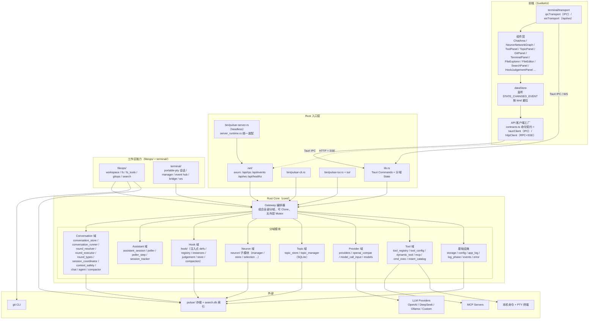
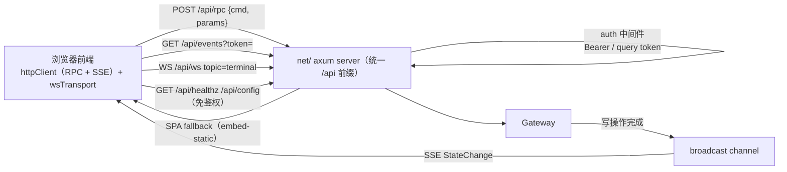
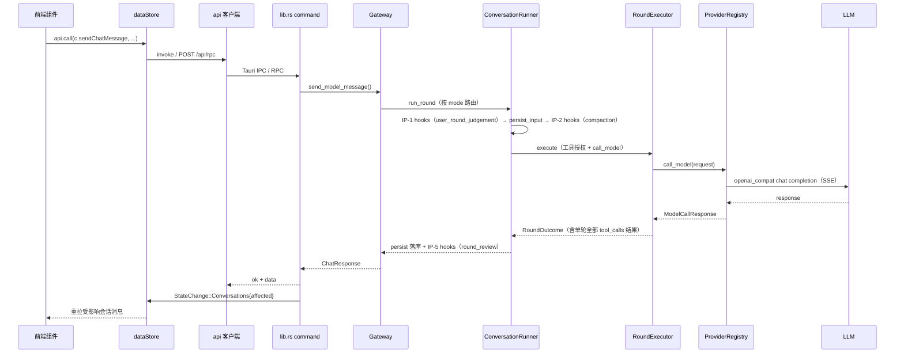
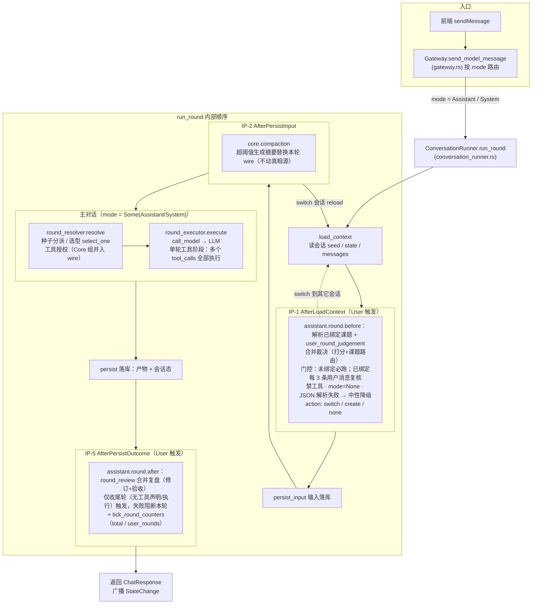
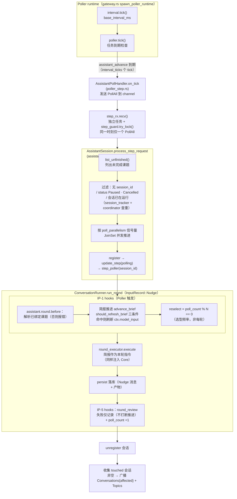

# Pulsar 架构（pulsar-app）

> 最近核对：2026-09-01，与 `packages/pulsar-app` 当前代码同步。

## 概览

`pulsar-app` 是一个 **Rust 核心 + 多入口** 应用：业务逻辑在 Rust core 中实现一次，通过
Tauri GUI（默认）、CLI、TUI 三种入口暴露；另可脱离 GUI 以 headless 方式启动内嵌 HTTP 服务
（`pulsar-server`，远程模式），让浏览器前端通过 RPC + SSE + WebSocket 复用同一套 core，
并在启用 `embed-static` 时单端口托管完整前端。

技术栈：

- **Rust core**：Tauri v2、tokio、axum 0.8（RPC/SSE/WS）、rusqlite（SQLite + FTS5）、
  rust-embed（inserts + 前端静态资源）、portable-pty（终端）、tree-sitter（代码分块）、
  mlua（脚本运行时，已声明未接入）
- **LLM 调用**：自实现 OpenAI Chat Completions 兼容层（`openai_compat`：serde + reqwest + SSE
  流式解析），不依赖 async-openai
- **前端**：SvelteKit + TypeScript + Vite（GUI 与浏览器前端共用）

## 总体分层



## 入口层

| 入口 | 位置 | 说明 |
|------|------|------|
| Tauri GUI | `src-tauri/src/lib.rs` | 默认入口；命令适配 + 分域 State 管理 + 启动装配/引导 |
| headless server | `src-tauri/src/bin/pulsar-server.rs` | 无 GUI/WebView，直接启动 net 服务；与 GUI 共用 `server_runtime.rs` 装配与 config `server` 节（覆盖链 CLI > env > config > 默认） |
| CLI | `src-tauri/src/bin/pulsar-cli.rs` | 参数解析、终端输出、shell 友好退出码 |
| TUI | `src-tauri/src/bin/pulsar-tui.rs` + `src-tauri/src/tui/` | 交互式终端会话，斜杠命令映射共享命令模型 |
| 远程模式 | `src-tauri/src/net/` | 内嵌 axum server：RPC + SSE + WS + 静态资源托管；GUI 与 headless 共用 |

- `server_runtime.rs::build_server_runtime` 是核心初始化唯一入口（GUI 与 headless 共用）：
  ConversationStore → TerminalManager + AgentTerminalBridge → `Gateway` → 提取分域句柄。
- 生产部署：`scripts/server-prod.sh` / `server-prod.cmd` 以 `--bin pulsar-server
  --features embed-static` 单命令启动（`PULSAR_HOST=0.0.0.0 PULSAR_PORT=9999`）。
- 入口层只做适配，不实现独立业务分支。新功能先改 spec、扩展 core，再在各入口暴露。

## Rust Core 分域

`src-tauri/src/core/` 按业务能力分域，模块与职责：

### Gateway（编排器）

- 文件：`core/gateway.rs`
- 组合全部领域组件，对外提供统一入口（`send_model_message` / `send_model_message_stream` /
  `compact_conversation` / `list_*` / `save_*` 等）。
- 主要字段：`store`（ConversationStore）、`providers`、`tool_registry`、`topic_store`、
  `neuron_store`、`hook_judgement_store`、`neuron_manager`、`chat`、`agent`、`assistant`、
  `poller`、`session_tracker`、`coordinator`（会话级串行）、`workspace_store`、`file_system`、
  `git_service`、`terminal`（`Option<Arc<AgentTerminalBridge>>`）、`mcp_server_statuses`、
  `assemble_lock`（MCP/工具装配串行化）、`state_emit`。
- **可 Clone**：内层 `current_conversation_id: Arc<Mutex<String>>`，无外层 `Mutex<Gateway>`，
  可安全跨 Tauri State / 后台 task 共享，不持锁跨网络。
- 后台 runtime：① poller runtime（`spawn_poller_runtime`）；② neuron 容量回收 runtime
  （`spawn_neuron_recycle_runtime`）；③ 启动期 MCP/工具后台装配（经 `assemble_lock` 串行化，
  完成后广播 `StateChange::Tools`）。

### Conversation 域（轮次管线）

| 模块 | 职责 |
|------|------|
| `conversation_store.rs` | 会话/消息 JSON 持久化（`sessions/<id>.json`，写端全量写；读端已分页：`list_conversation_summaries` 轻量摘要分页、`history_page` 消息倒序切片） |
| `conversation_runner.rs` | 统一轮次编排：`run_round`（load_context → IP-1 hooks → persist_input → IP-2 hooks → call_model → 落库 → IP-5 hooks），另含 `InputRecord`（User/Nudge/Continue）、流式 `run_round_stream` |
| `round_types.rs` | 纯数据契约：`SessionSeed` / `SessionState` / `RoundOutcome` / `ToolResultItem` |
| `round_resolver.rs` | 选型决策 + 角色上下文拼接（种子分派 / select_one，可含 LLM 选型，不落库） |
| `round_executor.rs` | 执行面：`ModelCaller` trait、工具授权、模型调用、单轮全部 tool_calls 执行 → `RoundOutcome`；支持 `response_format` 与 thinking 覆盖 |
| `session_coordinator.rs` | 会话级串行协调（同一会话同一时刻仅一轮）：User 轮可抢占取消当前轮，非 User 轮遇忙跳过；RAII guard 自动释放 |
| `context_safety.rs` | 上下文安全：工具结果统一截断（`cap_tool_result`）+ poller 熔断退避状态机（`ContextSafetyConfig`） |
| `log_phase.rs` | 全项目 tracing `phase=` 常量唯一注册表（供日志面板下拉） |
| `chat_session.rs` | Chat 模式业务接入（无 hooks 单轮直调） |
| `agent_session.rs` | Agent 模式（tool loop）业务接入：授权注册表全部工具，循环至收敛，上限 20 轮 |
| `compactor.rs` | `Compactor`（token 估算 + LLM 摘要）：手动压缩入口 + 被复用为 IP-2 自动压缩 hook（超阈值仅压缩本轮 wire，不动真相源） |

### Assistant 域

| 模块 | 职责 |
|------|------|
| `assistant_session.rs` | 助手模式业务编排：模式门控 / 课题解析 / 简报推进 / 计数；通过 `install_hooks` 向 Hook 域注册 `assistant.round.before`（IP-1）与 `assistant.round.after`（IP-5）两个业务 hook |
| `poller.rs` + `poller_step.rs` | 后台轮询推进（`PollAll` / step），并行度共享原子值 |
| `session_tracker.rs` | 运行中会话集合跟踪 + 注册跟踪工具（`RunningSession`） |

> 历史说明：早期 `NeuronCallService`（`call_service.rs`）已退役，模型调用统一收敛到
> `ConversationRunner` + `RoundExecutor`。

### Hook 域（`core/hook/`）

| 模块 | 职责 |
|------|------|
| `defs.rs` | 注入点即类型：`InjectPointId`（IP-1 AfterLoadContext / IP-2 AfterPersistInput / IP-3、IP-4 预留 / IP-5 AfterPersistOutcome）、`HookHandler`、`HookDef`、`HookRegistry`（IP-1 fail 策略、其余 ignore 策略；IP-1 支持会话切换 reload） |
| `registry.rs` | `HookInstance` + Before/After 执行签名；**ACTIVE_HOOKS（2 个）**：`user_round_judgement`（IP-1）、`round_review`（IP-5）；LEGACY_HOOKS（4 个休眠）：`score_feedback` / `match_topic` / `revise_topic` / `complete_scope` |
| `instances/` | 一个 hook 一个文件（常量 + JSON schema + fallback + 执行逻辑） |
| `judgement.rs` | 裁决共享类型（`JudgementStatus` / `JudgementOutcome` / `JudgementAnchor`）+ `hook_defs_meta()` |
| `store.rs` | `HookJudgementStore`：裁决调用全量账本，存 SQLite `app.db` 的 `hook_judgements` 表（两阶段写入 pending→终态，只读不删改） |
| `compaction.rs` | 把 `Compactor` 封装为 IP-2 hook（id `core.compaction`），gateway 装配期注册 |

### Neuron 域

> 独立域文档：[neuron/](./neuron/index.md)（概念边界 / 服务契约 / 生命周期 / 数据契约 / 愿景差距）。

- 目录：`core/neuron/`（子模块：`manager` / `store` / `model` / `config` / `creation` /
  `evolution` / `selection` / `query` / `spec` / `tools`），通过 `mod.rs` 提供兼容别名
  `neuron_manager` / `neuron_store` / `neuron_config` / `neuron_model` / `spec_manager`。
- 能力：系统神经元 ensure/bootstrap、创建/进化、连接与权重调整、邻域选择（候选池）、
  分页管理查询、容量回收；`neuron_versions` 表保留内容版本历史。
- 对外服务：**提示词服务**（`select_role` 选型，返回角色）与**评价服务**
  （`apply_score_feedback` 打分落网，外部只供分、域内决定如何落网）。

### Topic 域

- `topic_store.rs` / `topic_manager.rs`：课题 CRUD、scope item 管理、状态机
  （todo / in_progress / paused / done / cancelled），存储于 SQLite `app.db` 的 `topics` 表。

### Provider 域

| 模块 | 职责 |
|------|------|
| `providers.rs` | `ProviderRegistry`：内置 + 配置服务商统一管理，模型注册表，`call_model` 调用，API key 掩码回显，保存即热重载；thinking / response_format 参数透传 |
| `openai_compat.rs` | OpenAI Chat Completions 协议封装（serde + reqwest + SSE 流式解析），只做协议层不含服务商策略；`ResponseFormatSpec::JsonSchema` 结构化输出支持 |
| `models.rs` | 领域模型（Message / Conversation / Neuron / ProviderInfo / ToolInfo / StateChange / ThinkingConfig 等） |
| `model_call_input.rs` | system / user prompt 拼装模板 |

### Tool 域

| 模块 | 职责 |
|------|------|
| `tool_registry.rs` | 共享工具注册表（`Arc<RwLock<ToolRegistry>>`）：`register_core`（Core 组，随主对话 wire 常驻）与 `register`（按组授权）两级登记；register 要求 `inserts/<tool.name>.md` |
| `tool_config.rs` | 动态工具配置（`dynamic_tools.json`）、MCP 配置（`mcp_servers.json`）、校验与原子写回 |
| `dynamic_tool.rs` | `CommandTool`（本机命令）、`HttpTool`（HTTP 请求） |
| `cmd_exec.rs` / `current_time.rs` | 内置工具 `execute_command`（经 AgentTerminalBridge 走 PTY，输出与终端面板同源）/ `get_current_time` |
| `mcp.rs` | MCP server 客户端与状态（Connecting / Connected / Failed），后台渐进装配 |
| `insert_catalog.rs` | 自描述契约目录：`inserts/<id>.md`（rust-embed 内嵌），供模型读取决策契约 |

Core 组常驻工具：`execute_command` / `get_current_time` + 文件工具 11 个（LS / Read / Write /
SearchReplace / Delete / Glob / Grep / SemanticSearch / FileInfo / CreateDirectory / Rename）+
git 只读 6 个（status / diff / log / branch / blame / stash_list）。

### FileOps 域（`src-tauri/src/fileops/`）

| 模块 | 职责 |
|------|------|
| `workspace.rs` | 工作区列表（`workspaces.json`）+ `resolve_in_workspace` 越界护栏 + 每工作区 ignore 规则 |
| `fs.rs` | 文件操作层（list / read / write / create_dir / delete / rename / move / glob / grep / info），统一上限护栏与已读清单（写前必读） |
| `fs_tools.rs` | AI 原生文件工具：`register_file_tools` 注册 11 个 Core 组工具，与前端 UI 共用同一护栏 |
| `gitops/` | `GitBackend` trait + `CliGitBackend`（spawn git CLI：参数数组不经 shell、`-C` 锁定根、超时/并发/截断限制）；`service.rs` 组合 backend + 确认服务 + active repo；`tools.rs` 注册 15 个 git 工具（只读 6 个 Core 组 + 写 9 个需确认组：add / restore / commit / reset / checkout / stash / push / pull / resolve_conflict，restore/commit/push/pull 走确认、reset/checkout 另受 `git.dangerous_writes` 开关约束）；`confirm.rs` 写操作确认（pending 队列 + `git_confirm` 60s 超时） |
| `search/` | 语义搜索（本地实现，不调 LLM）：`indexer.rs` tree-sitter 语法感知分块；`retriever.rs` SQLite FTS5 + bm25 块级检索（mtime/size 增量，英文前缀 + 中文 2-gram），索引存 `<data>/search/<sha256(root)[..16]>/search.db`；`tools.rs` 暴露 `semantic_search` 工具 |

### Terminal 域（`src-tauri/src/terminal/`）

| 模块 | 职责 |
|------|------|
| `session.rs` | 基于 portable-pty 的单 PTY 会话（spawn / write / resize / kill），读线程 → tokio mpsc |
| `manager.rs` | session_id ↔ TerminalSession 注册表，command 层与 Agent 桥接层共用 |
| `events.rs` | `TerminalEventHub` 双路广播：桌面 AppHandle IPC 事件 + broadcast channel（供 WS 订阅）；headless 构造跳过桌面 IPC |
| `commands.rs` | 5 个 Tauri 命令：terminal_spawn / write / resize / kill / list |
| `bridge.rs` | `AgentTerminalBridge`：core `execute_command` 经此创建一次性 PTY 会话并广播输出，Agent 执行与手动终端共用同一事件流，前端零区分渲染 |
| `ws.rs` | `topic: "terminal"` 的 WS 业务 handler（client→server spawn/write/resize/kill/list，server→client spawned/output/exit/list/error，二进制 base64） |

### runtime（预留）

- `runtime/script_engine.rs`：mlua（vendored, lua54）Lua VM，`eval` 执行 Lua 并映射 JSON。
- **当前仅声明，未接入工具链与启动流程**（无对应 command / 调用点）。

### 基础设施

| 模块 | 职责 |
|------|------|
| `storage.rs` | 数据目录解析（`.pulsar`，自动从旧 `.agent-app` 迁移） |
| `config.rs` | `config.json` 读写（ConfigStore）：建模节 `poller` / `neuron` / `server` / `git`（dangerous_writes）/ `context`（tool_result_max_chars / poll 熔断参数）；`providers` / `defaults` 等未建模键经 `extra` 原样保留 |
| `app_log.rs` + `log_redact.rs` + `log_phase.rs` | 滚动日志文件、GUI Logs 面板、级别控制、敏感信息脱敏、`phase=` 阶段标识 |
| `events.rs` | `StateChange` / `StateEmitter` 统一状态事件通道 |
| `error.rs` | `AppError` 域错误统一编码 |

## Tauri 适配层（lib.rs）

- **分域 State**（`app.manage`，12 个）：`Arc<NeuronManager>`、`Arc<StdMutex<TopicStore>>`、
  `Arc<StdMutex<HookJudgementStore>>`、`Arc<AssistantSession>`、`Arc<StdMutex<Poller>>`、
  `SessionTracker`、`ProviderRegistry`、`ConversationStore`、`TerminalEventHub`、
  `Arc<TerminalManager>`、`Gateway`、`StateEmitter`。命令按域取 State；
  WorkspaceStore / FileSystem / GitService 不单独 manage，经 Gateway 内部访问。
- **108 个 commands**（lib.rs 103 + terminal/commands.rs 5），按域分组：
  Debug(1) / Server(1) / Chat(5) / Info(17) / Topic(10) / HookJudgements(2) / Poller(5) /
  Neuron(9) / Session Specs(6) / Workspace+Files(16) / 路径补全(2) / Git(23) / Logs(6) /
  Terminal(5)。
- **状态事件**：写操作完成后 `StateEmitter` 广播 `StateChange` → 前端 `app://state-changed`；
  `kind` 区分数据域（topics / conversations{affected} / message_delta（流式增量）/
  poller{status} / sessions / neurons / providers / tools / workspaces / git / git_confirm），
  避免事件爆炸。
- **启动装配**（`run()`）：
  1. 解析 storage_root；挂 opener / dialog 插件；
  2. 初始化日志（LogEntry 经桌面事件回传）、panic hook 落盘；
  3. 建窗前清理 WebKit 缓存目录；
  4. 解析 config `server` 节 + env 覆盖 → 远程模式配置；
  5. 构造 StateEmitter（桌面 emit + SSE broadcast）与 TerminalEventHub；
  6. `server_runtime::build_server_runtime` 统一构造 Gateway + 分域服务 + 终端设施；
  7. manage 12 个 State；远程模式条件启动 `net::run_server`；
  8. 异步 neuron bootstrap（不持任何锁跨模型调用）；
  9. 手动建主窗口（`create: false`），全部 web 资源 `Cache-Control: no-store`。

## 网络层（远程模式）



- `net/mod.rs`：`ServerConfig` / `NetState`（可 Clone 的 Gateway + StateEmitter + SSE 广播
  通道 + token 白名单 + Terminal 设施）；公开端点 `/api/healthz`、`/api/config`，鉴权 API
  `/api/rpc`（POST）、`/api/events`（SSE）、`/api/ws`（WebSocket）；`embed-static` feature 下
  SPA fallback 托管前端静态资源。
- `net/auth.rs`：token 白名单鉴权——白名单为空放行（默认 loopback）；非空要求
  `Authorization: Bearer` 或 `?token=` query（EventSource / WS 无法带 header），否则 401。
- `net/rpc.rs`：`POST /api/rpc` 统一端点，`params` 与前端 Tauri `invoke` 一致（零迁移），
  每个分支与 `lib.rs` 对应 command 同语义。
- `net/sse.rs`：把 `StateChange` 广播转发为 SSE（事件名同 Tauri `app://state-changed`）。
- `net/ws.rs`：通用 WS 服务，帧信封 `{topic, ...}` 按 topic 分发；v1 仅 `terminal`。
- `net/static_assets.rs`：rust-embed 内嵌 SvelteKit `build/`，SPA fallback + `no-store`。
- 本机 Tauri IPC 路径不受影响，两套前端共用同一 `ApiClient` 契约。

## 前端（SvelteKit + TypeScript）

```
src/
  routes/+page.svelte        # 单页入口（+layout.ts 加载配置）
  lib/
    api/                     # 连接抽象
      contracts.ts           # 后端命令契约唯一真源：def<P,R>(cmd) 编译期类型，api.call(c.xxx)
      index.ts               # 客户端工厂：local（Tauri IPC）/ remote（HTTP+SSE），switchConn 切换 + discoverRemote 同源发现
      tauriClient.ts         # 本机模式：invoke + listen
      httpClient.ts          # 远程模式：fetch RPC + EventSource SSE
      env.ts / types.ts      # 环境检测 / ApiClient 契约
    stores/
      dataStore.svelte.ts    # 全局数据 store：监听 state-changed 按 kind 重拉；bootstrap 拉取含 workspaces / git 聚合；会话与消息分页（50/30）
      fileEditorStore.svelte.ts  # 编辑器 tab 元数据（dirty 标记 / mtime 冲突检测），内容由组件持有
    terminal/transport.ts    # 终端传输抽象：ipcTransport（IPC）/ wsTransport（WS，自动重连）
    layout/                  # 布局系统：viewRegistry 容器视图（sessions / providers-models /
                             # neurons-list / topics / hook-judgements / poller / tools / logs /
                             # terminal / files / git / search）+ mainViews 主区视图
                             # （chat / neurons / tool-editor / provider-manager / file-editor /
                             # git-diff / commit-diff），EditorTabs + Splitter + WindowEdgeResize
    components/              # 业务组件：ChatArea、ChatMessage、ToolCallBlock、ThinkingBlock、
                             # NudgeBlock、ToolPanel、ToolEditor、TopicPanel、PollerPanel、
                             # NeuronNetworkGraph、NeuronManager、NeuronDetailDrawer、
                             # ProvidersModelsPanel、ProviderManager、LogPanel、SessionList、
                             # StatusBar、GitPanel、GitDiff、CommitDiff、GitConfirmHost、
                             # FileExplorer、FileEditor、SearchPanel、TerminalPanel、
                             # HookJudgementPanel、JudgementCard 等
    features/neuron/         # 网络图布局（networkLayout）、系统类型配色
    i18n/                    # zh / en 国际化
    hotkey/                  # 全局快捷键服务
```

前端不直接调用 `invoke`：所有数据访问经 `api.call(c.xxx, params)` 命令契约（`contracts.ts`），
`tauriClient` 与 `httpClient` 实现同一契约，`switchConn` 后重新 `dataStore.bootstrap()` 即可
切换连接模式。终端面板独立走 `terminal/transport`（桌面 IPC / 浏览器 WS 双路自动选择）。

## 存储布局

数据根目录 `storage::resolve` → `.pulsar/`（旧 `.agent-app` 首次启动自动整体迁移）。

```text
.pulsar/
  config.json          # 建模节：poller / neuron / server / git / context；
                       # providers、defaults 等未建模键经 extra 原样保留
  workspaces.json      # 工作区列表 + ignore 规则（fileops/workspace）
  sessions/<id>.json   # 会话与消息（ConversationStore，JSON；读端分页、写端全量）
  app.db               # SQLite：topics / neurons / connections / neuron_versions / hook_judgements
  dynamic_tools.json   # 动态工具配置（tool_config）
  mcp_servers.json     # MCP server 配置
  search/<hash>/search.db   # 语义搜索 FTS5 索引（按 workspace 隔离，不写用户项目目录）
```

- 环境变量（`OPENAI_API_KEY` 等）优先于 `config.json` 文件值；API key 不入库不提交。
- 详见 [storage.md](./storage.md)。

## 关键数据流

### 用户发送消息（GUI）



流式分支：`send_model_message_stream` 以 `message_delta` kind 增量广播，前端合并渲染。

### 后台推进（Poller）

`Poller` tick → `AssistantSession.poll_all` → `ConversationRunner::run_round`
（`InputRecord::Nudge`）逐候选执行 → 状态变更经 `StateChange` 广播 → 前端重拉。
并行度由前端调整并经共享原子值运行时生效、持久化到 config；`context_safety` 熔断退避
控制失败会话的推进节奏。

### 助手模式（Assistant）执行流程

助手模式的一轮统一为「读会话 → IP-1 before hooks → 输入落库 → IP-2 hooks → 主对话 →
落库 → IP-5 after hooks」，由 `ConversationRunner::run_round` 编排；
`AssistantSession` 以 `assistant.round.before`（IP-1）与 `assistant.round.after`（IP-5）
两个业务 hook 承载课题副作用（裁决 / 简报 / 验收 / 计数）。

#### 1. 用户输入时（User 轮）



要点：

- **hook 与主对话同源**：`user_round_judgement` / `round_review` 与主对话共用
  `ctx.model`（用户所选模型）与 `ctx.messages`（只读历史）。
- **裁决禁工具**：裁决调用构造 `mode: None` + 空 tool 集合，不注入任何标签工具；
  裁决调用使用 `response_format` JSON Schema（无约束能力则降级），主对话轮不注入。
- **主对话注入 Core**：`mode = Some(...)`，Core 组工具（内置 + 文件 11 个 + git 只读 6 个）
  并入 wire。
- **switch 会话**：`user_round_judgement` 若裁决切换到其它课题绑定的会话，runner 检测
  `session_id` 变化后 `reload` 重读上下文。
- **会话串行**：`session_coordinator` 保证同一会话同一时刻仅一轮；User 轮可抢占
  （取消当前轮并等待收敛），`cancel_active` 供停止按钮。

#### 2. 轮询时（Poller）



要点：

- **nudge 落库**：轮询推进以 `InputRecord::Nudge` 落 nudge 消息，简报作为本轮指令进入
  `model_input`。
- **不打断推进**：Poller 触发下 `round_review` 失败仅记录；空转（无未完成课题 / 全部跳过）
  不发状态事件，避免无效刷新。
- **串行化**：`step_guard.try_lock()` 保证同一时刻只有一个 PollAll；tick 循环不被模型调用
  拖住；`session_coordinator` 使非 User 轮遇忙跳过。

## 并发与锁纪律

GUI 卡死 / 系统「无响应」的根因与目标契约见正式 spec：
[`docs/specs/2026-08-01_12-07_gateway-lock-unfreeze.md`](../specs/2026-08-01_12-07_gateway-lock-unfreeze.md)。

硬规则（实现必须遵守）：

1. **Never hold Gateway / Meta / 域锁 across network I/O**（bootstrap、converse、
   `call_model`、ensure 补齐）。
2. **Clone-out then await**：短临界区 `Arc::clone` → drop → 再跑长任务。
3. **禁止** sync Tauri command 对可能被长任务占用的锁使用 `blocking_lock` 死等；读路径用
   `async` + 短 `.lock().await` 或只碰已 clone 的域 State。
4. 跨域加锁顺序固定：`meta → topic → neuron`。

实现态：Tauri 分域 `manage` 12 个 State（见上）；`Gateway` 无外层 Mutex，内层
`current_conversation_id` 为 `Arc<Mutex<String>>`；MCP/工具装配经 `assemble_lock` 串行化；
`session_coordinator` 保证会话级单轮（User 抢占）；bootstrap spawn 只 clone `NeuronManager`，
不持任何 Gateway 锁跨网络。

## 相关文档索引

| 文档 | 内容 |
|------|------|
| [neuron/](./neuron/index.md) | **Neuron 域独立文档**（概念边界 / 服务契约 / 生命周期 / 数据契约 / 愿景差距） |
| [neuron-init.md](./neuron-init.md) | 神经元启动就绪流程与 mermaid 图 |
| [storage.md](./storage.md) | 存储布局、配置字段、环境变量 |
| [logging.md](./logging.md) | 滚动日志、Logs 面板、过滤器与级别 |
| [assistant-prompt-synthesis.md](./assistant-prompt-synthesis.md) | 助手模式各模型调度点的 prompt 拼装 |
| [model-call-sites.md](./model-call-sites.md) | 模型调用点对照 |
| [session-message-architecture.md](./session-message-architecture.md) | 会话/消息三层视角与映射 |
| [msgs-lifecycle.md](./msgs-lifecycle.md) | Round Pipeline v2 消息生命周期（生产/落库/消费） |
| [commands.md](./commands.md) | 命令模型 |
| [errors.md](./errors.md) | 错误编码 |
| [roadmap.md](./roadmap.md) | 里程碑规划 |
