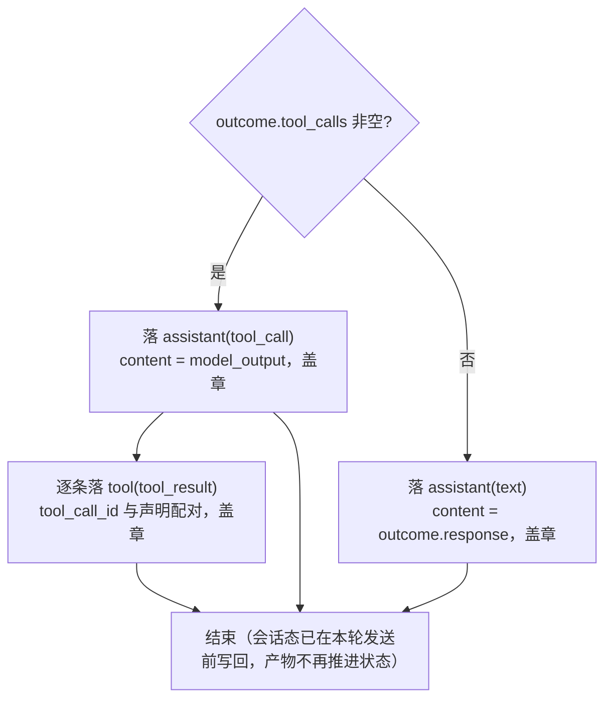

# 对话 msgs 生命周期：生产 · 落库 · 消费

> 本文是**现状的事实梳理**（Round Pipeline v2，`docs/specs/2026-08-16_18-00_round-resolver-message-truth.md`），不包含任何设计主张。每个环节都给出代码位置与可运行测试，可直接对照验证。代码为真相，文档与代码冲突时以代码为准。

## 0. 三个环节一句话

- **生产**：`resolve`（[round_resolver.rs](file:///home/lab/Documents/trae_projects/new-start-wt/packages/pulsar-app/src-tauri/src/core/round_resolver.rs#L46-L211)）把「历史 + 角色决策」拼进 `Vec<Message>`（真相源），runner 再按触发形态 append 输入消息（[append_input_message](file:///home/lab/Documents/trae_projects/new-start-wt/packages/pulsar-app/src-tauri/src/core/conversation_runner.rs#L313-L342)）——`ctx.messages` 就是**唯一**发给模型的 msg 列表（发送前由 `project_history` 投影为 `ModelMessage`）。
- **落库**：`persist_input`（发送前，wire 组装完即可落）＋ `persist_outcome`（发送后，依赖模型产物）把 `Vec<Message>` 增量追加进 `ConversationStore`。
- **消费**：下一轮 `load_context` 直接读 `conversation.messages`（落库真相源）；选型上下文与发送前投影共用 `project_history`（[model_call_input.rs](file:///home/lab/Documents/trae_projects/new-start-wt/packages/pulsar-app/src-tauri/src/core/model_call_input.rs#L223-L235)）逐条 `from_message` 回灌（严格前缀）。

## 1. 跨轮闭环总览（时序图）

```mermaid
sequenceDiagram
  autonumber
  participant R as ConversationRunner
  participant RS as RoundResolver
  participant EX as RoundExecutor
  participant ST as ConversationStore
  participant LLM as LLM

  Note over R,ST: 第 N 轮开始（历史 = 第 N-1 轮落库的消息）
  R->>ST: 读会话 messages（require_conversation）
  ST-->>R: Vec&lt;Message&gt;（落库真相源）
  R->>RS: resolve(seed, last_selected, 历史, reselect)
  RS-->>R: (with_role, neuron)（old + 角色上下文：首轮 System / 后续 RoleContext）
  R->>R: append 输入消息（User / Nudge 按触发形态）→ ctx.messages = 完整 wire
  R->>ST: persist_input（发送前：wire[old_len..] 增量，全落）
  R->>R: 发送前写回锚点 last_selected_neuron_id（D7）
  R->>EX: execute(neuron, ctx.messages, model, tools)
  EX->>EX: project_history 投影 Vec&lt;Message&gt; → ModelMessage
  EX->>LLM: call_model(model_messages)
  LLM-->>EX: ModelCallResponse（文本 或 tool_calls）
  EX->>EX: 执行本轮全部 tool_calls，结果拼接进 output
  EX-->>R: RoundOutcome
  R->>ST: persist_outcome（发送后：产物）
  Note over R,ST: 第 N 轮结束，messages 追加完成
  Note over R,ST: 第 N+1 轮：读库 → from_message 回灌<br/>历史 = 第 N 轮 wire 的严格前缀
```

## 2. 生产：msgs 从哪来

### 2.1 历史 = 上轮落库的投影

[load_context](file:///home/lab/Documents/trae_projects/new-start-wt/packages/pulsar-app/src-tauri/src/core/conversation_runner.rs#L258-L296) 直接 `conversation.messages.clone()`（**不转模型层**）；选型与发送前的投影统一走 [project_history](file:///home/lab/Documents/trae_projects/new-start-wt/packages/pulsar-app/src-tauri/src/core/model_call_input.rs#L223-L235)：

```text
落库 Message[] ──from_message──▶ ModelMessage[] ──防御过滤──▶ ──sanitize_tool_pairs──▶ 模型层历史
```

- `from_message`：逐条映射（映射表见 §4.2），`Nudge` / `RoleContext` 也回灌为 `User` 文本。
- 防御过滤：丢弃「非 tool_call 且 content 空」的 assistant 残留（模型偶发空响应，不清理会锁死后续调用）。
- `sanitize_tool_pairs`：校验 tool_call/tool_result 配对，丢弃孤儿 tool 消息与未应答的声明。

### 2.2 resolve：选型 + 角色上下文拼接（`RoundResolver`）

[resolve](file:///home/lab/Documents/trae_projects/new-start-wt/packages/pulsar-app/src-tauri/src/core/round_resolver.rs#L46-L211) 目标单一——获取角色神经元，输出 `(new_messages, selected_neuron)`：

| 输出 | 含义 |
|---|---|
| `new_messages` | old + 角色上下文：选中神经元且首轮 → `System(neuron.content)`；非首轮 → `RoleContext("[当前角色]\n" + content)`；未选中 → 原样返回 old |
| `selected_neuron` | 本轮选中神经元（直连 / None 选型为 None） |

- 角色上下文拼接在 [attach_role](file:///home/lab/Documents/trae_projects/new-start-wt/packages/pulsar-app/src-tauri/src/core/round_resolver.rs#L216-L245)：首轮 System 落库后历史自带稳定角色，无需跨轮冻结状态（B2 冻结状态机已删）。
- 选型输入用 `project_history(old_messages)`（与发送前共用同一投影，真相源唯一）。
- 本轮输入消息**不在 resolve 拼接**（由 runner 的 `append_input_message` 构造）。

### 2.3 输入消息构造（`ConversationRunner`）

[append_input_message](file:///home/lab/Documents/trae_projects/new-start-wt/packages/pulsar-app/src-tauri/src/core/conversation_runner.rs#L313-L342) 按 `RoundTriggerKind` 把输入追加进 `ctx.messages`，与角色上下文一起构成完整 wire：

| trigger | 追加消息 | 说明 |
|---|---|---|
| User | `User(Text)` | 用户输入 |
| Poller | `User(Nudge)`（仅 `nudge_persist`） | 「生成一次，进 wire 一次」；复用缓存简报的推进轮不构造（历史回灌自带简报） |
| ManualStep / AgentLoop | 不追加 | 无输入消息（简报由 hook 注入 / Continue 文本作为 model_input 但不落消息） |

## 3. 落库：wire 如何变成 store 消息

[run_round](file:///home/lab/Documents/trae_projects/new-start-wt/packages/pulsar-app/src-tauri/src/core/conversation_runner.rs#L106-L204) 中 persist 拆两段：

### 3.1 persist_input（发送前，[L346-L351](file:///home/lab/Documents/trae_projects/new-start-wt/packages/pulsar-app/src-tauri/src/core/conversation_runner.rs#L346-L351)）

```text
wire[old_len..]（System / RoleContext / 输入 / Nudge）→ 逐条 add_message，全落
```

- **进 wire 必落库**：resolve 拼接的角色上下文与 runner 构造的输入消息都直接落，不依赖模型产物；模型调用失败/超时也不丢用户消息。
- 首轮 System 是 `attach_role` 在 old 为空时拼的 `System(neuron.content)`，走同一增量落库，无需特殊分支。
- 落库顺序 = wire 注入顺序（System → RC → 输入），保证回灌即还原。

### 3.2 persist_outcome（发送后，[L354-L423](file:///home/lab/Documents/trae_projects/new-start-wt/packages/pulsar-app/src-tauri/src/core/conversation_runner.rs#L354-L423)）



> 盖章（`neuron_id`）：RC / Nudge / 产物类消息盖选中神经元 id；首轮 System 与用户输入不盖章。

## 4. 消费：store 消息如何回灌

### 4.1 映射入口

下一轮 [load_context](file:///home/lab/Documents/trae_projects/new-start-wt/packages/pulsar-app/src-tauri/src/core/conversation_runner.rs#L258-L296) 读回 `Vec<Message>`；选型（resolver）与发送前（executor）分别调用 [project_history](file:///home/lab/Documents/trae_projects/new-start-wt/packages/pulsar-app/src-tauri/src/core/model_call_input.rs#L223-L235) 投影。不存在独立的「to_model_messages」转换层。

### 4.2 落库 Message ↔ 模型 ModelMessage 双向映射表（[from_message](file:///home/lab/Documents/trae_projects/new-start-wt/packages/pulsar-app/src-tauri/src/core/model_call_input.rs#L244-L299)）

| 落库（MessageBody） | 落库 role | 盖章 | 回灌为 ModelMessage |
|---|---|---|---|
| `Text` | user / assistant / system | 产物类盖章 | 按 role 转 User / Assistant / System |
| `ToolCall` | assistant | ✓ | Assistant + tool_calls |
| `ToolResult` | tool | ✓ | Tool（tool_call_id 配对） |
| `Nudge` | user | ✓ | User（文本） |
| `RoleContext` | user | ✓ | User（`[当前角色]\n...`） |
| `Compaction` | system | – | System（`[Previous conversation summary]`） |

## 5. 端到端示例（可对照测试验证）

第 1 轮（首轮，无工具场景）与第 2 轮，wire vs 落库逐条对照：

```text
第 1 轮：
  wire    = [System(A), U₁]
  落库    = [System(A), U₁, A₁]              （persist_input: System + User；persist_outcome: Assistant text）

第 2 轮：
  历史    = [System(A), U₁, A₁]               （from_message 回灌）
  wire    = [System(A), U₁, A₁, RC₂, U₂]     （attach_role 追加 RC → append 输入）
  落库    = [System(A), U₁, A₁, RC₂, U₂, A₂] （persist_input: RC + User；persist_outcome: Assistant text）
```

工具场景下 `A₁` 展开为两条：`assistant(tool_call)` + `tool(tool_result)`（逐条配对）。

行为断言在测试 [converse_role_first_round_system_then_context](file:///home/lab/Documents/trae_projects/new-start-wt/packages/pulsar-app/src-tauri/src/core/conversation_runner.rs#L906-L946)：首轮 wire 为 `System + User` 且 System 落库为历史第一条；次轮 wire 追加 RC 且位于用户输入前。

## 6. 不变式（可验证结论）

1. **落库顺序 = wire 注入顺序**：`System → RC → 输入 → 产物`，两段 persist 合起来与 runner 的组装顺序一致（`resolve 拼接 → append 输入 → 发送前落 → 发送后落产物`）。
2. **回灌 = 严格前缀累积**：第 N+1 轮历史 = 第 N 轮 wire（作为前缀）+ 尾部增量，服务端前缀缓存可命中。
3. **进 wire 必落库**：`persist_input` 落 `wire[old_len..]` 全量增量（System / RoleContext / 输入 / Nudge），不依赖模型产物。
4. **发模型只走一条路径**：发送前统一 `project_history(ctx.messages)`（[round_executor.rs L110](file:///home/lab/Documents/trae_projects/new-start-wt/packages/pulsar-app/src-tauri/src/core/round_executor.rs#L109-L119)），选型上下文与之共用同一投影——不存在第二份"给模型的 msg"。
5. **无跨轮冻结状态**：首轮 System 落库后历史自带稳定角色；`SessionState` 仅存选型锚点 `last_selected_neuron_id`（发送前写回）。

---

相关文档：[session-message-architecture.md](./session-message-architecture.md)（消息模型与映射细节）、[assistant-prompt-synthesis.md](./assistant-prompt-synthesis.md)（装配规则）、[docs/specs/2026-08-16_18-00_round-resolver-message-truth.md](../specs/2026-08-16_18-00_round-resolver-message-truth.md)（Round Pipeline v2 spec）。
