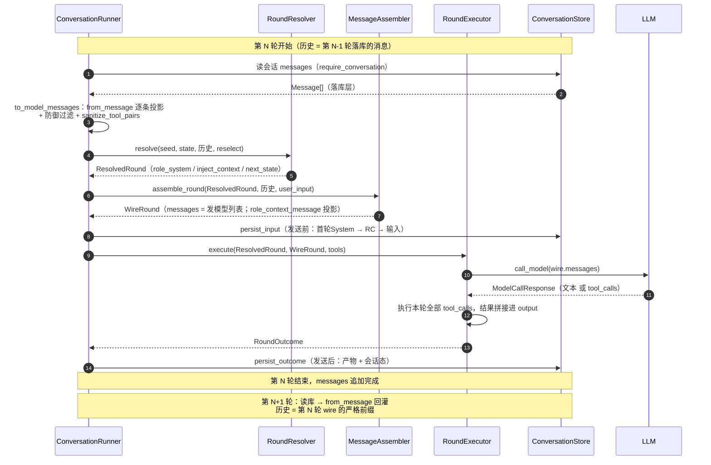
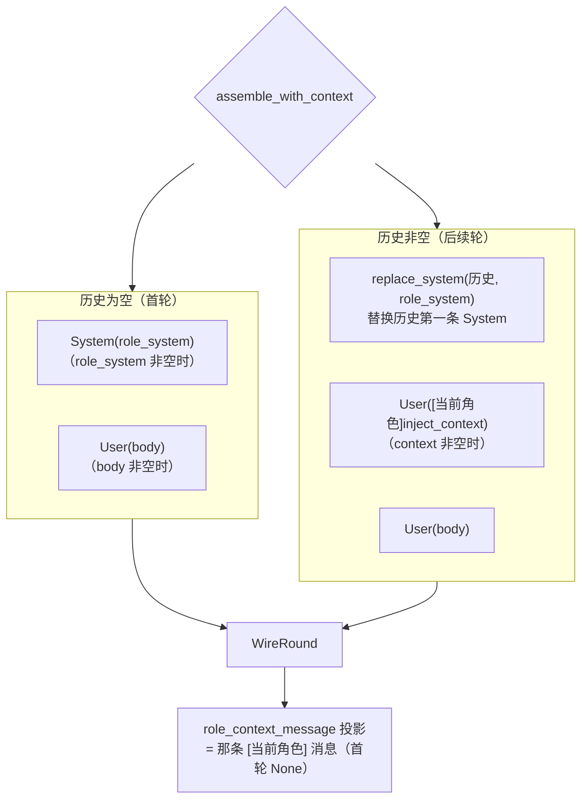
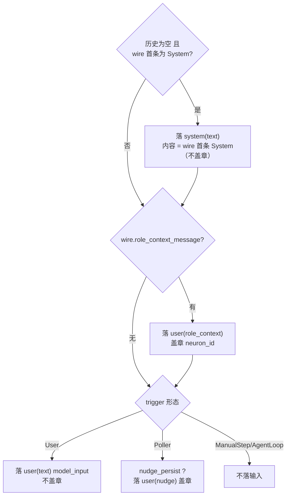
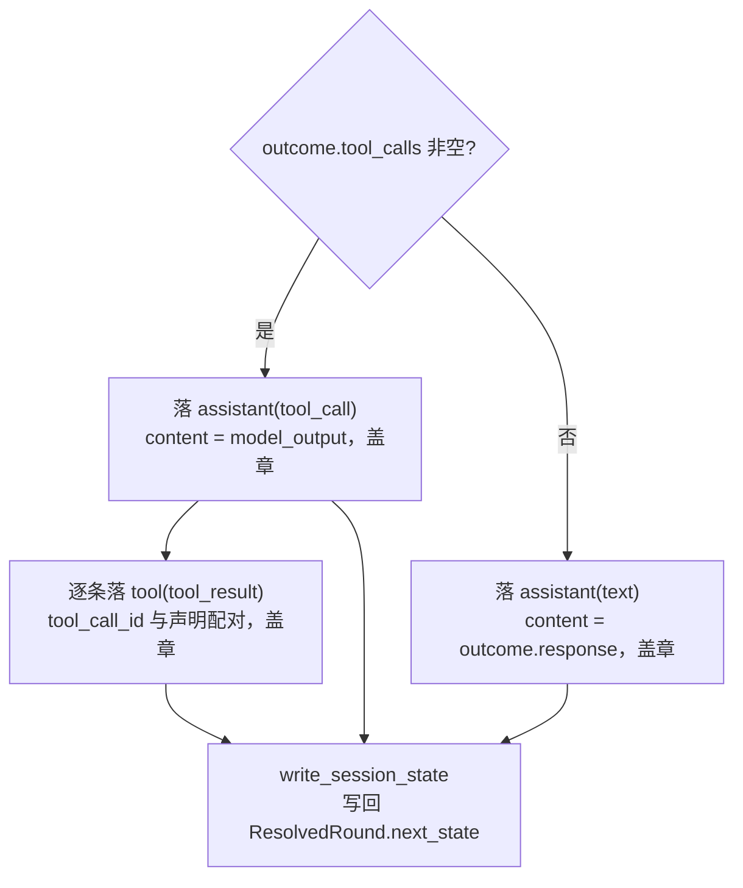

# 对话 msgs 生命周期：生产 · 落库 · 消费

> 本文是**现状的事实梳理**（RoundPipeline 拆分后），不包含任何设计主张。每个环节都给出代码位置与可运行测试，可直接对照验证。代码为真相，文档与代码冲突时以代码为准。

## 0. 三个环节一句话

- **生产**：`MessageAssembler::assemble_round` 把「历史（上轮落库回灌） + 角色决策 + 用户输入」拼成 `WireRound.messages` —— 这是**唯一**发给模型的 msg 列表。
- **落库**：`persist_input`（发送前，wire 组装完即可落）＋ `persist_outcome`（发送后，依赖模型产物）把 msgs 追加进 `ConversationStore`。
- **消费**：下一轮 `load_context → to_model_messages` 用 `from_message` 把落库消息逐条投影回 `ModelMessage`，成为下一轮组装的历史（严格前缀）。

## 1. 跨轮闭环总览（时序图）



## 2. 生产：msgs 从哪来

### 2.1 历史 = 上轮落库的投影

[to_model_messages](file:///home/lab/Documents/trae_projects/new-start-wt/packages/pulsar-app/src-tauri/src/core/conversation_runner.rs#L230-L244)：

```text
落库 Message[] ──from_message──▶ ModelMessage[] ──防御过滤──▶ ──sanitize_tool_pairs──▶ 历史
```

- `from_message`：逐条映射（映射表见 §4.2），`Nudge` / `RoleContext` 也回灌为 `User` 文本。
- 防御过滤：丢弃「非 tool_call 且 content 空」的 assistant 残留（模型偶发空响应，不清理会锁死后续调用）。
- `sanitize_tool_pairs`：校验 tool_call/tool_result 配对，丢弃孤儿 tool 消息与未应答的声明。

### 2.2 resolve：角色决策（`RoundResolver`）

[resolve](file:///home/lab/Documents/trae_projects/new-start-wt/packages/pulsar-app/src-tauri/src/core/round_resolver.rs#L36-L229) 产出 `ResolvedRound`：

| 字段 | 含义 |
|---|---|
| `role_system` | 首轮 System 内容（B2 冻结后 = `stable_system_prompt`） |
| `selected_neuron` | 本轮选中神经元（直连 / None 选型为 None） |
| `inject_context` | B2 冻结后 = 选中神经元 content，交给 assemble 决定落位 |
| `next_state` | 本轮后新运行态（`freeze_or_replace` 首轮冻结角色） |

### 2.3 assemble：拼出 wire（唯一模型输入，`MessageAssembler`）

入口 [assemble_round](file:///home/lab/Documents/trae_projects/new-start-wt/packages/pulsar-app/src-tauri/src/core/model_call_input.rs#L132-L155)，核心 [assemble_with_context](file:///home/lab/Documents/trae_projects/new-start-wt/packages/pulsar-app/src-tauri/src/core/model_call_input.rs#L166-L210)：



**关键点**：`role_context_message` 与 `messages` **同源**（[L163-165](file:///home/lab/Documents/trae_projects/new-start-wt/packages/pulsar-app/src-tauri/src/core/model_call_input.rs#L163-L165)）——它就是 messages 里那条 RC 的副本，assemble 时同时产出，落库直接消费，不需要事后扫描。

## 3. 落库：wire 如何变成 store 消息

[run_round](file:///home/lab/Documents/trae_projects/new-start-wt/packages/pulsar-app/src-tauri/src/core/conversation_runner.rs#L149-L178) 中 persist 拆两段：

### 3.1 persist_input（发送前，[L305-L387](file:///home/lab/Documents/trae_projects/new-start-wt/packages/pulsar-app/src-tauri/src/core/conversation_runner.rs#L305-L387)）



### 3.2 persist_outcome（发送后，[L389-L464](file:///home/lab/Documents/trae_projects/new-start-wt/packages/pulsar-app/src-tauri/src/core/conversation_runner.rs#L389-L464)）



> 盖章（`neuron_id`）：RC / Nudge / 产物类消息盖选中神经元 id；首轮 System 与用户输入不盖章。

## 4. 消费：store 消息如何回灌

### 4.1 映射入口

下一轮 [load_context](file:///home/lab/Documents/trae_projects/new-start-wt/packages/pulsar-app/src-tauri/src/core/conversation_runner.rs#L246-L285) → `to_model_messages` → 历史。

### 4.2 落库 Message ↔ 模型 ModelMessage 双向映射表（[from_message](file:///home/lab/Documents/trae_projects/new-start-wt/packages/pulsar-app/src-tauri/src/core/model_call_input.rs#L295-L350)）

| 落库（MessageBody） | 落库 role | 盖章 | 回灌为 ModelMessage |
|---|---|---|---|
| `Text` | user / assistant / system | 产物类盖章 | 按 role 转 User / Assistant / System |
| `ToolCall` | assistant | ✓ | Assistant + tool_calls |
| `ToolResult` | tool | ✓ | Tool（tool_call_id 配对） |
| `Nudge` | user | ✓ | User（文本） |
| `RoleContext` | user | ✓ | User（`[当前角色]\n...`） |
| `Compaction` | system | – | System（`[Previous conversation summary]`） |

## 5. 端到端示例（可对照测试验证）

第 1 轮（首轮，无工具场景）与第 2 轮，wire vs 落库逐条对照：

```text
第 1 轮：
  wire    = [System(A), U₁]
  落库    = [System(A), U₁, A₁]              （persist_input: System + User；persist_outcome: Assistant text）

第 2 轮：
  历史    = [System(A), U₁, A₁]               （from_message 回灌）
  wire    = [System(A), U₁, A₁, RC₂, U₂]     （replace_system 替换第一条 System → 追加 RC → 追加输入）
  落库    = [System(A), U₁, A₁, RC₂, U₂, A₂] （persist_input: RC + User；persist_outcome: Assistant text）
```

工具场景下 `A₁` 展开为两条：`assistant(tool_call)` + `tool(tool_result)`（逐条配对）。

行为断言在测试 [converse_frozen_round_carries_context_message](file:///home/lab/Documents/trae_projects/new-start-wt/packages/pulsar-app/src-tauri/src/core/conversation_runner.rs#L925-L975)：首轮 `role_context_message` 为 None、不落 RC；次轮落 RC 且位于用户输入前。

## 6. 不变式（可验证结论）

1. **落库顺序 = wire 注入顺序**：`System → RC → 输入 → 产物`，两段 persist 合起来与 assemble 的注入顺序一致。
2. **回灌 = 严格前缀累积**：第 N+1 轮历史 = 第 N 轮 wire（作为前缀）+ 尾部增量，服务端前缀缓存可命中。
3. **首轮 System 落库内容 = wire 首条 System**：`persist_input` 直接取 wire 内容（[L319-L326](file:///home/lab/Documents/trae_projects/new-start-wt/packages/pulsar-app/src-tauri/src/core/conversation_runner.rs#L319-L326)），不经过 `stable_system_frozen` 判断（那是 resolve 侧 B2 概念）。
4. **发模型只走一条路径**：`execute` 只消费 `wire.messages`（[round_executor.rs L118](file:///home/lab/Documents/trae_projects/new-start-wt/packages/pulsar-app/src-tauri/src/core/round_executor.rs#L113-L121)），不存在第二份"给模型的 msg"。

---

相关文档：[session-message-architecture.md](./session-message-architecture.md)（消息模型与映射细节）、[assistant-prompt-synthesis.md](./assistant-prompt-synthesis.md)（装配规则）。
