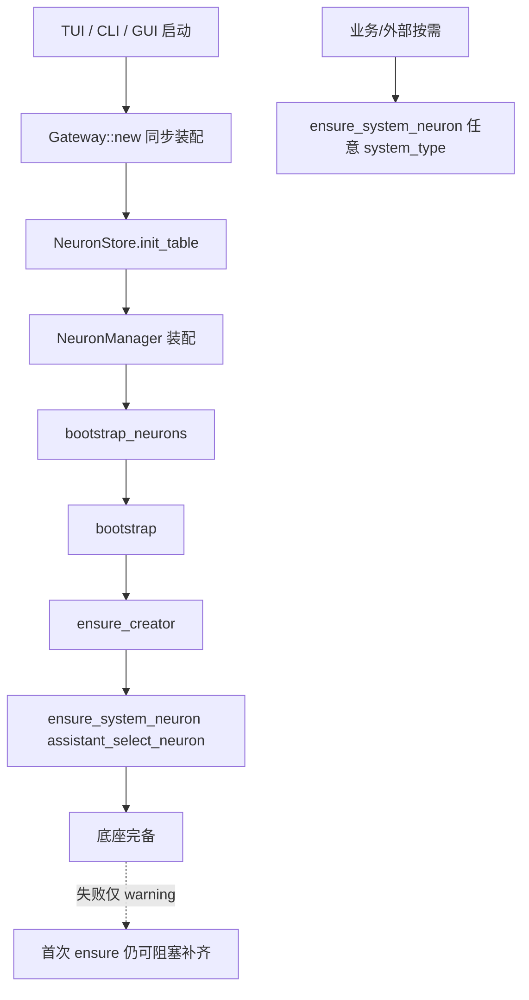
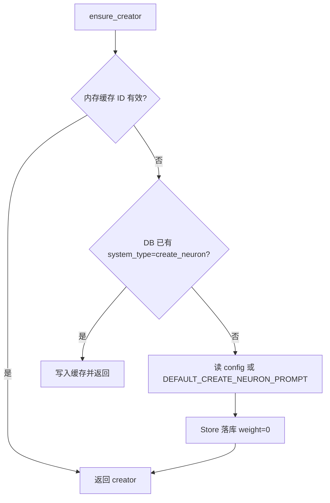
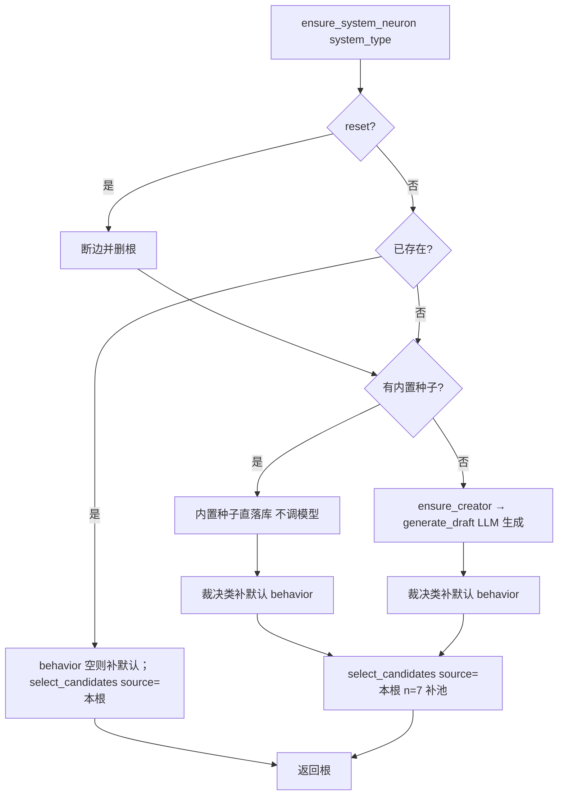
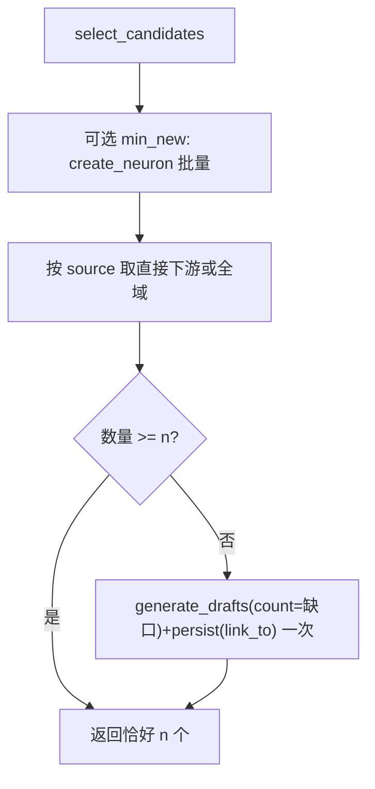

# 神经元初始化流程

本文描述 Pulsar 启动时与首次按需补齐时的神经元初始化路径。实现真相源：`NeuronManager` / `Gateway`。

- API 契约：`docs/specs/2026-08-01_02-40_neuron-manager-api.md`
- 相关迭代：`docs/sdd-lab/2026-07-28_23-43_neuron-bootstrap/`、`2026-07-29_22-50_neuron-system-prompt-ready/`、`2026-08-01_00-31_neuron-create-weight-zero/`

诊断时请打开 GUI 底部 **Logs**，或查看 `{storage}/logs/pulsar.log`；字段与过滤说明见 [logging.md](./logging.md)。

## 总览

初始化分两段：

1. **同步装配**（`Gateway::new`）：建库、装配 `NeuronManager`，不创建业务神经元。
2. **异步完备**（`Gateway::bootstrap_neurons` → `NeuronManager::bootstrap`）：保证底座 `create_neuron` 与 `assistant_select_neuron` 可用。

其它系统提示词（含未来自定义 `system_type`）**不在启动时批量创建**，由外部调用 `ensure_system_neuron` 懒补齐。除创建种子外，一律走统一创建流。



## 1. 同步装配：`Gateway::new`

| 步骤 | 行为 |
| --- | --- |
| 打开 `app.db` | 共享 SQLite 连接 |
| `NeuronStore::init_table` | 建表 / 迁移（含 `system_type`、`tool_ids`） |
| 构造 `NeuronManager` | Store + `DefaultNeuronModelCaller` + `NeuronConfigReader` |
| 注册工具 / Assistant / Poller | 只挂服务，不写神经元业务数据 |

此时库中可能仍无任何神经元。

## 2. 异步完备：`bootstrap`

入口：`pulsar-tui` / `pulsar-cli` / GUI 在装配后 `await bootstrap_neurons()`。失败打 warning，不阻断启动。

顺序固定（仅底座）：

1. `ensure_creator()` → `system_type = create_neuron`
2. `ensure_system_neuron("assistant_select_neuron", reset=false)`

也可手动：`/neuron bootstrap`。

全量重建已知 Assistant 系统提示词（不含 `create_neuron` 种子）：

```text
/neuron rebootstrap
```

等价于依次 `reset-system`：`assistant_select_neuron` → `assistant_match_topic` → `assistant_complete_scope` → `assistant_score_feedback` → `assistant_revise_topic`，再 `bootstrap`。重建走内置种子（content 零模型调用），仅补池调模型。

### 2.1 `ensure_creator`（不调模型）



- 种子文案：`.pulsar/config.json` → `neurons.bootstrap.create_neuron_prompt`；缺失用代码默认。
- 创建时节点权重强制为 `0`（无上游边）。
- **唯一例外**：不经 pool→7→1。

### 2.2 `ensure_system_neuron`（内建 type 零模型调用；自定义 type 可能调模型）

用于 `assistant_select_neuron` 及任意其它系统根（业务自定义 `system_type` 亦同）。



要点：

- **内置种子优先**：内建 system_type（`assistant_select_neuron` + 4 个裁决 hook）有 `SYSTEM_PROMPT_SEEDS` 内置文案（见 `neuron/config.rs`），创建时直接落库，**不调模型生成 content**；`rebootstrap` 亦命中种子稳定重建。可被 `config.json → neurons.bootstrap.system_prompts.<type>` 非空覆盖。
- **自定义 type 兜底**：无内置种子的 `system_type` 保持旧行为——`ensure_creator` → `generate_draft(system=creator种子)` LLM 生成。
- 候选池 / 子项：`select_candidates(n=7, source_id=**本系统根**.id)` —— 只看自己的直接下游；不足时一次 `generate_drafts(count=缺口)` 批量补齐（此补池仍调模型，与 content 生成无关）。
- 写系统根 content：种子分支用内置文案；LLM 分支用 `create_neuron` 种子作 model system，不借用其它根的下游当本根 pool。
- 赋 `system_type` **只许**本方法；禁止旁路贴标。
- 命中已存在的裁决类系统神经元时，若 `behavior` 为空则按 `default_behavior_for_system_type` 自动补写默认值（`Fixed` + 对应 `insert_id`）；已有值不覆盖。

### 2.3 普通神经元：`create_neuron(input, link_to, count)`

统一创建流：`ensure_creator` → pool→7→1（creator 下游）→ 模型一次返回 **JSON 列表**（`count` ∈ 1..=10）→ 逐条落库（无 `system_type`）。可选全部挂为某节点直接下游。AI 工具名同为 `create_neuron`，参数含 `count`（默认 1）。

## 3. 候选补齐：`select_candidates`



- 有 `source_id`：只取**该源**直接下游，不递归；补齐也挂到该源下。
- 无来源：全域候选（含系统节点）；补齐为无上游节点。
- 排序：`weight DESC, RANDOM()`；创建权重恒为 0，差异来自后续评价 delta。

## 4. 启动后懒加载

| 时机 | 行为 |
| --- | --- |
| 启动 bootstrap | 只保证 `create_neuron` + `assistant_select_neuron` |
| Assistant / 外部需要其它系统提示词 | `ensure_system_neuron(system_type)` |
| 运维 | `/neuron ensure-system <type>`、`/neuron reset-system <type>` |

## 5. 权重规则（创建）

- 新建节点权重 = `0`
- 新建边权重 = `0`
- 忽略模型 JSON / 创建参数中的权重
- 之后仅通过 `adjust_weight` / `adjust_edge_weight`（评价、Hook、人工）增减

详见 `docs/sdd-lab/2026-08-01_00-31_neuron-create-weight-zero/`。

## 6. 关键常量 / API

| 名称 | 含义 |
| --- | --- |
| `create_neuron`（system_type） | 创建器系统根；种子不调模型 |
| `assistant_select_neuron` | 7 选 1 裁决提示词根；bootstrap 必保 |
| `DEFAULT_SELECT_N = 7` | 候选池默认大小 |
| `ensure_creator` / `select_*` / `create_neuron` / `ensure_system_neuron` / `bootstrap` | 业务正门五动词 |
