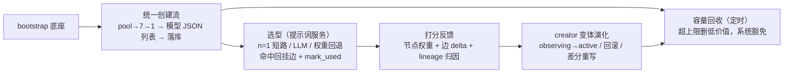

# Neuron 域生命周期（docs/pulsar/neuron/lifecycle.md）

节点从出生到遗忘的完整路径。配合 [data-model.md](./data-model.md) 的数据契约阅读。

## 1. 启动（bootstrap）

`NeuronManager::bootstrap`（异步，启动装配时 spawn，失败仅 warning 不阻断）：

1. `ensure_creator`：`create_neuron` 种子直落库（`DEFAULT_CREATE_NEURON_PROMPT`），**零模型调用**。
2. `ensure_system_neuron(assistant_select_neuron)`：选型器种子直落库（[creation.rs:375](file:///home/lab/Documents/trae_projects/new-start-wt/packages/pulsar-app/src-tauri/src/core/neuron/creation.rs#L375)）。
3. `ensure_generic_neuron`：内置"通用助手"普通节点（`BUILTIN_GENERIC_NEURON_DESC`，权重 50 兜底，[config.rs:227](file:///home/lab/Documents/trae_projects/new-start-wt/packages/pulsar-app/src-tauri/src/core/neuron/config.rs#L227)）。

`rebootstrap`：按 `REBOOTSTRAP_SYSTEM_TYPES`（`assistant_select_neuron` / `assistant_user_round_judgement` / `assistant_round_review`）重置重建；**不含 `create_neuron`**（种子根，见 [manager.rs:39-46](file:///home/lab/Documents/trae_projects/new-start-wt/packages/pulsar-app/src-tauri/src/core/neuron/manager.rs#L39-L46)）。

## 2. 懒补齐

- `ensure_system_neuron(type, opts)`：内建种子零模型调用；自定义 type 才走 LLM 生成（[creation.rs:123](file:///home/lab/Documents/trae_projects/new-start-wt/packages/pulsar-app/src-tauri/src/core/neuron/creation.rs#L123)）。裁决类创建即注册默认 behavior（`Fixed + 契约段`，[creation.rs:256-261](file:///home/lab/Documents/trae_projects/new-start-wt/packages/pulsar-app/src-tauri/src/core/neuron/creation.rs#L256-L261)）。
- `ensure_session_neuron`：`session.` 前缀校验 → 新建时写 behavior 与 content，已存在不覆盖（[creation.rs:274](file:///home/lab/Documents/trae_projects/new-start-wt/packages/pulsar-app/src-tauri/src/core/neuron/creation.rs#L274)、[spec.rs:52](file:///home/lab/Documents/trae_projects/new-start-wt/packages/pulsar-app/src-tauri/src/core/neuron/spec.rs#L52)）。

## 3. 创建流（普通神经元）

1. 候选装池：`fill_candidates_batch` 取候选（pool→7→1）。
2. 生成：creator（`create_neuron` 的 content 当指令）→ 模型一次返回 JSON 列表（1..=10 条 `{desc, content, tool_ids}`）。
3. 落库：`persist_plain` 逐条落库（创建恒 0 权重），可选挂父（parent 边）。

输入约束：模型 JSON 中 `weight` 被忽略、`desc ≤ 20 字`、禁止生成系统级节点（`assistant_` / `create_neuron` 由项目种子负责，[config.rs:37](file:///home/lab/Documents/trae_projects/new-start-wt/packages/pulsar-app/src-tauri/src/core/neuron/config.rs#L37)）。

## 4. 选型（提示词服务内部）

`select_role`（[manager.rs:428](file:///home/lab/Documents/trae_projects/new-start-wt/packages/pulsar-app/src-tauri/src/core/neuron/manager.rs#L428)）：

1. scope 装配候选池（按邻域池/全局策略过滤已删、系统豁免、observing 变体）。
2. 候选 n=1 → 硬规则短路：直接选中 + `mark_used`（不调模型）。
3. n>1 → LLM 选型（`assistant_select_neuron` 指令，输出 `{"neuron_id"}`）。
4. 命中 → 回挂边（source→target，权重 0，幂等不自环）+ `mark_used`。
5. LLM 失败 → 权重回退 `pick_by_weight`（确定性折中，非真随机）。

## 5. 打分反馈（评价服务内部）

`apply_score_feedback`（[assistant_session.rs:990](file:///home/lab/Documents/trae_projects/new-start-wt/packages/pulsar-app/src-tauri/src/core/assistant_session.rs#L990)）：

1. 节点权重：`adjust_weight(delta)` 叠加，合并"打分即使用"信号（use_count+1）。
2. 关联边：被评价节点的连接边按 delta 同步增减。
3. lineage 归因：分数回流到生成它的 creator 变体（`accumulated_delta` 累计）。
4. 触发 `maybe_evolve_creator_variants`：见 §6。

## 6. creator 变体演化（自迭代）

**语义**：演化的是"生成器"（creator），不是神经元本身——变体是 creator 的"孩子"，被使用/打分后按表现决定去留，表现信息差分写回 creator。这是元学习雏形，范围仅限 `create_neuron` 的变体池。

- `observing`（观察期）变体不进候选池。
- 表现好 → 晋升 active；表现差 → 回滚。
- 差分重写：把变体的有效信息写回 creator 内容（每次调用只处理一个变体，[evolution.rs](file:///home/lab/Documents/trae_projects/new-start-wt/packages/pulsar-app/src-tauri/src/core/neuron/evolution.rs)）。
- `manual_edited` 的变体不参与自动重写/淘汰（防覆盖用户改动）。

## 7. 容量回收（遗忘）

- 后台 runtime：`spawn_neuron_recycle_runtime`（gateway 启动时注册，[gateway.rs:1417](file:///home/lab/Documents/trae_projects/new-start-wt/packages/pulsar-app/src-tauri/src/core/gateway.rs#L1417)），按 `neuron.recycle_interval_ms`（默认 1h）定时调用。
- 判定：`recycle_if_over_capacity`（[query.rs:212](file:///home/lab/Documents/trae_projects/new-start-wt/packages/pulsar-app/src-tauri/src/core/neuron/query.rs#L212)）——活跃节点数超 `neuron.capacity`（默认 300，[config.rs:329](file:///home/lab/Documents/trae_projects/new-start-wt/packages/pulsar-app/src-tauri/src/core/neuron/config.rs#L329)）时，按低价值排序（weight ASC → use_count ASC → last_used_at ASC）删除差额。
- 方式：**逻辑删除**（`deleted_at` 标记），数据与版本历史保留；全链路排除已删节点；**系统神经元豁免**。
- 语义确认（2026-09-01）：接受现状——异步定时批量清，创建路径不强制"一换一"。记录于 [roadmap.md](./roadmap.md)。
