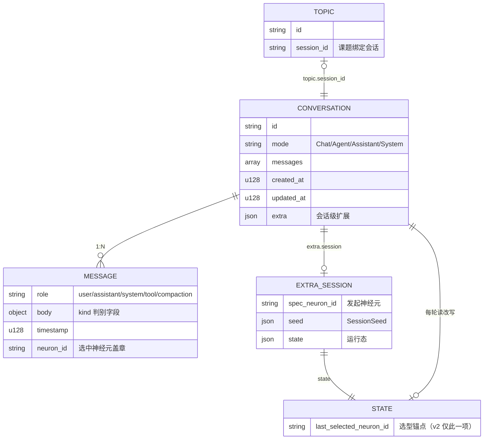
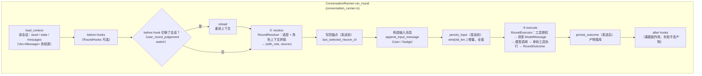
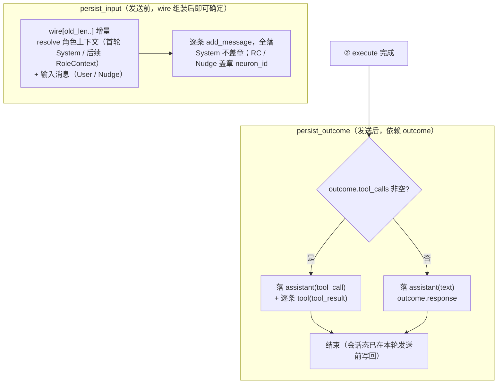
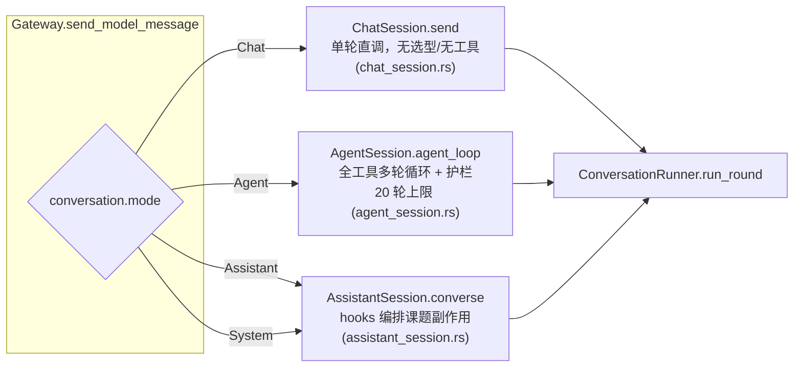
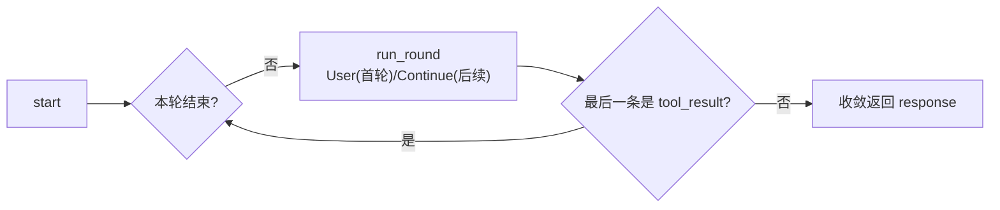
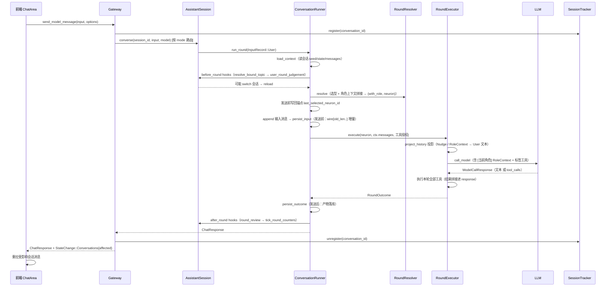
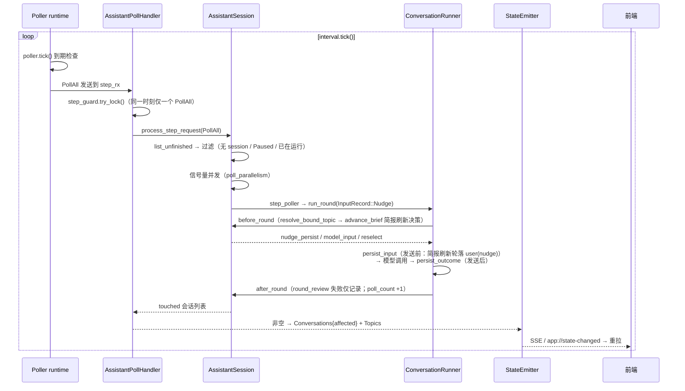

# 会话与消息架构

## 1. 概览

`pulsar-app` 的对话能力建立在 **会话（Conversation）↔ 消息（Message）** 的 1:N 结构上：

- **会话**是对话的运行容器：拥有固定 `id`、模式（`Chat` / `Agent` / `Assistant` / `System`）、有序消息列表与会话级运行态（`extra.session`）。
- **消息**是会话内的持久化记录：一条消息 = 角色（`role`）× 内容形态（`body.kind`），带时间戳，可选「选中神经元」盖章。

同一个会话存在**三层消息视角**，彼此通过映射函数转换：

```mermaid
flowchart LR
  subgraph disk["落库层（sessions/<id>.json）"]
    M["Message<br/>role × MessageBody(kind)"]
  end
  subgraph model["模型层（ModelMessage）"]
    MM["role × content<br/>+ tool_calls / tool_call_id"]
  end
  subgraph ui["前端渲染层"]
    R["按 body.kind 分支渲染<br/>ChatMessage / ToolCallBlock ..."]
  end

  M -- "project_history / from_message<br/>(model_call_input.rs)" --> MM
  MM -- "persist_input / persist_outcome<br/>(conversation_runner.rs)" --> M
  M -- "history() / StateChange 重拉" --> R

  note[M"落库与回灌互为镜像：<br/>落库顺序 = wire 注入顺序<br/>（nudge / role_context 也回灌）"]
```

- 持久化：`sessions/<conversation-id>.json`（`ConversationStore`，见 [conversation_store.rs](file:///home/lab/Documents/trae_projects/new-start-wt/packages/pulsar-app/src-tauri/src/core/conversation_store.rs)）。
- 单轮执行引擎：`ConversationRunner`（见 [conversation_runner.rs](file:///home/lab/Documents/trae_projects/new-start-wt/packages/pulsar-app/src-tauri/src/core/conversation_runner.rs)），负责「读会话 → 调用模型 → 落库消息 + 会话态」。
- 领域模型：见 [models.rs](file:///home/lab/Documents/trae_projects/new-start-wt/packages/pulsar-app/src-tauri/src/core/models.rs)。

## 2. 会话数据模型



| 字段 | 说明 |
|---|---|
| `id` | 稳定会话 id（`conv_<nanos>`，见 [conversation_store.rs](file:///home/lab/Documents/trae_projects/new-start-wt/packages/pulsar-app/src-tauri/src/core/conversation_store.rs#L159-L164)） |
| `mode` | `ConversationMode`，决定 Gateway 路由与标签工具注入（见下） |
| `messages` | 有序消息数组，追加式增长 |
| `extra.session` | `spec_neuron_id`（发起神经元绑定）+ `seed`（`SessionSeed`）+ `state`（运行态），见 [conversation_runner.rs](file:///home/lab/Documents/trae_projects/new-start-wt/packages/pulsar-app/src-tauri/src/core/conversation_runner.rs#L472-L540) |

### 会话级运行态 `SessionState`

存于 `conversation.extra.session.state`，是「跨轮记忆」的唯一持久化载体（定义见 [round_types.rs](file:///home/lab/Documents/trae_projects/new-start-wt/packages/pulsar-app/src-tauri/src/core/round_types.rs#L23-L27)）：

- `last_selected_neuron_id`：选型锚点，邻域推进依据（旧数据从 `topic.extra.assistant` 迁出，读时回退兼容）。**发送前写回**（resolve 已定选中神经元）：选中 → 写回其 id；未选中 → 清空。
- B2 冻结字段 `stable_system_prompt` / `stable_system_frozen` **已删除（v2）**：首轮 System 落库后历史自带稳定角色，无需跨轮状态（见 [docs/specs/2026-08-16_18-00_round-resolver-message-truth.md](../specs/2026-08-16_18-00_round-resolver-message-truth.md)）。

读写入口：`read_session_state` / `session_seed` / `write_session_state`（[conversation_runner.rs](file:///home/lab/Documents/trae_projects/new-start-wt/packages/pulsar-app/src-tauri/src/core/conversation_runner.rs#L437-L499)）。

## 3. 消息数据模型

消息由 `role`（作者维度）与 `body`（内容形态，`kind` 为判别字段）**正交组合**（见 [models.rs](file:///home/lab/Documents/trae_projects/new-start-wt/packages/pulsar-app/src-tauri/src/core/models.rs#L17-L53)）。

| kind | 落库 role | 说明 | 回灌模型（message_to_model） |
|---|---|---|---|
| `text` | user / assistant / system | 普通正文（含内置命令回复） | ✓ 按 role 转 |
| `tool_call` | assistant | 模型声明的工具调用（content = 说明文字） | ✓ 转 Assistant + tool_calls |
| `tool_result` | tool | 工具返回，`tool_call_id` 与声明配对 | ✓ 转 Tool |
| `compaction` | system | 手动压缩摘要（`summary_of` = 被摘要时间戳集） | ✓ 转 System（`[Previous conversation summary]`） |
| `nudge` | user | 轮询推进简报（落库与 wire 同源） | ✓ 转 User 文本（回灌，`nudge_persist` 控制条数） |
| `role_context` | user | resolve 每轮拼接的选中神经元（`[当前角色]` 前缀；首轮无 RC，角色在 System） | ✓ 转 User 文本（回灌） |

> `Message.neuron_id`：assistant 模式每轮选中神经元，落库产物消息统一盖章；RC / Nudge 消息也盖章（见 [round_resolver.rs](file:///home/lab/Documents/trae_projects/new-start-wt/packages/pulsar-app/src-tauri/src/core/round_resolver.rs#L235-L242)）；用户输入与首轮 System 不盖章。评分区间由 `interval_neuron_ids` 按盖章边界推导。

### 3.1 落库 → 模型映射

`ModelCallInput::project_history`（[model_call_input.rs](file:///home/lab/Documents/trae_projects/new-start-wt/packages/pulsar-app/src-tauri/src/core/model_call_input.rs#L223-L235)，`from_message` 逐条投影）：

1. 逐条映射（见上表）；`Nudge` / `RoleContext` 均回灌为 User 文本（落库顺序 = wire 注入顺序）。
2. 防御过滤：模型偶发空响应的残留（非 tool_call 且 content 空的 assistant 消息）。
3. `ModelCallInput::sanitize_tool_pairs`：校验 tool_call/tool_result 配对，防止孤儿 tool 消息。

### 3.2 模型 → 落库映射（persist_outcome 产物）

发送后经 `persist_outcome`（[conversation_runner.rs](file:///home/lab/Documents/trae_projects/new-start-wt/packages/pulsar-app/src-tauri/src/core/conversation_runner.rs#L354-L423)）把 `RoundOutcome` 落库：

- 有 tool_calls → 1 条 `assistant(tool_call)` + 每个声明 1 条 `tool(tool_result)`（一一配对，不落 assistant text）。
- 无 tool_calls → 1 条 `assistant(text)`（`outcome.response`）。

## 4. 一轮会话执行（ConversationRunner）

### 4.1 输入记录与触发类型

触发语义只被业务编排感知，`ConversationRunner` 不感知。`InputRecord` 决定输入侧如何落库（[conversation_runner.rs](file:///home/lab/Documents/trae_projects/new-start-wt/packages/pulsar-app/src-tauri/src/core/conversation_runner.rs#L19-L40)）：

| InputRecord | 触发类型 | 输入落库 | model_input |
|---|---|---|---|
| `User(text)` | User | 落 `user(text)` | 文本 |
| `Nudge` | Poller | 简报刷新轮落 `user(nudge)`（`nudge_persist`，生成一次落库一次） | before hook 拼简报 |
| `Continue(text)` | AgentLoop | 不落 | 携带文本（Agent 后续轮） |
| `None` | ManualStep | 不落 | 简报由 hook 注入 |

### 4.2 一轮生命周期



要点（[conversation_runner.rs](file:///home/lab/Documents/trae_projects/new-start-wt/packages/pulsar-app/src-tauri/src/core/conversation_runner.rs#L106-L204)）：

- **真相源唯一**：管道内全程 `Vec<Message>`（`MessageBody` 带 kind，自描述），无 `ResolvedRound` / `WireRound` 中间层；发送前统一 `project_history` 投影为 `ModelMessage`。
- **进 wire 必落库**：`persist_input`（发送前）落 `wire[old_len..]` 全量增量（System / RoleContext / 输入 / Nudge），不依赖模型产物——模型调用失败/超时也不丢用户消息；`persist_outcome`（发送后）落产物。
- **锚点发送前写回**：resolve 已定选中神经元，模型调用前落 `last_selected_neuron_id`（选中 → 写回其 id；未选中 → 清空）。
- **先落库再跑 after hooks**：`round_review` 等副作用失败只影响副作用本身，不丢失本轮模型产物。
- **hook 与主对话同源**：`RoundContext` 携带 `model` / `messages` / `state`，before/after hooks 共享，裁决与主对话用同一模型。
- **工具标签**：`execute(tool_tags) = ctx.mode.tool_tags()`，executor 只做数据驱动并入（规范见 [docs/micro_specs/2026-08-16_hoist-tool-tag-mapping.md](../micro_specs/2026-08-16_hoist-tool-tag-mapping.md)）。

### 4.3 persist 两段式落库顺序



（实现见 [conversation_runner.rs](file:///home/lab/Documents/trae_projects/new-start-wt/packages/pulsar-app/src-tauri/src/core/conversation_runner.rs#L346-L423)）

## 5. 模式路由

`Gateway::send_model_message` 按会话 `mode` 委托各业务 session 文件（业务逻辑不进 Gateway，见 [gateway.rs](file:///home/lab/Documents/trae_projects/new-start-wt/packages/pulsar-app/src-tauri/src/core/gateway.rs#L532-L620)）：



各模式差异（均由 `ConversationRunner::run_round` 编排，差异在 hooks 与 `tool_override` / `tool_tags`）：

| 模式 | 业务接入 | hooks | 工具注入 | 输入落库 |
|---|---|---|---|---|
| Chat | `chat_session.send` | 无 | `tool_tags=[]`（无标签工具） | User → `user(text)` |
| Agent | `agent_session.agent_loop` | 无 | 注册表全部工具（override） | 首轮 User → `user(text)`；后续轮 `Continue` 不落 |
| Assistant | `assistant_session.converse` | `AssistantHooks`（打分/匹配/验收） | `tool_tags=[Core]` | User → `user(text)` |
| System | `assistant_session.converse` | `AssistantHooks` | `tool_tags=[Core, System]` | User → `user(text)` |

### Agent 多轮循环

`agent_loop`（[agent_session.rs](file:///home/lab/Documents/trae_projects/new-start-wt/packages/pulsar-app/src-tauri/src/core/agent_session.rs#L31-L80)）：



## 6. 会话 ↔ 课题（Topic）

课题与会话通过 `Topic.session_id` 双向绑定（见 [models.rs](file:///home/lab/Documents/trae_projects/new-start-wt/packages/pulsar-app/src-tauri/src/core/models.rs#L466-L479)）：

- **绑定方向**：`Topic.session_id → Conversation`。`AssistantHooks.resolve_bound_topic` 每轮按 `session_id` 反查课题（[assistant_session.rs](file:///home/lab/Documents/trae_projects/new-start-wt/packages/pulsar-app/src-tauri/src/core/assistant_session.rs#L514-L524)）。
- **切换方向**：`user_round_judgement` 裁决 `action: switch / create` 时可能**切换会话**（改写 topic 绑定到其它会话），runner 检测 `session_id` 变化后 `reload` 重读上下文。
- **轮询推进**：`process_step_request(PollAll)` 列出未完成课题 → 过滤无 `session_id` / Paused / Cancelled / 已在运行的会话 → 信号量并发 `step_poller`（[assistant_session.rs](file:///home/lab/Documents/trae_projects/new-start-wt/packages/pulsar-app/src-tauri/src/core/assistant_session.rs#L235-L339)）。

## 7. 运行时会话（SessionTracker）

纯内存的运行中会话集合（[session_tracker.rs](file:///home/lab/Documents/trae_projects/new-start-wt/packages/pulsar-app/src-tauri/src/core/session_tracker.rs#L29-L176)）：

- `register` / `unregister` / `update_step` / `close`（可携带 abort 回调强制取消）。
- 状态变化广播 `StateChange::Sessions` → 前端刷新 SessionList。
- 用途：①GUI 展示运行中会话；②轮询推进去重（已在运行则跳过），防止同一会话被重复推进。

## 8. 端到端时序

### 8.1 用户输入（Assistant 模式示例）



### 8.2 后台轮询推进（Poller）



## 9. 状态事件与前端刷新

写操作完成后 `StateEmitter` 广播 `StateChange`（[events.rs](file:///home/lab/Documents/trae_projects/new-start-wt/packages/pulsar-app/src-tauri/src/core/events.rs)）：

| kind | 触发 | 前端动作 |
|---|---|---|
| `Conversations{affected}` | 一轮结束 / 轮询推进 touched | 重拉受影响会话消息 |
| `Sessions` | SessionTracker 变化 | 刷新运行中会话列表 |
| `Topics` | 课题副作用（打分/验收/切换） | 刷新 TopicPanel |

前端 `dataStore` 监听后按 kind 重拉，`nudge` / `role_context` 消息按 `body.kind` 渲染但不作为轮起点（role_context 落库语义见 [docs/specs/2026-08-16_18-00_round-resolver-message-truth.md](../specs/2026-08-16_18-00_round-resolver-message-truth.md)）。

## 10. 相关文档

| 文档 | 内容 |
|---|---|
| [architecture.md](./architecture.md) | Pulsar 总体分层与关键数据流 |
| [storage.md](./storage.md) | 会话 JSON 存储布局与一致性规则 |
| [model-call-sites.md](./model-call-sites.md) | 模型调用点对照 |
| [assistant-prompt-synthesis.md](./assistant-prompt-synthesis.md) | 助手模式各模型调度点的 prompt 拼装 |
| [docs/specs/2026-08-16_18-00_round-resolver-message-truth.md](../specs/2026-08-16_18-00_round-resolver-message-truth.md) | Round Pipeline v2：真相源 `Vec<Message>`、删 B2 冻结状态机、工具授权按模式 |
| [docs/specs/2026-08-14_16-00_neuron-stable-system-prompt-b2.md](../specs/2026-08-14_16-00_neuron-stable-system-prompt-b2.md) | B2：稳定系统提示词 + RoleContext 落库（v2 已取代其冻结状态机，首轮 System 落库保留） |
| [docs/micro_specs/2026-08-16_hoist-tool-tag-mapping.md](../micro_specs/2026-08-16_hoist-tool-tag-mapping.md) | 模式 → 标签工具映射上移 |
