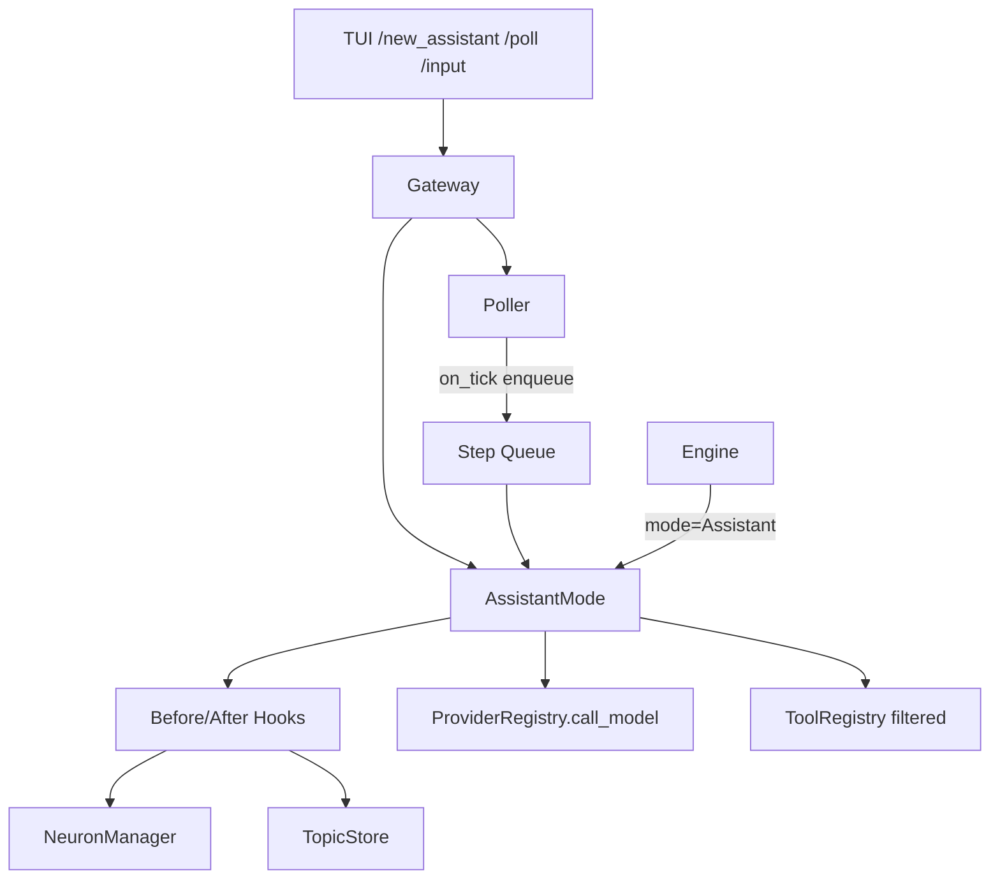

# Technical Plan / 技术方案: Assistant 运行模式

## Requirement Baseline / 需求基线

* 对应需求文档：`docs/sdd-lab/2026-07-26_21-30_assistant-mode/requirements.md`

* 前置依赖：`docs/sdd-lab/2026-07-28_23-43_neuron-bootstrap/`（已完成）

* 相关轻量能力：`docs/micro_specs/2026-07-29_00-34_topic-scope-item-management.md`（`scope_in` 单条完成已落地）

* 需求确认状态：实现缺口 1–5 与 Q9 已关闭；本方案等待用户确认后执行。

* 本方案覆盖：独立 Assistant 模块、before/after hook、一次工具调用核心、通用 Poller、Topic.`session_id`、TUI 接入。

* 不覆盖：Chat/Agent 模式切换、评分历史流水、并发上限控制。

## Current Project Facts / 当前项目事实

* `core/engine.rs`

  * 仅按 `ConversationMode::Chat|Agent` 分发；Agent 为多轮工具循环，Chat 无工具。

  * 需求要求 Assistant **不得**继续扩写在此文件内业务细节，只允许分发调用。

* `core/gateway.rs`

  * 组装 Provider、TopicStore、NeuronStore、NeuronManager、ToolRegistry、Engine、SessionTracker。

  * 是注入 Assistant、Poller、配置与对外门面的自然组装点。

* `core/neuron_manager.rs`

  * 已提供 `select_candidates(CandidateQuery)`、`adjust_weight`、按 `system_type` 查找/缓存创建节点。

  * `CandidateQuery` 支持 `n/source_id/system_type/min_new`，`source_id` 优先。

* `core/neuron_store.rs`

  * `list_direct_downstream(source_id, …)` 已实现“仅直接子节点”。

  * 连接边 `link` 为绝对写入；尚无边权重 delta API。

* `core/topic_store.rs`

  * Topic 尚无 `session_id`。

  * 已有 `complete_scope_item` / `add_scope_item` / pause-resume 与进度重算。

* `core/tool_registry.rs`

  * 工具稳定 ID 即 `Tool::name()`；可按名称执行。

* `core/session_tracker.rs`

  * 仅跟踪“正在执行中”的会话，不是 Topic↔Session 持久绑定。

* `tui/`

  * 已有 `/new`、`/new_agent`；会话列表标签只有 Chat/Agent。

  * 无 `/new_assistant`、`/poll`。

* `Cargo.toml`

  * `tokio` 当前 features 为 `macros, rt-multi-thread`，Poller 定时器需启用 `time`。

## Exec Scheme Bridge / 执行方案桥接

### 1. 改动依赖范围内的能力与代码现实

| 能力          | 现状                  | 证据                                    |
| ----------- | ------------------- | ------------------------------------- |
| 会话模式分发      | 缺 Assistant         | `engine.rs:ConversationMode` match    |
| 神经元候选       | 够用，可直接消费            | `NeuronManager::select_candidates`    |
| 直接下游查询      | 够用                  | `NeuronStore::list_direct_downstream` |
| 神经元权重 delta | 够用                  | `NeuronManager::adjust_weight`        |
| 连接边权重 delta | 缺，需扩                | `NeuronStore::link` 仅绝对写入             |
| 课题绑定会话      | 缺 `session_id`      | `Topic` / `topics` 表                  |
| scope 完成    | 够用                  | `TopicStore::complete_scope_item`     |
| 系统提示词节点     | 可用 `system_type`    | `get_neuron_by_system_type`           |
| 通用 Poller   | 缺                   | 无 `poller.rs`                         |
| TUI 入口      | 缺 Assistant/poll 命令 | `tui/commands.rs`                     |

### 2. 外部依赖：包与本任务用到的精确 API

| 包                              | 本任务使用的 API                                    | 备注                                        |
| ------------------------------ | --------------------------------------------- | ----------------------------------------- |
| `tokio 1.53.1`                 | `time::interval`、`sync::{Mutex,mpsc}`、`spawn` | 需在 `Cargo.toml` 为 tokio 增加 `time` feature |
| `rusqlite 0.32.1`              | `ALTER TABLE`、`transaction`、`params!`         | Topic.`session_id` 迁移                     |
| `async-trait 0.1.91`           | `#[async_trait]`                              | Hook trait、可选 async handler 适配            |
| `serde` / `serde_json 1.0.151` | 结构化 LLM 裁决 JSON 解析                            | 选神经元、匹配课题、完成条目、满意度分数                      |
| `async-openai 0.41.1`          | 仍经 `ProviderRegistry::call_model`             | Assistant 不直接依赖                           |

### 3. 设计契约

技术文档出处：`requirements.md` 的对外三方法、Hook、Poller、7 选 1 / 课题匹配 / afterhook / 满意度打分 / 次生直接子节点。

最小契约：

```rust
pub struct AssistantMode { /* stores, neuron_manager, tools, poller handle */ }

impl AssistantMode {
    pub async fn converse(&self, session_id: &str, user_input: &str, model: &ChatModelSelection) -> AppResult<ChatResponse>;
    pub async fn step(&self, session_id: &str, model: &ChatModelSelection) -> AppResult<ChatResponse>;
    pub fn register_polling(&self, poller: &mut Poller, interval_ticks: u64) -> AppResult<()>;
}

#[async_trait]
pub trait BeforeHook: Send + Sync {
    async fn run(&self, ctx: &mut AssistantRoundContext) -> AppResult<()>;
}

#[async_trait]
pub trait AfterHook: Send + Sync {
    async fn run(&self, ctx: &mut AssistantRoundContext) -> AppResult<()>;
}

pub trait PollHandler: Send {
    fn on_tick(&mut self);
}
```

相对需求的实现细化：

| 项目             | 说明                                                                                                                                        |
| -------------- | ----------------------------------------------------------------------------------------------------------------------------------------- |
| 文件落点           | 新增 `core/assistant_mode.rs` + `core/poller.rs`；Engine 只增加 `ConversationMode::Assistant` 分支并委托。                                            |
| Poller 与 async | PollHandler 保持同步 `on_tick`；Assistant 注册的 handler 仅向内部 channel 投递“步进请求”，由 Gateway/TUI 已有 tokio runtime 消费执行 `step`，避免在 tick 线程 `block_on`。 |
| 未知工具 ID        | 过滤掉并记录警告，不报硬失败、不回退完整工具集。                                                                                                                  |
| 多 tool\_calls  | 只执行第一个授权工具调用；其余忽略并写入轮次日志式状态（不持久化专用 hook 表）。                                                                                               |
| beforehook 失败  | `converse/step` 中止本轮并返回错误；Poller 路径吞掉错误只记日志，不中断调度。                                                                                        |
| afterhook 失败   | 核心对话结果已落盘；afterhook 失败返回可恢复错误，不回滚本轮消息。                                                                                                    |
| 系统提示词类型        | 固定常量：`assistant_select_neuron`、`assistant_match_topic`、`assistant_complete_scope`、`assistant_score_feedback`。缺失时明确报错，不静默拼临时提示词。           |

## Open Questions / 开放问题

当前无阻塞技术方案的未决问题。以下默认值已写入本方案，用户确认方案即一并确认：

* Poller 默认 `base_interval_ms = 1000`，Assistant 任务默认 `interval_ticks = 30`（可配置后调）。

* 首次选神经元：`select_candidates(n=7, source_id=None, system_type=None, min_new=0)`；若业务希望从 `create_neuron` 下游取候选，可在配置中改成 `system_type=create_neuron`。

* 次生轮次：`select_candidates(n=7, source_id=last_selected_neuron_id, …)`。

* 满意度打分 LLM 输出严格 JSON：`{"score": <int>}`，校验范围后应用。

## Solution Options / 方案候选

### Option A / 方案 A：独立 AssistantMode + 通用 Poller（推荐）

* 推荐：是。

* 摘要：业务全收束在 `assistant_mode.rs`；Hook 以 trait 对象链式执行；Poller 独立；Gateway 持有 Poller 与 Assistant；Engine 仅分发。

* 优点：符合需求边界；可测；Poller 可复用。

* 缺点：Gateway 职责略增。

* 风险：async 步进与 sync tick 需 channel 桥接。

### Option B / 方案 B：在 Engine 内嵌 Assistant 分支

* 推荐：否。

* 摘要：在 `engine.rs` 增加 Assistant 臂并实现流程。

* 缺点：直接违反需求“不在 engine 实现业务”。

## Decision / 方案决策

* Selected / 选定方案：Option A。

* Why / 选择原因：满足独立文件收束、三方法对外、通用 Poller 与 hook 规范，并复用已完成的神经元/课题能力。

* Decision Owner / 决策人：用户。

* Decision Time / 决策时间：2026-07-29 21:17。

* Open Questions 状态：无阻塞项。

## API Design / API 设计

### Contract Scope / 契约范围

* 变更类型：新增模式 + 扩展 Topic + 新增系统模块。

* 消费方：Engine 分发、Gateway/TUI、后续 Hook 实现。

* 真相源：`assistant_mode.rs`、`poller.rs`、`models.rs`、`topic_store.rs`。

### ConversationMode

```rust
pub enum ConversationMode { Chat, Agent, Assistant }
```

### Topic

* 新增 `session_id: Option<String>`。

* 约束：一个课题最多绑定一个会话；Assistant 会话必须能反查课题（由 `session_id` 唯一索引或查询保证）。

### AssistantRoundContext

```rust
pub struct AssistantRoundContext {
    pub session_id: String,
    pub topic_id: Option<String>,
    pub trigger: RoundTrigger, // UserInput | ManualStep | Poller
    pub user_input: Option<String>,
    pub system_prompt: Option<String>,
    pub selected_neuron: Option<Neuron>,
    pub authorized_tool_ids: Vec<String>,
    pub messages: Vec<ModelMessage>,
    pub model_output: Option<String>,
    pub tool_result: Option<String>,
    pub poll_count_for_topic: u64,
    pub last_selected_neuron_id: Option<String>,
}
```

### Hook 编排顺序

用户输入 `converse`：

1. `ScoreFeedbackBeforeHook`（若存在上一介入点）
2. `MatchTopicBeforeHook`
3. `SelectNeuronBeforeHook`
4. 建立授权工具集
5. Assistant 核心（1 次 LLM + 至多 1 次工具）
6. `CompleteScopeAfterHook`

手动/`poller` 触发 `step`：

1. `SelectNeuronBeforeHook`（按 `poll_count` 决定全域/直接子节点候选）
2. 授权工具集
3. 核心
4. `CompleteScopeAfterHook`

### 固定 system\_type

| system\_type               | 用途        |
| -------------------------- | --------- |
| `assistant_select_neuron`  | 7 选 1 提示词 |
| `assistant_match_topic`    | 课题匹配提示词   |
| `assistant_complete_scope` | 轮后完成条目判定  |
| `assistant_score_feedback` | 满意度打分     |

这些节点由配置/运维预置或管理入口创建；运行时缺失则失败。

### LLM 裁决协议

选神经元：

```json
{ "neuron_id": "n_..." }
```

课题匹配：

```json
{ "action": "switch", "topic_id": "topic_..." }
// 或
{ "action": "create", "name": "...", "description": "..." }
```

完成条目：

```json
{ "completed_item_ids": ["scope_..."] }
```

满意度：

```json
{ "score": -3 }
```

### Poller

```rust
pub struct Poller { /* base_interval_ms, tasks, tick_count, status, pending_trigger */ }
impl Poller {
    pub fn new(base_interval_ms: u64) -> Self;
    pub fn register(&mut self, name: &str, interval_ticks: u64, handler: Box<dyn PollHandler>);
    pub fn tick(&mut self);
    pub fn start(&mut self);
    pub fn pause(&mut self);
    pub fn resume(&mut self);
    pub fn trigger(&mut self);
    pub fn status(&self) -> PollerStatus;
}
```

### NeuronStore 增量

```rust
pub fn adjust_connection_weight(&self, source: &str, target: &str, delta: f64) -> AppResult<Connection>;
```

## Data Flow / 数据流



次生轮次：

```text
poll_count == 1 -> select_candidates(n=7, no source)
poll_count >= 2 -> select_candidates(n=7, source_id=last_selected_neuron_id)
-> LLM pick 1 -> selected.content as system prompt
```

## Execution Steps / 执行步骤

### Step 0. 执行前检查

* 用户确认 Option A。

* 重读需求，确认四类 `system_type` 常量命名可接受。

* 为 tokio 增加 `time` feature。

### Step 1. 模型与存储扩展

#### 文件：`core/models.rs`

* `ConversationMode::Assistant`

* `Topic.session_id: Option<String>`

#### 文件：`core/topic_store.rs`

* 迁移增加 `session_id TEXT`

* 唯一索引：`CREATE UNIQUE INDEX ... ON topics(session_id) WHERE session_id IS NOT NULL`

* 提供 `bind_session` / `find_by_session_id` / `list_unfinished`

#### 文件：`core/neuron_store.rs`

* 新增 `adjust_connection_weight(source, target, delta)`

### Step 2. 通用 Poller

#### 文件：`core/poller.rs`（新增）

* 按需求实现 register/tick/start/pause/resume/trigger/status

* handler 错误内部吞掉

* 单测覆盖到期触发、pause、trigger-next-tick

### Step 3. AssistantMode + Hooks

#### 文件：`core/assistant_mode.rs`（新增）

* 实现 `converse` / `step` / `register_polling`

* 内部统一 `run_round(ctx)`

* 工具过滤：`neuron.tool_ids ∩ registry`

* 核心：一次 `call_model`；若有 tool\_calls，校验后只执行第一个；拼接 tool 结果消息后结束（不再二次 LLM）

* 持久化每课题：`poll_count`、`last_selected_neuron_id`、`last_intervention_at`（可放 Topic.extra 或独立轻量表；本方案默认写 `Topic.extra.assistant` JSON，避免新表）

#### Hook 实现（同文件或 `core/assistant_hooks.rs`）

* MatchTopic / SelectNeuron / ScoreFeedback / CompleteScope

* 选神经元与匹配在选出前不暴露系统工具给模型；仅内部调用 NeuronManager + call\_model

### Step 4. Engine / Gateway 组装

#### 文件：`core/engine.rs`

* match 增加 Assistant 臂：调用注入的 `AssistantMode`（Engine 持有 `Option<Arc<AssistantMode>>` 或通过回调）

* **不**在此实现 hook/选神经元

推荐更干净的改写：Gateway.`send_model_message` 在 mode=Assistant 时直接走 Assistant，Engine 保持 Chat/Agent；若坚持 Engine 统一入口，则仅委托一行。

本方案选定：**Gateway 按 mode 路由**——Chat/Agent 走 Engine，Assistant 走 AssistantMode。这样 engine.rs 完全不新增业务，最贴合需求字面。

#### 文件：`core/gateway.rs`

* 持有 `Arc<AssistantMode>` 与 `Arc<Mutex<Poller>>`

* 启动后台 `tokio::spawn`：按 `base_interval_ms` sleep/interval 调 `poller.tick()`，并消费 step queue

* 暴露 `poll_status/pause/resume/trigger`、`create_assistant_session`

### Step 5. TUI

#### 文件：`tui/commands.rs` / `tui/app.rs` / `tui/render.rs`

* `/new_assistant`

* `/poll status|pause|resume|trigger`

* 会话列表显示 `[Assistant]`

* Assistant 会话用户输入走 `AssistantMode::converse`

### Step 6. 配置与文档

#### 文件：`docs/agent-app/storage.md`

* 记录四类 `system_type` 节点用途

* 可选 `assistant.poll_interval_ticks`

### Step 7. 验证与回写

* 单测：Poller；工具过滤；次生 `source_id`；未知 tool id 过滤；多 tool\_calls 只执行第一个；scope complete afterhook 解析

* `cargo fmt --check` / `cargo check` / `cargo test`

* 回写 `lifecycle.md`

## Risk And Mitigation / 风险与缓解

* 风险：Poller sync tick 与 async LLM 冲突

  * 缓解：tick 只入队，执行在 tokio task。

* 风险：缺少预置 system\_type 节点导致运行失败

  * 缓解：明确错误；TUI/管理入口可 `ensure` 诊断；不静默造提示词。

* 风险：Topic.extra 承载助手运行态不够结构化

  * 缓解：约定固定 JSON schema；若后续不够再拆表。

* 风险：课题匹配 LLM 返回无效 topic\_id

  * 缓解：校验存在性，失败则创建新课题兜底或返回错误（本方案：无效 id 视为无匹配并创建）。

* 风险：满意度区间节点集合过大

  * 缓解：只对“上一介入后新出现/使用过的选中神经元及其入边/出边”打分；具体集合=本区间 `last_selected_neuron` 链与相关 connections。

## Execute Checkpoint / 执行检查点

* 当前理解：Assistant 收束独立模块；选神经元/匹配课题/完成条目/打分都是 system\_type 提示词 + LLM 裁决；次生只取直接子节点。

* 核心目标：落地可运行的 Assistant 对话、步进与系统轮询，且工具权限跟随神经元。

* 状态：已完成（2026-07-29 21:30）。

* 验证方式：Poller/权限/次生/afterhook 相关单测 + cargo fmt/check/test（55 passed）。

* 运行前提：需预置 `assistant_select_neuron` / `assistant_match_topic` / `assistant_complete_scope` / `assistant_score_feedback` 四类 system\_type 神经元。

