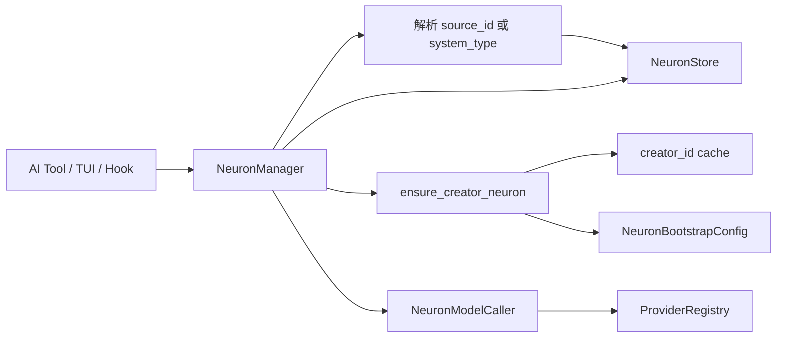

# Technical Plan / 技术方案: 神经元自举与工具契约

## Requirement Baseline / 需求基线

- 对应需求文档：`docs/sdd-lab/2026-07-28_23-43_neuron-bootstrap/requirements.md`
- 需求确认状态：用户已确认需求边界，并要求生成技术方案。
- 本方案覆盖范围：神经元模型与 SQLite 迁移、管理服务、自举模型调用、候选选择、AI 工具、人类 TUI 入口及配置文档。
- 下游依赖：`docs/sdd-lab/2026-07-26_21-30_assistant-mode/` 后续通过本方案提供的神经元候选与工具权限数据接入。
- 不覆盖：Assistant 模式、Hook 编排、Poller、Provider 协议重构。

## Current Project Facts / 当前项目事实

- `core/models.rs`
  - `Neuron` 当前只有 `id/desc/content/weight/created_at/updated_at`。
  - `NeuronUpdate` 当前允许直接设置 `weight`。
  - `ModelCallRequest/ModelCallResponse` 已可表达无会话模型调用。
- `core/neuron_store.rs`
  - `neurons` 表没有 `system_type` 和 `tool_ids`。
  - `connections` 是 `source → target` 有向边，并启用 `ON DELETE CASCADE`。
  - Store 当前支持 CRUD、link/unlink 和双向 BFS，不支持按系统类型查找、直接下游查询、原子权重增量或候选选择。
- `core/neuron_manager.rs`
  - `NeuronManager` 只持有 Store 并负责注册工具，业务逻辑分散在 8 个 Tool 实现中。
  - 当前 AI 可直接 create/delete/link/unlink，也可通过 update 覆盖绝对权重，与新需求冲突。
- `core/providers.rs`
  - `ProviderRegistry::call_model` 是具体实现，不存在可替换 Provider trait。
  - `.agent-app/config.json` 的解析结构私有且仅覆盖 defaults/providers。
- `core/gateway.rs`
  - Gateway 创建 ProviderRegistry、Store 和 ToolRegistry，是注入神经元模型调用适配器及配置读取器的组装点。
- `core/tool_registry.rs`
  - `Tool::name()` 当前同时承担注册 key 和模型工具名，可作为稳定工具 ID。
  - `with_defaults_and_topics_and_neurons` 当前把 Store 传给 NeuronManager，并存在 `runtime_manager` 未定义、应为 `session_tracker` 的编译错误。
- `tui/app.rs`
  - `/neuron` 直接操作 NeuronStore；更新支持绝对 weight，未经过统一业务约束。

## Exec Scheme Bridge / 执行方案桥接

### 1. 改动依赖范围内的能力与代码现实

| 能力 | 现状 | 证据 |
| --- | --- | --- |
| 神经元模型 | 缺 `system_type/tool_ids`，update 含 weight | `core/models.rs:Neuron/NeuronUpdate` |
| 神经元持久化 | 需扩字段、唯一索引、事务与候选查询 | `core/neuron_store.rs:NeuronStore` |
| 神经元业务层 | 需从“注册器”升级为统一服务 | `core/neuron_manager.rs:NeuronManager` |
| 模型调用 | 具体 ProviderRegistry 可用，但需适配后注入 | `core/providers.rs:ProviderRegistry::call_model` |
| 默认模型选择 | 已可解析 defaults.provider/model | `core/providers.rs:ProviderRegistry::default_model_selection` |
| 工具执行 | async Tool 足以承载候选补齐 | `core/tool_registry.rs:Tool` |
| 人类入口 | `/neuron` 已存在，但直接访问 Store | `tui/app.rs:handle_neuron_action` |

### 2. 外部依赖：包与本任务用到的精确 API

| 包 | 本任务使用的 API | 备注 |
| --- | --- | --- |
| `rusqlite 0.32.1`（lockfile） | `Connection::execute_batch`、`Connection::transaction`、`Transaction::execute`、`params!`、`query_map` | 完成迁移、唯一索引、权重原子增量、创建节点与连边事务 |
| `serde 1.x` | `Serialize`、`Deserialize` | 扩展 Neuron、配置和模型生成结果类型 |
| `serde_json 1.0.151`（lockfile） | `from_str`、`to_string` | `tool_ids` JSON 存储及模型输出解析 |
| `async-trait 0.1.91`（lockfile） | `#[async_trait]` | 定义可替换的异步神经元模型调用接口 |
| `tokio 1.53.1`（lockfile） | 现有 async runtime | 执行模型调用和异步 AI/TUI 候选入口；不新增并发模型 |
| `async-openai 0.41.1`（lockfile） | 继续由 `ProviderRegistry::call_model` 间接使用 | 神经元模块不直接引用 async-openai 类型 |

不新增 `rand`：同权重随机由 SQLite `ORDER BY weight DESC, RANDOM()` 完成。

### 3. 设计契约

技术文档出处：`requirements.md` 的 Data Contract、Bootstrap、Candidate Selection、Capability Exposure。

目标最小契约：

```rust
pub struct Neuron {
    pub id: String,
    pub desc: String,
    pub content: String,
    pub weight: f64,
    pub system_type: Option<String>,
    pub tool_ids: Vec<String>,
    pub created_at: u128,
    pub updated_at: u128,
}

pub struct NeuronUpdate {
    pub desc: Option<String>,
    pub content: Option<String>,
}

pub struct CandidateQuery {
    pub n: usize,
    pub source_id: Option<String>,
    pub system_type: Option<String>,
    pub min_new: usize,
}

#[async_trait]
pub trait NeuronModelCaller: Send + Sync {
    async fn call_model(&self, system_prompt: &str, user_prompt: &str)
        -> AppResult<String>;
}
```

相对需求文档的实现细化：

| 项目 | 说明 |
| --- | --- |
| 工具 ID | 沿用现有 `Tool::name()` 作为稳定 ID，不额外引入第二套 ID；依据是 ToolRegistry 当前以 name 为唯一 key。 |
| call_model 注入 | 使用 `Arc<dyn NeuronModelCaller>` 注入，而不是把 ProviderRegistry 传入 NeuronManager；保持可测试性和 Provider 解耦。 |
| 创建与连边 | 模型调用在事务外完成；合法草稿产生后，数据库“插入节点 + 插入边”在同一事务提交。网络请求无法纳入 SQLite 事务。 |
| 同权重随机 | 使用 SQLite `RANDOM()`，避免新增依赖。 |
| `source_id/system_type` | API 使用 snake_case；两者同时存在时在 Manager 层优先解析 `source_id`。 |

## Open Questions / 开放问题

当前没有阻塞技术方案的问题。以下实现默认值已由需求或代码现实确定：

- 工具稳定 ID 使用现有工具名。
- `source_id` 优先于 `system_type`。
- `system_type` 只解析唯一系统节点；除 `create_neuron` 外不自动创建未知系统类型。
- 生成单个神经元使用一次模型调用；批量补齐按数量逐个调用，任一失败即停止并返回错误，已成功持久化的前序节点保留并可供下次补齐复用。

## Solution Options / 方案候选

### Option A / 方案 A：NeuronManager 统一业务服务

- 推荐：是。
- 方案摘要：Store 只负责原子数据操作；NeuronManager 持有 Store、模型调用器、配置读取器和创建节点缓存，统一承载自举、候选选择、AI 权限与人类管理方法；Tool/TUI 只做参数适配。
- 优点：
  - 自举和候选流程集中，不在 Tool、TUI、Gateway 重复。
  - 能为模型调用提供 Mock，测试无需真实 Provider。
  - AI 与人类入口可复用业务能力，同时保留不同权限方法。
- 缺点：需要重构现有 Neuron Tool 的持有对象和 Gateway 组装。
- 风险：Manager 含 async 流程，必须避免跨 await 持有 `std::sync::MutexGuard`。

### Option B / 方案 B：继续以 Store 为中心扩展

- 推荐：否。
- 方案摘要：把自举、call_model 和候选补齐直接加入 NeuronStore，各工具继续直接持有 Store。
- 优点：改动文件较少。
- 缺点：
  - 数据访问层将依赖模型和配置，职责混乱。
  - TUI、Tool 和 Hook 容易绕过权限规则。
  - 模型调用跨越数据库锁，死锁和阻塞风险更高。
- 风险：后续 Assistant 接入时再次拆层。

## Decision / 方案决策

- Selected / 选定方案：Option A，NeuronManager 统一业务服务。
- Why / 选择原因：符合“所有神经元相关逻辑收束”和可注入 call_model 的需求，并保留 Store 的纯持久化边界。
- Decision Owner / 决策人：用户。
- Decision Time / 决策时间：2026-07-28 23:58。
- Open Questions 状态：无阻塞项。

## API Design / API 设计

### Contract Scope / 契约范围

- 变更类型：扩展并收紧现有契约。
- 消费方：Neuron AI Tools、TUI `/neuron`、后续 Assistant/Hook。
- 真相源：`core/models.rs`、`core/neuron_manager.rs`、`core/neuron_store.rs`。

### 数据类型

- `Neuron.system_type: Option<String>`：系统用途；数据库非空值唯一。
- `Neuron.tool_ids: Vec<String>`：允许工具名集合，数据库保存 JSON 数组。
- `NeuronUpdate`：只保留 `desc/content`。
- `NeuronCreate`（内部）：`desc/content/weight/system_type/tool_ids`，原始创建不暴露为 AI Tool。
- `CandidateQuery`：
  - `n: usize`
  - `source_id: Option<String>`
  - `system_type: Option<String>`
  - `min_new: usize`
- `GeneratedNeuronDraft`：严格解析模型输出的 `desc/content/weight/tool_ids`；`system_type` 始终由内部决定，不接收模型值。
- `NeuronBootstrapConfig.create_neuron_prompt: Option<String>`：来自 `.agent-app/config.json`。

### NeuronModelCaller

```rust
#[async_trait]
pub trait NeuronModelCaller: Send + Sync {
    async fn call_model(
        &self,
        system_prompt: &str,
        user_prompt: &str,
    ) -> AppResult<String>;
}
```

- `DefaultNeuronModelCaller` 由 Gateway 创建，内部持有 ProviderRegistry。
- 每次调用读取默认 provider/model，构造 `ModelCallRequest { tools: None }`。
- 神经元模块只接收 trait object，不读取 API key/base URL。

### NeuronStore

目标公开/包内方法：

- `create_neuron(create: NeuronCreate) -> AppResult<Neuron>`
- `get_neuron(id) -> AppResult<Option<Neuron>>`
- `get_neuron_by_system_type(system_type) -> AppResult<Option<Neuron>>`
- `list_neurons() -> AppResult<Vec<Neuron>>`
- `update_neuron(id, NeuronUpdate) -> AppResult<Neuron>`
- `adjust_weight(id, delta) -> AppResult<Neuron>`
- `create_downstream_neuron(source_id, create, edge_weight) -> AppResult<(Neuron, Connection)>`
- `list_direct_downstream(source_id, limit, excluded_ids) -> AppResult<Vec<Neuron>>`
- `list_global_candidates(limit, excluded_ids) -> AppResult<Vec<Neuron>>`
- 现有 `delete_neuron/link/unlink/get_connections/get_network` 保留给管理入口。

### NeuronManager

目标职责方法：

- `new(store, model_caller, config_reader) -> Self`
- `register_ai_tools(self: Arc<Self>, registry: &mut ToolRegistry)`
- `update_for_ai(id, update)`：拒绝更新系统节点。
- `update_for_admin(id, update)`：允许人类更新内容，不允许借此改 weight/system_type/tool_ids。
- `adjust_weight(id, delta)`：内部与人类入口使用。
- `create_downstream(...)`：AI 与人类均可使用。
- `select_candidates(query) -> async AppResult<Vec<Neuron>>`：AI 与人类均可使用。
- `set_system_type/set_tool_ids`：仅人类管理入口。
- `ensure_creator_neuron/create_generated_neuron`：私有自举能力。

### AI Tool 目标集合

保留：

- `get_neuron`
- `list_neurons`
- `update_neuron`
- `get_network`

新增：

- `create_downstream_neuron`
  - 参数：`source_id`、`desc`、可选 `content`
  - 不接受 `weight` / `edge_weight` / `system_type` / `tool_ids`；落库节点与边权重强制为 `0`
- `select_neuron_candidates`
  - 参数：`n`、可选 `source_id`、可选 `system_type`、`min_new`
  - 同时传来源时 `source_id` 优先

不再向普通 AI 注册：

- 原始 `create_neuron`
- `delete_neuron`
- `link_neurons`
- `unlink_neurons`
- 权重调整、system_type/tool_ids 管理、自举修复

### 配置契约

`.agent-app/config.json` 增加：

```json
{
  "neurons": {
    "bootstrap": {
      "create_neuron_prompt": "输出一个可用于指导模型创建神经元的系统提示词"
    }
  }
}
```

- Provider 配置继续忽略不认识的字段。
- 神经元配置读取器只读取 `neurons.bootstrap`。
- 缺少 prompt 不阻止应用启动；首次需要自举创建时返回明确配置错误。
- 创建出的 `system_type=create_neuron` 节点，其 `content` 等于该配置值。

### 模型生成协议

- system message：`system_type=create_neuron` 节点的 `content`。
- user message：包含创建目标、可选来源神经元摘要，并要求只返回 JSON。
- 期望原始 JSON：

```json
{
  "desc": "短描述",
  "content": "完整提示词或知识内容",
  "tool_ids": []
}
```

- 空 desc、空 content 或非数组 tool_ids 均视为无效结果。
- 模型输出中的 `weight` / `system_type` 即使存在也忽略；落库节点权重强制 `0`，普通生成节点 `system_type` 固定为 `None`。

### 数据库迁移

- `neurons` 增加：
  - `system_type TEXT NULL`
  - `tool_ids TEXT NOT NULL DEFAULT '[]'`
- 创建部分唯一索引：

```sql
CREATE UNIQUE INDEX IF NOT EXISTS idx_neurons_system_type_unique
ON neurons(system_type)
WHERE system_type IS NOT NULL;
```

- `init_table` 先创建基础表，再通过 `PRAGMA table_info(neurons)` 判断列是否存在并执行 `ALTER TABLE`，兼容已有 `app.db`。
- 既有数据迁移为 `system_type=NULL`、`tool_ids=[]`。
- 行读取统一解析 tool_ids；非法历史 JSON 返回 StorageError，不静默放大权限。

## Data Flow / 数据流



候选算法：

1. 校验 `min_new <= n`；`n=0` 时只允许 `min_new=0` 并返回空集合。
2. 若有 `source_id`，校验节点存在并作为来源；否则若有 `system_type`，查唯一系统节点作为来源；否则来源为空。
3. 先通过自举创建 `min_new` 个新节点；有来源时原子连接为直接下游。
4. 从目标集合按 `weight DESC, RANDOM()` 选择最多 `n - min_new` 个旧节点，排除本轮新节点和重复项。
5. 若总数不足 `n`，继续逐个自举创建并补齐。
6. 返回恰好 `n` 个不重复节点；创建失败则返回错误，已成功创建节点留作下次候选复用。

## Execution Steps / 执行步骤

### Step 0. 执行前检查

- 用户确认 Option A 并明确批准执行。
- 重读需求文档，确认 `source_id` 命名、AI 工具集合和配置契约没有变化。
- 不覆盖工作树中其他 Assistant 相关未提交改动。

### Step 1. 扩展配置与模型契约

#### 文件：`packages/agent-app/src-tauri/src/core/models.rs`

- 新增 Neuron 字段、NeuronCreate、CandidateQuery、GeneratedNeuronDraft。
- 从 NeuronUpdate 移除 weight。

#### 文件：`packages/agent-app/src-tauri/src/core/error.rs`

- 新增语义明确的神经元不存在、系统类型不存在和自举失败错误；不再用 `ConversationNotFound` 表示神经元错误。
- 保持模型配置、认证和调用失败的既有错误语义。

#### 文件：`packages/agent-app/src-tauri/src/core/neuron_config.rs`（新增）

- 读取 `.agent-app/config.json` 的 `neurons.bootstrap`。
- 配置缺失延迟到自举调用时报错。

#### 文件：`packages/agent-app/src-tauri/src/core/neuron_model.rs`（新增）

- 定义 NeuronModelCaller trait 和 DefaultNeuronModelCaller。
- 适配 ProviderRegistry 默认模型选择及 call_model。

#### 文件：`packages/agent-app/src-tauri/src/core/mod.rs`

- 注册模块并保守导出必要契约。

### Step 2. 数据迁移与原子 Store 能力

#### 文件：`packages/agent-app/src-tauri/src/core/neuron_store.rs`

- 实现兼容已有 app.db 的增量迁移和 system_type 唯一索引。
- 更新所有 SELECT/row mapper。
- 新增按 system_type、直接下游、全域权重候选查询。
- 新增原子 delta 权重更新。
- 新增事务化创建下游节点。
- 保留删除级联连接语义。

### Step 3. 收束 NeuronManager

#### 文件：`packages/agent-app/src-tauri/src/core/neuron_manager.rs`

- Manager 持有 Store、Arc<dyn NeuronModelCaller>、配置读取器和 creator ID 缓存。
- 实现 creator 查找/创建/缓存恢复。
- 实现严格模型 JSON 解析和普通神经元创建。
- 实现 `select_candidates` 来源优先级、min_new 和自动补齐。
- 区分 AI 更新与人类管理方法。
- 将 Tool 实现改为持有 `Arc<NeuronManager>`，避免各自复制业务逻辑。
- 调用模型期间不持有 Store/SQLite MutexGuard。

### Step 4. 调整工具注册与 Gateway 组装

#### 文件：`packages/agent-app/src-tauri/src/core/tool_registry.rs`

- 构造函数接收已实例化的 Arc<NeuronManager>。
- 注册目标 AI 工具集合。
- 修正 `runtime_manager` 为 `session_tracker`。
- 明确 `Tool::name()` 是 tool_ids 的稳定 ID。

#### 文件：`packages/agent-app/src-tauri/src/core/gateway.rs`

- 构造 DefaultNeuronModelCaller、NeuronConfigReader 和单例 NeuronManager。
- 将同一 Manager 注入 ToolRegistry，并向 TUI 暴露人类管理门面。
- 保持 ProviderRegistry 和 Engine 的既有调用行为。

### Step 5. 更新人类管理入口

#### 文件：`packages/agent-app/src-tauri/src/tui/app.rs`

- `/neuron set` 仅处理 desc/content。
- 增加 delta 权重命令。
- 增加候选命令，支持 `--source-id`、`--system-type`、`--min-new`。
- 增加 system_type/tool_ids 管理和自举诊断入口。
- 从直接调用 Store 改为调用 Gateway/NeuronManager。
- 候选和自举调用改为 async await。

#### 文件：`packages/agent-app/src-tauri/src/tui/commands.rs`

- 更新 `/neuron` 帮助文本和参数说明。

#### 文件：`docs/agent-app/storage.md`

- 增加 `neurons.bootstrap.create_neuron_prompt` 配置示例与缺失行为。

### Step 6. 测试与验证

#### 单元测试

- Store：
  - 旧表迁移后字段默认值正确。
  - system_type 非空唯一。
  - update 不能设置 weight。
  - delta 正负更新正确且原子。
  - 创建下游节点和边同事务成功/失败。
  - 直接下游不混入上游或递归后代。
- Manager：
  - Mock ModelCaller 下首次自举创建 creator，后续命中缓存。
  - creator 删除后缓存恢复并重建。
  - `source_id` 优先于 system_type。
  - 无来源走全域；system_type 走对应直接下游。
  - `min_new` 和不足补齐返回恰好 n 个。
  - AI 更新拒绝系统节点。
  - 模型非法 JSON 不写入节点。
- Tools/TUI：
  - JSON Schema 使用 `source_id`。
  - 只注册允许的 AI 工具。
  - 人类候选参数解析正确。

#### 命令

- `cargo fmt --check`
- `cargo check`
- `cargo test`

工作目录：`packages/agent-app/src-tauri`

### Step 7. 回写

#### 文件：`docs/sdd-lab/2026-07-28_23-43_neuron-bootstrap/lifecycle.md`

- 记录实际 API、迁移结果、工具集合和验证证据。
- 若实现与本方案契约发生偏差，先回写 requirements/technical-plan，再继续代码。

#### 文件：`docs/sdd-lab/2026-07-26_21-30_assistant-mode/requirements.md`

- 前置迭代完成后，仅回写依赖状态；Assistant 仍单独进入技术方案与执行。

## Risk And Mitigation / 风险与缓解

- 风险：SQLite ALTER TABLE 在既有数据库上重复执行失败。
  - 缓解：PRAGMA 检测列后迁移，唯一索引使用 IF NOT EXISTS。
- 风险：system_type 历史重复值导致唯一索引失败。
  - 缓解：新增字段默认 NULL；只有管理入口写入，写前检查并依赖数据库唯一约束兜底。
- 风险：模型调用期间持锁阻塞 TUI 或工具。
  - 缓解：网络 await 前释放所有 std MutexGuard，只在短数据库操作阶段加锁。
- 风险：批量补齐部分成功。
  - 缓解：每个节点独立验证和事务提交；失败返回已发生事实，下次调用复用已创建节点，不尝试跨网络全局回滚。
- 风险：AI 候选工具触发大量模型调用。
  - 缓解：严格校验 `n/min_new`，技术实现设置合理上限；上限值在执行前按现有模型成本策略确定。
- 风险：工具名作为稳定 ID 后发生重命名。
  - 缓解：本次不重命名既有保留工具；未来重命名必须提供 tool_ids 数据迁移。
- 风险：TUI 继续绕过 Manager。
  - 缓解：本迭代将所有 `/neuron` 写操作迁移到 Gateway/Manager 门面。

## Execute Checkpoint / 执行检查点

- 当前理解：技术方案已生成，需求和目标 API 已固定为 snake_case。
- 核心目标：先完成独立神经元能力，再让 Assistant 消费稳定的自举、候选和工具权限契约。
- 下一步动作：用户审阅并确认 Option A；明确批准后才修改 Rust 代码。
- 主要风险：数据库迁移、异步模型调用持锁、批量补齐部分成功和 AI 调用成本。
- 验证方式：迁移/Manager/Tool/TUI 单元测试 + cargo fmt/check/test。
