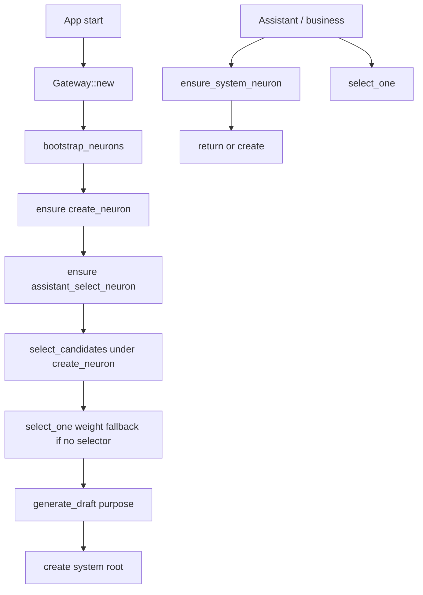

# Technical Plan / 技术方案: 神经元系统提示词自举完备

## Requirement Baseline / 需求基线

- 对应需求文档：`docs/sdd-lab/2026-07-29_22-50_neuron-system-prompt-ready/requirements.md`
- 前置：`neuron-bootstrap`（已完成）、`assistant-mode`（已完成，本迭代将反向同步其取提示词方式）
- 需求确认状态：Q1–Q7 已关闭；本方案等待用户确认后执行
- 本方案覆盖：`NeuronManager` 选一 / 创建 / ensure / bootstrap_ready / 重置；候选 pool 规则；去掉 `CandidateQuery.system_type`；Assistant 改调新 API；Gateway 启动初始化
- 不覆盖：启动批量创建全部 `assistant_*`；课题 / Poller / 工具权限模型重做

## Current Project Facts / 当前项目事实

- `NeuronManager::select_candidates`：支持 `n/source_id/system_type/min_new`；`resolve_source` 用 `system_type` 解析来源；不足时 `create_generated_neuron`
- `NeuronStore::list_direct_downstream` / `list_global_candidates`：SQL 均带 `system_type IS NULL`，与需求「不排除系统节点」冲突，需改
- `ensure_creator_neuron`：仅服务 `create_neuron`；种子只读配置，缺配置即失败——需加代码默认文案
- `assistant_mode::call_system_prompt_json`：`get_neuron_by_system_type`，缺失硬失败；`SelectNeuronBeforeHook` 内联 7 选 1
- AI 工具 `select_neuron_candidates` 与 TUI `/neuron candidates` 仍暴露 `--system-type`
- `Gateway::new` 为同步；神经元 bootstrap 含 LLM，启动初始化必须是 **async** 入口

## Exec Scheme Bridge / 执行方案桥接

### 1. 改动依赖范围内的能力与代码现实

| 能力 | 现状 | 本迭代动作 |
| --- | --- | --- |
| `CandidateQuery` | 含 `system_type` | 删除字段 |
| `select_candidates` | 经 `resolve_source(system_type)` | 仅 `source_id`；去掉 resolve 的 type 分支（`bootstrap_creator_candidates` 改为先 ensure creator 再传 id） |
| `list_*_candidates` | 过滤系统节点 | 去掉 `system_type IS NULL` |
| `ensure_creator_neuron` | 仅配置种子 | 配置优先，否则 `DEFAULT_CREATE_NEURON_PROMPT` |
| 选一 / ensure / 创建 / reset / bootstrap | 无或散落在 Assistant | 收束到 `NeuronManager` |
| Assistant 取系统提示词 | 硬失败 | `ensure_system_neuron` / `get_system_prompt` |
| Gateway 启动 | 无 bootstrap_ready | 增加 `async bootstrap_neurons`，TUI/CLI 启动 await |

### 2. 外部依赖：包与本任务用到的精确 API

| 包 | API | 备注 |
| --- | --- | --- |
| `serde` / `serde_json 1.0.x` | `Deserialize` 裁决 JSON、`to_string` | 与现有一致 |
| `async-trait 0.1.x` | 既有 `NeuronModelCaller` | 不新增 crate |
| `rusqlite 0.32.x` | `params!`、查询改写 | 候选 SQL |
| `rand` | **不新增**；同权随机用 `ORDER BY RANDOM()` 已有，或 `weight` 并列时在内存 `fastrand`/`std` 抽样——优先复用 SQL `RANDOM()` / 现有模式 | 若需纯 Rust 随机，用已有依赖或 `slice` 洗牌简易实现 |

### 3. 设计契约

相对需求原文的实现细化：

| 项目 | 契约 |
| --- | --- |
| `select_one` | 先 `select_candidates(n=7, source_id?, min_new=0)`（或接受已给候选）；再 LLM 裁决或权重兜底 |
| 创建提示词 | `source_id = create_neuron.id` 上做 pool→7→1，胜者 `content` 作为「创建用」system；再以 purpose/msgs 调模型得 `GeneratedNeuronDraft` |
| ensure 系统根 | 已存在且非 reset → 返回；否则在约定源（默认 `create_neuron`）上选一 → `generate_draft(purpose=为 {system_type} 写系统提示词)` → `create_neuron(NeuronCreate { system_type: Some(...), ... })` 无上游边 |
| `bootstrap_ready` | ensure `create_neuron` → ensure `assistant_select_neuron`（内部会走选一；尚无裁决提示词时权重兜底） |
| 重置 | 查根 → 删所有 `source=根` 与 `target=根` 的一级边 → 删根节点 → ensure 重建 |
| Assistant | `call_system_prompt_json` 改为 `manager.ensure_system_neuron(system_type)` 取 content；选神经元改 `manager.select_one(...)` |

## Open Questions / 开放问题

当前无阻塞方案的未决问题。以下为方案默认值（确认方案即一并确认）：

- ensure 其它 `assistant_*` 时默认 `source_id = create_neuron.id`；调用方可覆盖为 `None`（全域）或其它源。
- `generate_draft` 在创建普通神经元时：system = 选一胜者的 content；user = purpose 或序列化 msgs；输出仍为既有 JSON schema。
- Gateway 测试默认**不**自动打真实 LLM bootstrap；单测用 mock `NeuronModelCaller` 覆盖 bootstrap/ensure。

## Solution Options / 方案候选

### Option A / 方案 A：能力全收 `NeuronManager` + Gateway 显式 async bootstrap（推荐）

- 推荐：是
- 摘要：新 API 全部挂在 Manager；`Gateway::bootstrap_neurons().await` 在 TUI/CLI `main` 启动后调用；Assistant 只依赖 Manager
- 优点：边界清、可测、符合需求「不依赖业务预置」
- 缺点：所有异步入口都要记得 await bootstrap（漏调则首次 ensure 仍可补救）

### Option B / 方案 B：Assistant 内保留选一，仅加 ensure

- 推荐：否
- 缺点：违反「7 选 1 迁移到 Manager」

## Decision / 方案决策

- Selected：Option A
- Decision Owner：用户
- Decision Time：2026-07-29 23:53
- Open Questions 状态：无阻塞项

## API Design / API 设计

### `CandidateQuery`（改写）

```rust
pub struct CandidateQuery {
    pub n: usize,
    pub source_id: Option<String>,
    pub min_new: usize,
    // system_type 删除
}
```

### `NeuronManager` 新增/调整

```rust
/// pool → 7 → 1；无裁决提示词或 LLM 失败 → 权重+同权随机
pub async fn select_one(&self, query: CandidateQuery) -> AppResult<Neuron>;

/// 或对已有候选选一（长度建议 7，允许其它）
pub async fn select_one_from(&self, candidates: &[Neuron]) -> AppResult<Neuron>;

/// 创建普通神经元：取创建提示词(select_one under create_neuron) + 模型生成 + 落库；可选挂到 parent
pub async fn create_generated(
    &self,
    input: CreateNeuronInput, // Purpose(String) | Messages(Vec<...>)
    link_to: Option<&str>,
) -> AppResult<Neuron>;

/// 获取系统提示词根；缺失则补齐。reset=true 时先断一级边、删根再重建
pub async fn ensure_system_neuron(
    &self,
    system_type: &str,
    reset: bool,
) -> AppResult<Neuron>;

/// 启动完备：create_neuron + assistant_select_neuron
pub async fn bootstrap_ready(&self) -> AppResult<BootstrapReadyReport>;

pub fn ensure_creator_neuron(&self) -> AppResult<Neuron>; // 已有，改为配置∥默认文案
```

常量：

- `create_neuron`
- `assistant_select_neuron`（及 Assistant 仍使用的其它 `assistant_*` 字符串，ensure 时按需）

默认种子：需求文档 Default Seed 原文落入 `neuron_config.rs` 或 `neuron_manager.rs` 的 `DEFAULT_CREATE_NEURON_PROMPT`。

### Store 增量

```rust
// list_direct_downstream / list_global_candidates：去掉 system_type IS NULL

pub fn unlink_all_edges_of(&self, neuron_id: &str) -> AppResult<usize>;
// 删除 source=id OR target=id 的边，不删其它节点
```

### Assistant 改写

- `SelectNeuronBeforeHook` → `neuron_manager.select_one(CandidateQuery { n: 7, source_id, min_new: 0 })`
- `call_system_prompt_json` → 先 `ensure_system_neuron(system_type, false)`，再用返回 content 调模型
- 首次对话若未 bootstrap：ensure 内会阻塞补齐（满足 Q6）

### Gateway

```rust
pub async fn bootstrap_neurons(&self) -> AppResult<()>;
// 内部 neuron_manager.bootstrap_ready()
```

`agent-app-tui` / `agent-app-cli`：`Gateway::default()` 之后 `bootstrap_neurons().await`（失败则日志/可恢复错误，不静默吞掉关键路径）。

### TUI / AI 工具

- `/neuron candidates`：删除 `--system-type`
- `select_neuron_candidates` schema：删除 `system_type`
- 可选：`/neuron bootstrap`、`/neuron ensure <system_type>`、`/neuron reset-system <system_type>` 便于人工运维（非必须，建议做最小 ensure/reset）

## Data Flow / 数据流



## Execution Steps / 执行步骤

### Step 0

- 用户确认 Option A 与方案默认值
- 冻结默认种子文案（可后换配置覆盖）

### Step 1. 模型与 Store

- `models.rs`：删 `CandidateQuery.system_type`
- `neuron_store.rs`：候选查询去过滤；`unlink_all_edges_of`
- 单测：全域候选可含系统节点；有源仅直接下游

### Step 2. Config 默认文案

- `create_neuron_prompt()`：有配置用配置，否则返回 `DEFAULT_CREATE_NEURON_PROMPT`
- `docs/agent-app/storage.md`：注明默认回退

### Step 3. Manager API

- 实现 `select_one` / `select_one_from`、`create_generated`、`ensure_system_neuron`、`bootstrap_ready`
- 改写 `select_candidates`、`bootstrap_creator_candidates`、`ensure_creator_neuron`
- 更新 AI 工具与既有单测

### Step 4. Assistant + Gateway + TUI

- Assistant 改调用
- Gateway `bootstrap_neurons` + 入口 await
- TUI candidates 参数清理；可选 ensure/reset 命令

### Step 5. 反向同步

- 轻量回写 `assistant-mode` / `neuron-bootstrap` 需求中「缺失即失败 / select 含 system_type」的过时表述（或加指针到本迭代）

### Step 6. 验证

- `cargo fmt --check` / `cargo check` / `cargo test`
- 重点：默认文案 ensure creator；select_one 兜底；ensure 幂等；reset 只断边；工具无 system_type；Assistant 编译路径

## Risk And Mitigation / 风险与缓解

- 风险：bootstrap 依赖真实 LLM，CI 无密钥失败  
  - 缓解：单元测试 mock `NeuronModelCaller`；集成测试标记 ignore 或可选
- 风险：无源全域含系统根，选一可能选中另一系统提示词  
  - 缓解：按需求接受；创建链路默认带 `create_neuron` 源
- 风险：ensure 嵌套多次 LLM 成本高  
  - 缓解：bootstrap 只做 selector；其它懒 ensure；幂等跳过
- 风险：`list_direct_downstream` 去过滤后行为变化  
  - 缓解：单测锁定；文档写明

## Execute Checkpoint / 执行检查点

- 状态：已完成（2026-07-29 23:58）。
- 验证：`cargo fmt --check` / `cargo check` / `cargo test`（57 passed）。
- 偏差：启动 bootstrap 失败时 TUI/CLI 仅 warning，首次 ensure 仍可阻塞补齐（符合懒 ensure）。
