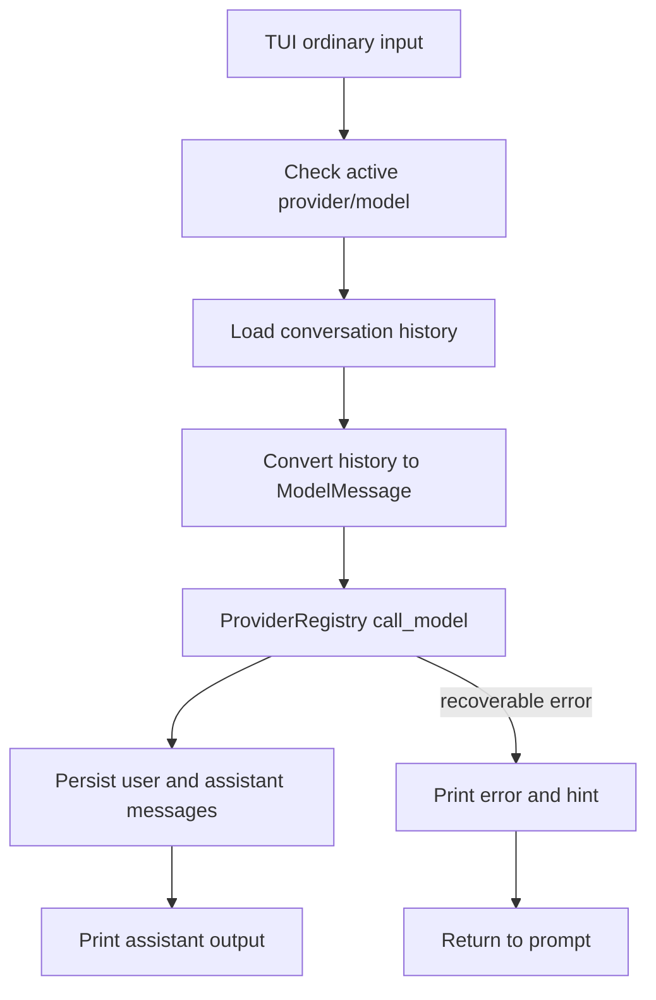

# Spec: TUI 会话聊天二期

## Goal

为 `agent-app` TUI 增加可用的会话型模型聊天体验，修复当前普通输入只走本地占位回复、`/call` provider 错误会导致进程退出、模型清单硬编码且易过期的问题。

本轮目标是：

- TUI 普通输入走真实 provider-backed session chat。
- TUI 所有可恢复错误都只打印错误和提示，不退出进程。
- provider/model 选择进入 TUI 交互状态和配置文件。
- 模型清单从 Rust 静态代码迁移到配置层，便于后期调整。

## Problem

当前行为存在三个基础缺口：

- 普通输入调用 `Gateway::send_message`，但 `send_message` 仍使用本地 `AgentRuntime::respond`，返回 `Agent App 收到：...`，不是模型对话。
- `/call <provider> <model> <message>` 是无会话单次调用，错误从 `run().await?` 直接冒泡到 `main`，导致 TUI 退出。
- DeepSeek 模型在代码中写死为 `deepseek-chat` / `deepseek-reasoner`，但实际服务端可能只支持 `deepseek-v4-pro` / `deepseek-v4-flash`，模型列表不应靠发版更新。

## Scope

### In

- TUI 二期交互契约。
- provider/model 配置模型。
- 会话型 chat 调用链路。
- 可恢复错误处理。
- `/use <provider> <model>` 模型选择命令。
- `/call` 保留为无会话调试命令。
- Rust 单元测试和 TUI 手动 smoke。

### Out

- streaming 输出。
- tool calling 循环。
- 远端 models API 自动同步。
- 多 provider 自动路由。
- 凭据加密存储。
- 全屏 TUI 布局。

## Configuration Contract

模型清单和默认选择放入 `.agent-app/config.json`。环境变量仍可覆盖 API key/base URL，但不负责表达模型清单。

示例：

```json
{
  "defaults": {
    "provider": "deepseek",
    "model": "deepseek-v4-flash"
  },
  "providers": {
    "deepseek": {
      "api_key": "...",
      "api_base": "https://api.deepseek.com/v1",
      "models": [
        {
          "id": "deepseek-v4-flash",
          "display_name": "DeepSeek V4 Flash",
          "capabilities": {
            "chat": true,
            "tools": false,
            "streaming": false
          }
        },
        {
          "id": "deepseek-v4-pro",
          "display_name": "DeepSeek V4 Pro",
          "capabilities": {
            "chat": true,
            "tools": false,
            "streaming": false
          }
        }
      ]
    }
  }
}
```

Rules:

- API key 不能写入文档真实示例，也不能提交真实配置。
- `providers.<id>.models` 是该 provider 的模型清单来源。
- `defaults.provider` / `defaults.model` 只表示 TUI 和 chat 默认选择，不改变 `/call` 的显式调用语义。
- 若配置文件没有模型清单，TUI 应提示用户补充配置或使用允许自由模型名的 provider。
- Rust 代码中可保留 provider kind、默认 base URL、环境变量名等稳定元数据，但不再把具体商业模型名作为唯一来源。

## Command Contract

### Startup

TUI 启动后必须展示：

- 当前 session id。
- 当前 provider/model，若未选择则显示 `not-selected`。
- 下一步提示。

示例：

```text
Agent App TUI
status> session=conv_x model=not-selected
hint> Run /providers, /models deepseek, then /use deepseek deepseek-v4-flash.
agent-app [no-model] conv_x>
```

### `/use <provider> <model>`

设置当前 TUI 会话使用的 provider/model。

Behavior:

- provider 不存在时返回 `provider_not_found`，不退出。
- model 不在配置清单中时返回 `model_not_found`，不退出。
- 成功后 prompt 更新为 `agent-app [provider/model] session>`。

### 普通输入

普通输入是会话型聊天。

Behavior:

- 未选择 provider/model 时返回 `model_not_selected`，并提示 `/use`。
- 已选择 provider/model 时，读取当前会话历史，追加当前用户输入，调用 provider。
- 调用成功后写入 user message 和 assistant message。
- 调用失败时不写入 assistant message；是否写入 user message 本轮采用“不写入”，避免失败请求污染 history。

### `/call <provider> <model> <message>`

保留为无会话调试命令。

Behavior:

- 不读取 session history。
- 不写入 session history。
- 错误只打印，不退出。
- 适合验证 key、base URL、模型名。

## Error Contract

TUI 只有以下情况退出：

- 用户输入 `/exit` 或 `/quit`。
- stdin EOF。
- 启动阶段无法初始化 storage/gateway。

所有命令处理阶段的错误都必须留在 loop 内处理：

```text
error [llm_request_failed]: 400 Bad Request ...
hint> Run /models deepseek to check configured models, or update .agent-app/config.json.
agent-app [deepseek/deepseek-v4-flash] conv_x>
```

建议 hint 规则：

- `model_not_selected`: 提示 `/use <provider> <model>`。
- `provider_auth_missing`: 提示设置对应环境变量或 `.agent-app/config.json`。
- `model_not_found`: 提示 `/models <provider>` 或更新配置文件。
- `llm_request_failed`: 显示 provider 原始错误摘要，并提示检查模型名/base URL/key。
- `invalid_input`: 显示命令 usage。

## Core Design

新增或改造会话型 chat API：

```rust
pub struct ChatOptions {
    pub provider_id: String,
    pub model_id: String,
    pub conversation_id: Option<String>,
}

impl Gateway {
    pub async fn send_model_message(
        &mut self,
        input: impl AsRef<str>,
        options: ChatOptions,
    ) -> AppResult<ChatResponse>;
}
```

Flow:



Notes:

- `ProviderRegistry::call_model` 继续保持无会话边界。
- `Gateway` 负责 session history 与 provider request 的桥接。
- TUI 不直接拼 provider 请求，只调用 core API。
- Tauri/CLI 后续可复用同一会话型 chat API。

## Provider / Model Registry Design

`ProviderRegistry` 调整为配置驱动：

- 读取 `.agent-app/config.json`。
- provider 稳定元数据可由代码提供默认值。
- model list 从配置读取。
- 配置里的 provider/model 覆盖或扩展代码默认元数据。
- `custom` / `ollama` 可继续允许未列出模型，但 TUI 仍优先展示配置清单。

第一版不做远端 models API 自动同步。原因是 OpenAI-compatible 服务的 models API 行为不一致，自动同步会引入额外失败面。

## TUI Loop Design

将 TUI loop 拆成可测试的 handler：

```rust
struct TuiState {
    active_provider_id: Option<String>,
    active_model_id: Option<String>,
}

enum TuiAction {
    Continue,
    Exit,
}

async fn handle_input(
    gateway: &mut Gateway,
    state: &mut TuiState,
    input: &str,
) -> AppResult<TuiAction>;
```

`main` loop 负责捕获每次 `handle_input` 的错误并继续：

```rust
match handle_input(&mut gateway, &mut state, input).await {
    Ok(TuiAction::Continue) => {}
    Ok(TuiAction::Exit) => break,
    Err(error) => print_tui_error(error),
}
```

这样 provider 错误不会再穿透到 `main`，也不会触发 pnpm 脚本失败。

## Validation

Rust tests:

- `/use` 成功设置 active provider/model。
- `/use` 未知 provider/model 返回错误但不要求退出。
- 普通输入未选择模型返回 `model_not_selected`。
- provider 调用失败时 history 不新增消息。
- provider 调用成功时 history 新增 user + assistant。
- 配置文件模型清单能被 registry 读取。

Manual smoke:

```bash
pnpm --filter agent-app tui
```

验证步骤：

- 输入错误 `/call deepseek wrong-model 你好`，确认 TUI 不退出。
- 输入普通文本但未 `/use`，确认提示选择模型。
- 输入 `/models deepseek`，确认展示配置模型。
- 输入 `/use deepseek deepseek-v4-flash`。
- 输入两轮普通文本，确认 assistant 正常回复。
- 输入 `/history`，确认写入多轮 user/assistant。

## Done Contract

完成必须满足：

- 文档明确 TUI 二期行为、配置格式、错误策略。
- 普通输入不再走本地占位回复。
- `/call` provider 错误不会导致 TUI 退出。
- provider/model 可通过配置文件调整，不需要改 Rust 代码里的模型名。
- TUI 启动、未选模型、错误模型、缺 key、LLM 失败都有明确提示。
- Rust 测试和手动 smoke 覆盖核心路径。

