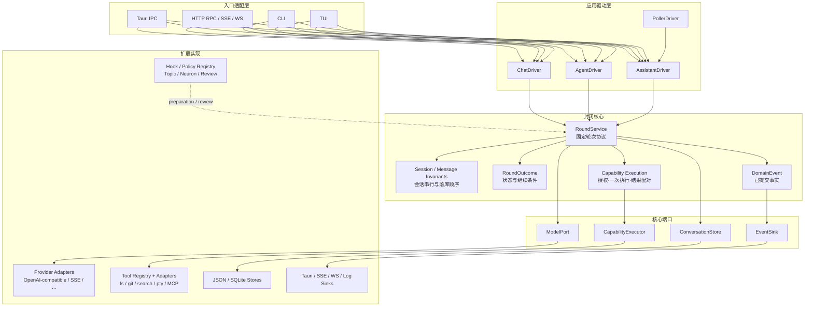

# Pulsar 后端架构设计：固定核心与扩展点

> 状态：**方案待批，未开始实现**。
> 本版按开放封闭原则重写，重点从“领域地图”调整为“固定核心 + 受控变化方向”。

## 一、设计目标

Pulsar 的后端应满足：增加新的驱动方式、模型供应商、工具、存储后端或传输入口时，固定核心不需要修改；已有会话语义、消息顺序、工具执行语义和对外 wire 契约保持不变。

开放封闭原则在本设计中的具体含义：

- **核心对运行语义封闭**：轮次如何成立、状态如何落库、能力调用如何完成、失败如何返回，由核心固定。
- **核心对变化来源开放**：驱动策略、hook、模型、工具、存储和传输通过契约接入。
- **扩展不能重定义核心事实**：扩展可以提供决策和实现，但不能改变消息真相源、轮次边界、一次性执行和结果语义。

## 二、固定核心

固定核心只包含不会因产品模式或外部技术替换而改变的运行协议。

### 2.1 轮次协议

一次 `Round` 是不可重入的应用操作，生命周期固定为：

```text
获取会话状态
→ 准备本轮输入
→ 生成模型请求
→ 调用模型
→ 执行本轮声明的能力
→ 持久化轮次结果
→ 发布结果事件
→ 返回 RoundOutcome
```

核心只负责一轮。是否开始下一轮由外部 `RoundDriver` 根据 `RoundOutcome` 决定。Chat、Agent、Assistant、Poller 都不能改变一轮内部顺序，也不能直接操作会话存储绕过轮次协议。

### 2.2 会话与消息不变量

会话是持久化状态，不是驱动器或入口的私有状态。核心固定以下不变量：

1. 每个会话有唯一真相源。
2. 消息按顺序追加，历史不会被入口层重排。
3. 进入模型 wire 的内容必须来自已落库历史、本轮输入或明确注册的准备策略。
4. 输入在模型调用前落库，模型产物和工具结果在调用后落库。
5. 同一会话同一时刻只有一个活动轮次。
6. 轮次失败时，已经落库的输入不回滚、不丢失。

存储介质可以从 JSON、SQLite 替换为其他实现，但不能改变这些不变量。

### 2.3 能力执行协议

模型声明的每个能力调用都经过同一条核心协议：

```text
ToolCall
→ 授权判断
→ 执行一次
→ 标准化 ToolResult
→ 应用上下文上限
→ 写入轮次结果
```

核心固定授权时机、一次性执行、调用结果配对、结果截断和失败表达。文件、Git、搜索、PTY、MCP 等都是能力实现，不得在各自实现中重新定义这套生命周期。

### 2.4 结果与事件语义

`RoundOutcome` 是驱动层唯一需要理解的轮次结果，至少包含：

```rust
pub struct RoundOutcome {
    pub session_id: ConversationId,
    pub response: ChatResponse,
    pub tool_calls_declared: bool,
    pub status: RoundStatus,
}
```

核心固定结果字段的含义和状态转换。事件只表达已发生的事实，例如会话受影响、运行会话变化、课题变化或工具状态变化；Tauri、SSE、WS 和 CLI 是事件消费者，不能重新解释业务状态。

### 2.5 并发、取消与失败边界

- 会话级串行闸由核心持有。
- 用户轮次可以取消当前后台轮次。
- 后台驱动遇到同会话忙状态时跳过，不创建第二个轮次。
- 网络、模型或工具失败必须转换为明确的领域错误或轮次状态。
- 不持锁跨网络、模型、PTY 或 Git 调用。
- 轮次完成后统一释放会话闸并发布结果事件。

这些规则属于运行语义，不属于某个入口、provider 或具体工具。

## 三、封闭核心契约

本节把固定核心落实为稳定的输入、输出和不变量。扩展实现只能通过这些契约进入核心，不能直接修改核心上下文。

### 3.1 核心唯一入口

```rust
#[async_trait]
pub trait RoundService: Send + Sync {
    async fn run(&self, request: RoundRequest) -> Result<RoundOutcome>;
}

pub struct RoundRequest {
    pub session_id: ConversationId,
    pub input: InputRecord,
    pub mode: RoundMode,
}
```

`RoundService::run` 是执行一轮的唯一入口。Entry Adapter、Driver 和 Hook 不得直接调用 Store、ModelPort 或 ToolExecutor 来拼出自己的轮次。

### 3.2 核心上下文

```rust
pub struct RoundContext {
    pub session: SessionSnapshot,
    pub messages: Vec<Message>,
    pub input: InputRecord,
    pub selected_model: ModelRef,
    pub authorized_tools: Vec<ToolDescriptor>,
}
```

核心负责创建和推进 `RoundContext`。扩展只能通过明确的准备结果影响上下文：

```rust
pub struct Preparation {
    pub messages_to_append: Vec<Message>,
    pub model_override: Option<ModelRef>,
    pub tool_policy: ToolPolicy,
    pub reload_session: Option<ConversationId>,
}
```

禁止扩展直接替换完整消息数组、直接写入 Store 或伪造已完成的工具结果。

### 3.3 模型端口

```rust
#[async_trait]
pub trait ModelPort: Send + Sync {
    async fn complete(&self, request: ModelRequest) -> Result<ModelResponse>;
}
```

核心只接受统一的 `ModelResponse`。Provider 可以选择协议、模型和重试方式，但必须将外部响应转换为统一结果；传输重试不得重复提交已经产生业务副作用的能力调用。

### 3.4 能力执行端口

```rust
#[async_trait]
pub trait CapabilityExecutor: Send + Sync {
    async fn execute(
        &self,
        call: AuthorizedToolCall,
    ) -> Result<ToolResult>;
}
```

核心对每个模型声明的 `ToolCall` 生成一个 `AuthorizedToolCall`，最多调用一次 `execute`，并将返回值规范化为 `ToolResult`。失败也必须生成可配对的结果记录，不能静默丢弃。

### 3.5 持久化端口

```rust
#[async_trait]
pub trait ConversationStore: Send + Sync {
    async fn load(&self, id: &ConversationId) -> Result<SessionSnapshot>;
    async fn append_input(&self, id: &ConversationId, items: &[Message]) -> Result<()>;
    async fn append_outcome(&self, id: &ConversationId, outcome: &PersistedOutcome) -> Result<()>;
}
```

核心规定调用顺序：先 `append_input`，再调用模型和能力，最后 `append_outcome`。Store 实现可以使用 JSON 或 SQLite，但不能把追加操作改成无序覆盖，也不能在输入落库后悄悄删除输入。

### 3.6 结果与事件端口

```rust
pub struct RoundOutcome {
    pub session_id: ConversationId,
    pub response: ChatResponse,
    pub tool_calls_declared: bool,
    pub status: RoundStatus,
}

pub trait EventSink: Send + Sync {
    fn publish(&self, event: DomainEvent);
}
```

`RoundOutcome` 是驱动器判断是否继续的唯一依据。`EventSink` 只发布已经提交的事实；事件消费者不能通过事件回写核心状态。

### 3.7 核心不变量表

| 契约 | 必须成立的条件 | 违反时 |
|---|---|---|
| 会话串行 | 同一 `session_id` 同时最多一个活动轮次 | 拒绝或跳过新轮次 |
| 输入持久化 | 模型调用前输入已成功追加 | 不调用模型，返回持久化错误 |
| 工具配对 | 每个声明的调用最多一个结果 | 轮次失败并记录错误 |
| 结果提交 | 产物和工具结果按 wire 顺序追加 | 不发布成功事件 |
| 事件事实性 | 事件只对应已提交状态 | 禁止发布成功事件 |
| 取消语义 | 取消后不再启动新的外部调用 | 返回 Cancelled 状态 |

## 四、新版架构图



图中的边界含义：入口和 Driver 可以增加；端口可以替换实现；Hook/Policy 可以增加；但 `RoundService`、会话不变量、能力执行协议和 `RoundOutcome` 的语义保持封闭。

## 五、受控扩展点

扩展点只对应已经确认的变化方向。每个扩展点由核心定义输入、输出和失败边界。

| 变化方向 | 扩展契约 | 扩展可以做什么 | 扩展不能做什么 |
|---|---|---|---|
| 下一轮由谁发起 | `RoundDriver` | 根据 `RoundOutcome` 决定是否继续、使用何种输入 | 改变单轮顺序、直接写消息 |
| 轮次前后附加业务 | `Hook` / `Policy` | 准备输入、裁决课题、复盘结果 | 绕过持久化、伪造核心结果 |
| 模型与供应商 | `ModelPort` / Provider Adapter | 将统一请求转换为供应商协议，返回统一响应 | 改变消息真相源、执行工具 |
| 工具与真实世界能力 | `Tool` / Capability Adapter | 声明、授权并执行具体能力 | 改变调用配对、绕过授权和结果上限 |
| 持久化介质 | `ConversationStore` 等 Store 接口 | 保存和读取核心状态 | 改变追加顺序和一致性语义 |
| 传输入口 | Entry Adapter | 将 IPC、HTTP、CLI、TUI 映射到应用用例 | 持有业务流程或独立实现一套会话逻辑 |
| 观测出口 | `EventSink` / `LogSink` | 将事实转成 UI、SSE 或日志输出 | 反向驱动领域状态 |

### 5.1 RoundDriver

驱动器只拥有循环策略，不拥有轮次实现：

```rust
#[async_trait]
pub trait RoundDriver: Send + Sync {
    async fn run(&self, first: InputRecord) -> Result<RoundOutcome>;
}
```

Chat 驱动一次即返回；Agent 驱动在 `tool_calls_declared` 为真时继续；Poller 驱动按课题节拍发起 Nudge。三者共享同一个 `RoundService`，不建立继承层次，也不把具体策略写进核心。

### 5.2 Hook 与 Policy

Hook 是轮次协议中的命名插槽，而不是独立领域。核心只规定插槽位置、上下文、失败策略和是否允许要求重新载入会话；具体的评分、课题匹配、简报和复盘逻辑由注册实例提供。

Hook 不得直接调用入口层，不得直接修改未提交的会话数组，不得绕过核心的持久化阶段。

### 5.3 ModelPort

模型层分为统一领域请求、provider 适配和协议实现三层：

```text
RoundService → ModelPort → ProviderAdapter → ProtocolClient → 外部模型
```

核心只依赖统一请求和响应。OpenAI-compatible、SSE、thinking、response format 等属于适配层能力；流式 delta 作为事件或响应流输出，不改变轮次提交语义。

### 5.4 Tool 与 Capability Adapter

Tool Registry 负责声明、分组和授权；Capability Adapter 负责执行。`fs`、`git`、`search`、`pty` 和 `mcp` 可以各自演进，但都必须返回统一的 `ToolResult`，并服从工作区边界、确认闸、超时和输出上限。

## 六、核心依赖方向

```text
Entry Adapters
       │
       ▼
Application Drivers ──▶ RoundService ──▶ ModelPort
       │                     │             │
       │                     ├─────────────┘
       │                     ├────────────▶ Tool Registry
       │                     ├────────────▶ Conversation Store
       │                     └────────────▶ Event Sink
       │
       └────────────▶ Topic / Neuron / Hook Policies

具体实现：Tauri、axum、JSON、SQLite、reqwest、PTY、Git CLI、MCP
均位于上述契约之外，由组合根装配。
```

依赖规则：

- Entry 只能调用 Application 用例或直通能力服务。
- Application 可以组合核心服务和扩展策略，但不依赖具体传输实现。
- Core 只依赖自己定义的端口和稳定类型。
- Infrastructure 实现端口，不反向拥有应用流程。
- 任何模块不得通过共享可变全局状态绕过端口。

## 七、对外兼容面

本次架构整理不改变以下已有契约：

1. Tauri、RPC、SSE、WS、CLI、TUI 的命令名称和 JSON 字段。
2. `app://state-changed`、日志事件和终端事件的既有语义。
3. `.pulsar/` 下会话、SQLite、工作区、工具配置和搜索索引的布局。
4. 会话消息的顺序、工具调用与结果配对、输入先落库语义。

兼容适配器可以暂时保留旧入口名称，但新实现必须落到同一组 Application 用例和固定核心协议。

## 八、组合根

组合根是唯一组装具体实现的位置，负责：

1. 创建 Store、Provider、Tool Registry、Event Sink 和各项能力适配器。
2. 创建 `RoundService`，注入端口和 Hook/Policy 集合。
3. 创建 Chat、Agent、Assistant、Poller 等 Driver。
4. 启动并监督后台任务，并统一处理取消信号。
5. 向 Tauri、HTTP、CLI、TUI 暴露同一批应用用例。

组合根可以知道所有具体类型；固定核心不能知道具体类型。命令注册可以继续使用显式注册表，是否使用宏属于实现选择，不是架构前提。

## 九、迁移顺序

### M1：固定核心

从现有 `conversation_runner`、`round_types`、`session_coordinator`、`context_safety` 提取 `RoundService`、`RoundOutcome` 和会话不变量，保持现有 wire 与存储行为。

### M2：建立扩展契约

把现有 provider、tool registry、store、event emitter 包装为 `ModelPort`、Tool、Store、EventSink；先保留旧实现，不同时进行大规模目录搬迁。

### M3：迁移驱动器

把 Chat、Agent、Assistant、Poller 的循环和节拍逻辑移到 `RoundDriver` 实现，确保驱动策略变化不再修改 `RoundService`。

### M4：迁移入口与直通能力

让 Tauri、HTTP、CLI、TUI 统一调用 Application 用例；文件、Git、终端等直通操作复用能力适配器，但不经过不适用的模型轮次。

### M5：清理与反向同步

删除绕过核心的旧路径，更新 `docs/pulsar/architecture.md` 及相关域文档，补充核心不变量、契约测试和四门面冒烟验证。

## 十、验证标准

- 新增 Driver、Provider、Tool 或 Entry Adapter 时，`RoundService` 无需修改。
- 现有会话消息顺序、工具配对和输入落库测试保持通过。
- 旧 wire 命令、事件和存储布局 diff 为空。
- 每个扩展契约至少有一个真实实现和一个测试替身或契约测试。
- `cargo fmt`、`cargo check`、`cargo test` 通过，四个入口完成最小冒烟。

## Open Questions

- 现有 `send_message`、`send_model_message`、`send_model_message_stream` 是否在 M2 统一映射为同一组 Application 用例。
- `runtime/script_engine` 是否继续作为 Tool Adapter 保留，还是在 M5 清理。
- 现有 Hook 的失败策略是否全部纳入统一 `HookPolicy`，还是保留 IP-1 的特殊 reload 语义。

## Checkpoint Summary

- 当前目标：以开放封闭原则重新梳理 Pulsar 后端架构。
- 当前结论：固定核心是轮次协议、会话不变量、能力执行协议、结果/事件语义、并发/失败边界。
- 扩展方向：Driver、Hook/Policy、Model、Tool、Store、Entry、Event/Log Sink。
- 当前状态：设计已重写，未开始代码实现。
- Execution Approval：Pending。

## Change Log

- 2026-09-06：初稿，十域地图版。
- 2026-09-09：第二版，主流程驱动版。
- 2026-09-09：第三版，按开放封闭原则重写为固定核心与扩展点；移除七域地图作为主轴，补充核心不变量、扩展契约、依赖方向、组合根和迁移顺序。

## Validation

- 文档检查：已核对现有 conversation、provider、tool、入口和事件边界。
- 代码修改：未开始。
- 测试：不适用，当前仅完成架构文档。
- 人工确认：已获得本次重写方向确认；执行批准仍为 Pending。

## Resume / Handoff

- 当前状态：固定核心与扩展点设计已落盘。
- 下一步唯一动作：用户确认设计后，按 M1 提取并验证 `RoundService` 核心契约。
