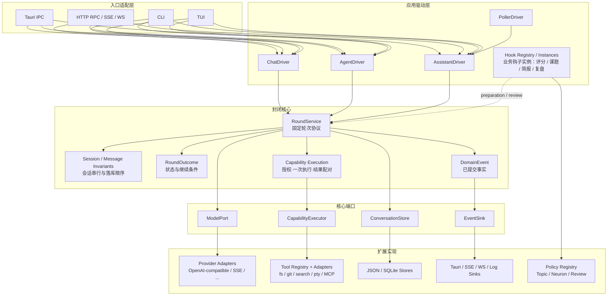

# Pulsar 后端架构设计：固定核心与扩展点

> 状态：**已批准，M1-M6 全部落地（M1-M5：2026-09-09；M6：2026-09-12）**。
> 本版按开放封闭原则重写，重点从”领域地图”调整为”固定核心 + 受控变化方向”。

## 一、设计目标

Pulsar 的后端应满足：增加新的驱动方式、模型供应商、工具、存储后端或传输入口时，固定核心不需要修改；已有会话语义、消息顺序、工具执行语义和对外 wire 契约保持不变。

开放封闭原则在本设计中的具体含义：

- **核心对运行语义封闭**：轮次如何成立、状态如何落库、能力调用如何完成、失败如何返回，由核心固定。
- **核心对变化来源开放**：驱动策略、hook、模型、工具、存储和传输通过契约接入。
- **扩展不能重定义核心事实**：扩展可以提供决策和实现，但不能改变消息真相源、轮次边界、一次性执行和结果语义。

## 二、固定核心

固定核心只包含不会因产品模式或外部技术替换而改变的运行协议。

### 2.1 轮次协议

一次 `Round` 是不可重入的应用操作，生命周期固定为：

```text
获取会话状态
→ 准备本轮输入
→ 生成模型请求
→ 调用模型
→ 执行本轮声明的能力
→ 持久化轮次结果
→ 发布结果事件
→ 返回 RoundOutcome
```

核心只负责一轮。是否开始下一轮由外部 `RoundDriver` 根据 `RoundOutcome` 决定。Chat、Agent、Assistant、Poller 都不能改变一轮内部顺序，也不能直接操作会话存储绕过轮次协议。

### 2.2 会话与消息不变量

会话是持久化状态，不是驱动器或入口的私有状态。核心固定以下不变量：

1. 每个会话有唯一真相源。
2. 消息按顺序追加，历史不会被入口层重排。
3. 进入模型 wire 的内容必须来自已落库历史、本轮输入（含驱动续轮指令）、或明确注册的准备策略。
4. 用户输入与 Nudge 输入在模型调用前落库，模型产物和工具结果在调用后落库；驱动续轮指令（Continue）不落库，仅作用于本轮模型输入，不代表新的用户消息。
5. 同一会话同一时刻只有一个活动轮次。
6. 轮次失败时，已经落库的输入不回滚、不丢失。

存储介质可以从 JSON、SQLite 替换为其他实现，但不能改变这些不变量。

### 2.3 能力执行协议

模型声明的每个能力调用都经过同一条核心协议：

```text
ToolCall
→ 授权判断
→ 执行一次
→ 标准化 ToolResult
→ 应用上下文上限
→ 写入轮次结果
```

核心固定授权时机、一次性执行、调用结果配对、结果截断和失败表达。文件、Git、搜索、PTY、MCP 等都是能力实现，不得在各自实现中重新定义这套生命周期。

### 2.4 结果与事件语义

`RoundOutcome` 是驱动层唯一需要理解的轮次结果（字段定义以 §3.6 为准）：`session_id` 标识轮次所属会话，`response` 携带本轮对外响应，`tool_calls_declared` 表示本轮是否声明了能力调用，`status` 表达轮次终态。核心固定结果字段的含义和状态转换。

事件经同一 `EventSink` 出口分两类：

- **事实事件**：只表达已提交的状态，例如会话受影响、运行会话变化、课题变化或工具状态变化。
- **流式增量（Delta）**：活动轮次进行中的瞬态输出片段（如模型输出增量）。Delta 不是事实、不表达终态；消费方只可用于渲染，不得持久化为会话内容，不得作为业务判断依据；轮次提交后以事实事件为准。

Tauri、SSE、WS、CLI 和 TUI 是事件消费者，不能重新解释业务状态，也不能通过事件回写核心状态。

> **落地记录（2026-09-12）**：Delta 已契约化——载荷为 `StreamDelta { message_index, content, reasoning, done }`（落在 `core/round_contract.rs`），经 `DomainEvent::Delta { conversation_id, delta }` 发布；供应商协议层的同名 SSE 增量已更名 `models::SseDelta` 以消除同名歧义（见 §3.6）。

### 2.5 并发、取消与失败边界

- 会话级串行闸由核心持有。
- 用户轮次可以取消当前后台轮次；取消经核心暴露的 `cancel` 用例到达（见 §3.1），入口不得绕过核心直接终止轮次。
- 后台驱动遇到同会话忙状态时跳过，不创建第二个轮次。
- 网络、模型或工具失败必须转换为明确的领域错误或轮次状态。
- 不持锁跨网络、模型、PTY 或 Git 调用。
- 轮次完成后统一释放会话闸并发布结果事件。

这些规则属于运行语义，不属于某个入口、provider 或具体工具。

## 三、封闭核心契约

本节把固定核心落实为稳定的输入、输出和不变量。扩展实现只能通过这些契约进入核心，不能直接修改核心上下文。

### 3.1 核心唯一入口

```rust
#[async_trait]
pub trait RoundService: Send + Sync {
    async fn run(&self, request: RoundRequest) -> Result<RoundOutcome>;

    /// 流式执行一轮：`on_delta` 每块增量回调；轮次终态与 `run` 一致。
    async fn run_stream(
        &self,
        request: RoundRequest,
        on_delta: Box<dyn FnMut(StreamDelta) + Send>,
    ) -> Result<RoundOutcome>;

    /// 请求取消该会话当前活动轮次；轮次以 Cancelled 状态收敛。
    async fn cancel(&self, session_id: &ConversationId) -> Result<()>;
}

pub struct RoundRequest {
    pub session_id: ConversationId,
    pub input: InputRecord,
    pub mode: RoundMode,
}
```

`RoundService::run` 是执行一轮的唯一入口。Entry Adapter、Driver 和 Hook 不得直接调用 Store、ModelPort 或 ToolExecutor 来拼出自己的轮次。

- `ConversationId` 是核心引入的会话标识新类型（包装现有字符串 id）；落地时 wire 与存储中的字符串表示不变，仅在核心边界内使用新类型。
- `RoundMode` 标识发起轮次的业务模式（Chat / Agent / Assistant / Poller），核心据此采用默认的工具授权与输入处理策略；它不建立继承层次，循环策略仍由 `RoundDriver` 决定。
- 取消通过 `cancel` 进入核心：核心在会话闸内标记取消后，当前轮次不再启动新的外部调用，已进入的外部调用按端口实现的取消语义收敛，轮次以 `Cancelled` 状态返回并照常释放会话闸。
- **模型选型归会话（用户拍板）**：会话有自己的 model（落库 `extra.session.state.model`，应用侧 `set_session_model` 写入）。核心 `load_context` 从会话运行态读取本轮模型；它首先作用于主对话的调用模型，其次作为上下文传入 hook；**每个 hook 有权决定用对话带过来的 model 还是自己约定的 model**。会话未选择模型（`None`）时核心返回领域错误——核心不依赖 providers、未新增模型解析端口。
- **落地记录（2026-09-12）**：`RoundService::run_stream` 已落地（`ConversationRunner` 实现，见 §五 / §九 M6）；`RoundRequest` 已收窄为最终形状 `{ session_id, input, mode }`（原过渡字段 `model` / `tool_override` / `thinking_override` 已删除）；默认工具授权与思考配置由核心按 `RoundMode` / 触发类型推导（见 §3.2 落地记录与 `core/round_policy.rs`）。

### 3.2 核心上下文

```rust
pub struct RoundContext {
    pub session: SessionSnapshot,
    pub messages: Vec<Message>,
    pub input: InputRecord,
    pub selected_model: ModelRef,
    pub authorized_tools: Vec<ToolDescriptor>,
}
```

核心负责创建和推进 `RoundContext`。选型与上下文拼装（对应现有 `round_resolver` 的种子分派与选型决策）是核心内部步骤，产生 `selected_model` 与按 `RoundMode` 确定的默认工具授权策略（如 Agent 模式授权注册表全部工具、助手模式并入 Core 组）。

扩展只能通过明确的准备结果影响上下文：

```rust
pub struct Preparation {
    pub messages_to_append: Vec<Message>,
    pub model_override: Option<ModelRef>,
    pub tool_policy: ToolPolicy,
    pub reload_session: Option<ConversationId>,
}
```

`Preparation` 是对默认决策的受控覆盖：`model_override` 覆盖选型结果，`tool_policy` 只能在核心安全下限（工作区边界、确认闸、超时与输出上限）之内调整授权。禁止扩展直接替换完整消息数组、直接写入 Store、伪造已完成的工具结果或放宽安全下限。

> **落地记录（2026-09-12，形状偏离，如实标注）**：`RoundContext` **未**按本节字面换成 `selected_model: ModelRef` + `authorized_tools: Vec<ToolDescriptor>`——`ctx.model` 仍为完整 `ChatModelSelection`（承载采样 / 思考配置，hook 需要），`ModelRef` / `ToolDescriptor` 类型**未引入**；`Preparation` **未引入**（决策与理由见 §5.2）。已落地的默认决策为：核心 `round_policy::default_tool_override` 按 `RoundMode` 算出授权默认值并写入 `ctx.tool_override`（`Agent` → 目录全量；`Chat` / `Assistant` / `Poller` → `None`，执行面回退选中神经元的 `tool_ids`）；思考默认按**触发类型**取（`User` / `AgentLoop` → 跟随会话 / 模型即 `None`；`ManualStep` / `Poller` → 显式关闭）。模型选型不在此处：由 `load_context` 从会话运行态读取（见 §3.1）。

### 3.3 模型端口

```rust
#[async_trait]
pub trait ModelPort: Send + Sync {
    async fn complete(&self, request: ModelRequest) -> Result<ModelResponse>;
}
```

核心只接受统一的 `ModelResponse`。Provider 可以选择协议、模型和重试方式，但必须将外部响应转换为统一结果；传输重试不得重复提交已经产生业务副作用的能力调用。

### 3.4 能力执行端口

```rust
#[async_trait]
pub trait CapabilityExecutor: Send + Sync {
    async fn execute(
        &self,
        call: AuthorizedToolCall,
    ) -> Result<ToolResult>;
}
```

核心对每个模型声明的 `ToolCall` 生成一个 `AuthorizedToolCall`，最多调用一次 `execute`，并将返回值规范化为 `ToolResult`。失败也必须生成可配对的结果记录，不能静默丢弃。

工具目录以只读端口进入核心（落地记录，2026-09-12）：

```rust
pub trait ToolCatalog: Send + Sync {
    fn tools_with_tag(&self, tag: ToolTag) -> Vec<String>;
    fn list_definitions(&self) -> Vec<ToolDefinition>;
    fn definitions_for(&self, tool_ids: &[String]) -> Vec<ToolDefinition>;
}
```

核心的授权决策与 wire 工具声明只依赖 `ToolCatalog`，不感知注册表实现（由 `impl ToolCatalog for RwLock<ToolRegistry>` 实现）。`CapabilityExecutor` 的真实实现命名 `CapabilityAdapter`（原 `RegistryToolExecutor`，位于 `tools/capability_adapter.rs`）；`RoundExecutor` 授权决策只依赖 `ToolCatalog`。（命名对齐见 §5.4）

### 3.5 持久化端口

```rust
#[async_trait]
pub trait ConversationStore: Send + Sync {
    async fn load(&self, id: &ConversationId) -> Result<SessionSnapshot>;
    async fn append_input(&self, id: &ConversationId, items: &[Message]) -> Result<()>;
    async fn append_outcome(&self, id: &ConversationId, outcome: &PersistedOutcome) -> Result<()>;
}
```

核心规定调用顺序：先 `append_input`，再调用模型和能力，最后 `append_outcome`。`PersistedOutcome` 是 `RoundOutcome` 的落库投影：由核心在持久化阶段把本轮产物消息、会话状态与轮次终态组装而成，Store 不接触驱动层语义。Store 实现可以使用 JSON 或 SQLite，但不能把追加操作改成无序覆盖，也不能在输入落库后悄悄删除输入。

> **落地记录（2026-09-12）**：端口落地为**两组方法并存**——① 核心管线原语（同步）`require_conversation` / `add_message` / `update_message_at` / `save_conversation`（核心轮次管线实际使用；JSON 实现为本地文件 + 可重入锁、无 IO 等待，故同步）；② 本节异步契约面 `load`（返回 `SessionSnapshot`，形状 `{ id, mode, seed, state, messages }`）/ `append_input` / `append_outcome` / `update_text_at` / `save`（供介质替换与契约测试使用）。`PersistedOutcome`（`{ session_id, status, messages }`）与 `SessionSnapshot` 均已落地；JSON 实现更名 `JsonConversationStore`。

### 3.6 结果与事件端口

```rust
pub struct RoundOutcome {
    pub session_id: ConversationId,
    pub response: ChatResponse,
    pub tool_calls_declared: bool,
    pub status: RoundStatus,
}

pub trait EventSink: Send + Sync {
    /// DomainEvent 区分事实（Fact）与流式增量（Delta）两类。
    fn publish(&self, event: DomainEvent);
}
```

`RoundOutcome` 是驱动器判断是否继续的唯一依据。`EventSink` 是事件唯一出口，承载两类事件：事实事件对应已提交状态；Delta 对应活动轮次的瞬态输出片段，只可渲染、不得落库或参与业务判定，轮次提交后以事实事件为准。事件消费者不能通过事件回写核心状态。

> **落地记录（2026-09-12）**：Delta 已契约化并成为 `DomainEvent` 的唯一 Delta 载体：
>
> ```rust
> pub struct StreamDelta {
>     pub message_index: usize,
>     pub content: String,
>     pub reasoning: String,
>     pub done: bool,
> }
>
> pub enum DomainEvent {
>     Fact(StateChange),
>     Delta { conversation_id: String, delta: StreamDelta },
> }
> ```
>
> `StreamDelta` 落在 `core/round_contract.rs`；供应商协议层的 SSE 增量更名 `models::SseDelta` 以消除同名歧义。`done: true` 表示本轮完成，消费方应收敛为全量重拉（Gateway 经 `EventSink` 映射 `StateChange::MessageDelta`）。

### 3.7 核心不变量表

| 契约 | 必须成立的条件 | 违反时 |
|---|---|---|
| 会话串行 | 同一 `session_id` 同时最多一个活动轮次 | 拒绝或跳过新轮次 |
| 输入持久化 | 模型调用前输入已成功追加 | 不调用模型，返回持久化错误 |
| 工具配对 | 每个声明的调用最多一个结果 | 轮次失败并记录错误 |
| 结果提交 | 产物和工具结果按 wire 顺序追加 | 不发布成功事件 |
| 事件事实性 | 事实事件只对应已提交状态；Delta 仅作瞬态渲染 | 禁止把 Delta 当事实发布或落库 |
| 取消语义 | 取消后不再启动新的外部调用 | 返回 Cancelled 状态 |

## 四、新版架构图



图中的边界含义：入口和 Driver 可以增加；端口可以替换实现；Hook/Policy 可以增加；但 `RoundService`、会话不变量、能力执行协议和 `RoundOutcome` 的语义保持封闭。

## 五、受控扩展点

扩展点只对应已经确认的变化方向。每个扩展点由核心定义输入、输出和失败边界。

| 变化方向 | 扩展契约 | 扩展可以做什么 | 扩展不能做什么 |
|---|---|---|---|
| 下一轮由谁发起 | `RoundDriver` | 根据 `RoundOutcome` 决定是否继续、使用何种输入 | 改变单轮顺序、直接写消息 |
| 轮次前后附加业务 | `Hook` / `Policy` | 准备输入、裁决课题、复盘结果 | 绕过持久化、伪造核心结果 |
| 模型与供应商 | `ModelPort` / Provider Adapter | 将统一请求转换为供应商协议，返回统一响应 | 改变消息真相源、执行工具 |
| 工具与真实世界能力 | `Tool` / Capability Adapter | 声明、授权并执行具体能力 | 改变调用配对、绕过授权和结果上限 |
| 持久化介质 | `ConversationStore` 等 Store 接口 | 保存和读取核心状态 | 改变追加顺序和一致性语义 |
| 传输入口 | Entry Adapter | 将 IPC、HTTP、CLI、TUI 映射到应用用例 | 持有业务流程或独立实现一套会话逻辑 |
| 观测出口 | `EventSink` / `LogSink` | 将事实转成 UI、SSE 或日志输出 | 反向驱动领域状态 |

### 5.1 RoundDriver

驱动器只拥有循环策略，不拥有轮次实现：

```rust
#[async_trait]
pub trait RoundDriver: Send + Sync {
    async fn run(&self, first: InputRecord) -> Result<RoundOutcome>;
}
```

四个驱动共享同一个 `RoundService`，不建立继承层次，也不把具体策略写进核心：

- **ChatDriver**：单轮即返回，不续轮。
- **AgentDriver**：`tool_calls_declared` 为真时续轮，续轮输入为核心承认的 `InputRecord::Continue` 固定指令（不落库，仅进入本轮模型输入）；直到本轮不再声明能力调用或达到轮数上限。
- **AssistantDriver**：单轮直通，业务副作用（课题裁决、简报、复盘、计数）全部经由 IP-1 / IP-5 Hook 承载，不自带循环。
- **PollerDriver**：按课题节拍发起 `InputRecord::Nudge` 轮次（Nudge 落库），同会话忙时跳过。

驱动可以构造续轮输入，但只能使用核心承认的输入类别（用户输入、Nudge、Continue 指令），不得直接改写已落库消息。

> **落地记录（2026-09-12）**：四驱动均已实现 `run_stream(first, on_delta)` 变体（入参沿用 M3 记录的完整 `RoundRequest`，非本节字面 `InputRecord`）。Chat / Assistant / Poller 为单轮直通（直接转 `RoundService::run_stream`）；Agent 在多轮循环内**跨轮共享同一 `on_delta`**，20 轮上限、`tool_calls_declared` 收敛判据、`Cancelled` / `Skipped` 不续轮均与阻塞版 `run` 一致。会话层流式路径全部改走驱动 `run_stream`，`run_round_stream` 降为 `RoundService::run_stream` 的私有内部实现（应用层零直调）。

### 5.2 Hook 与 Policy

Hook 是轮次协议中的命名插槽，而不是独立领域。核心只规定插槽位置、上下文、失败策略和是否允许要求重新载入会话；具体的评分、课题匹配、简报和复盘逻辑由注册实例提供。注入点沿用现有 IP-1～IP-5 编号，与轮次协议的对应关系固定为：

> **物理落点（2026-09-12 修订）**：插槽协议（`InjectPointId` / `HookHandler` / `HookDef` / `HookRegistry` / 失败策略）在 `core/hook/defs.rs`；注册表与实例（`HookInstance` / `HookRun` / `ACTIVE_HOOKS` / 各 IP 注册实现）连同其业务上下文 `AssistantHooks` 归应用侧 `application/hook/`。理由：实例的 `HookRun` 签名需要应用侧业务上下文（课题 / 评分 / 裁决），与 Assistant 会话同层才不产生「策略反向依赖应用流程」的环；`policies/` 只保留 Topic / Neuron / Review 策略。
>
> **落地记录（2026-09-12 后续修订，superseded）**：`HookInstance` / `HookRun` / `ACTIVE_HOOKS` / `LEGACY_HOOKS` 已删除——裁决改为**定义（`JudgementSpec` + `run`）/ 注册（`HookRegistry::register`，默认关闭）/ 开启（`set_enabled`，运行时可切）**三阶段；裁决 handler 直接是核心 `HookHandler` 闭包（装配期注册进同一 `HookRegistry`），不再有独立注册表与壳 hook 二次分发。`application/hook/` 现承载裁决定义（`instances/`）、定义元数据（`judgement.rs` 的 `JudgementSpec` / `JUDGEMENT_SPECS`）与账本。见 [2026-09-12 Hook 三阶段分离 spec](./2026-09-12_10-42_hook-definition-registration-enablement.md)。

| 注入点 | 轮次协议位置 | 失败策略（沿用现状） |
|---|---|---|
| IP-1 AfterLoadContext | 获取会话状态之后；支持会话切换 reload | fail：失败阻断本轮 |
| IP-2 AfterPersistInput | 输入落库之后（自动压缩等 wire 准备） | ignore：失败仅记录 |
| IP-3 AfterCallModel | 调用模型之后（预留，暂无注册者） | ignore |
| IP-4 AfterExecuteTools | 执行能力之后（预留，暂无注册者） | ignore |
| IP-5 AfterPersistOutcome | 持久化轮次结果之后（复盘、计数） | ignore；触发方式差异见 Hook 域文档 |

Hook 不得直接调用入口层，不得直接修改未提交的会话数组，不得绕过核心的持久化阶段。

> **落地口径（2026-09-12）**：IP-1 保留 `&mut RoundContext` 直改**业务字段**，`Preparation` **未引入**。依据本节「核心只规定插槽位置 / 上下文 / 失败策略」：IP-1 现有副作用（会话切换 reload、课题 / 计数等业务字段透传）本质是**业务编排而非上下文注入**，用 `&mut RoundContext` 直改更贴合；`Preparation{messages_to_append, model_override, tool_policy, reload_session}` 的受控覆盖语义未另建抽象，模型选型与授权默认已由核心默认策略（`round_policy` + 会话运行态读取）承担，安全下限仍由核心管线强制（见 §3.2 落地记录）。

### 5.3 ModelPort

模型层分为统一领域请求、provider 适配和协议实现三层：

```text
RoundService → ModelPort → ProviderAdapter → ProtocolClient → 外部模型
```

核心只依赖统一请求和响应。OpenAI-compatible、SSE、thinking、response format 等属于适配层能力；流式 delta 以 Delta 类事件经 `EventSink` 输出（见 §2.4、§3.6），不改变轮次提交语义。

### 5.4 Tool 与 Capability Adapter

Tool Registry 负责声明、分组和授权；Capability Adapter 负责执行。`fs`、`git`、`search`、`pty` 和 `mcp` 可以各自演进，但都必须返回统一的 `ToolResult`，并服从工作区边界、确认闸、超时和输出上限。

> **落地记录（2026-09-12）**：工具目录以只读端口 `ToolCatalog`（`tools_with_tag` / `list_definitions` / `definitions_for`，由 `impl ToolCatalog for RwLock<ToolRegistry>` 实现）进入核心，`RoundExecutor` 授权决策只依赖该端口；执行侧真实实现命名 `CapabilityAdapter`（原 `RegistryToolExecutor`，位于 `tools/capability_adapter.rs`），是 `CapabilityExecutor` 端口的唯一实现。（端口形状见 §3.4）

## 六、核心依赖方向

```text
Entry Adapters
       │
       ▼
Application Drivers ──▶ RoundService ──▶ ModelPort
       │                     │             │
       │                     ├─────────────┘
       │                     ├────────────▶ Tool Registry
       │                     ├────────────▶ Conversation Store
       │                     └────────────▶ Event Sink
       │
       └────────────▶ Topic / Neuron / Hook Policies

具体实现：Tauri、axum、JSON、SQLite、reqwest、PTY、Git CLI、MCP
均位于上述契约之外，由组合根装配。
```

依赖规则：

- Entry 只能调用 Application 用例或直通能力服务。
- Application 可以组合核心服务和扩展策略，但不依赖具体传输实现。
- Core 只依赖自己定义的端口和稳定类型。
- Infrastructure 实现端口，不反向拥有应用流程。
- 任何模块不得通过共享可变全局状态绕过端口。

## 七、对外兼容面

本次架构整理不改变以下已有契约：

1. Tauri、RPC、SSE、WS、CLI、TUI 的命令名称和 JSON 字段。
2. `app://state-changed`、日志事件和终端事件的既有语义。
3. `.pulsar/` 下会话、SQLite、工作区、工具配置和搜索索引的布局。
4. 会话消息的顺序、工具调用与结果配对、输入先落库语义。

兼容适配器可以暂时保留旧入口名称，但新实现必须落到同一组 Application 用例和固定核心协议。

## 八、组合根

组合根是唯一组装具体实现的位置，负责：

1. 创建 Store、Provider、Tool Registry、Event Sink 和各项能力适配器。
2. 创建 `RoundService`，注入端口和 Hook/Policy 集合。
3. 创建 Chat、Agent、Assistant、Poller 等 Driver。
4. 启动并监督后台任务，并统一处理取消信号。
5. 向 Tauri、HTTP、CLI、TUI 暴露同一批应用用例。

组合根可以知道所有具体类型；固定核心不能知道具体类型。命令注册可以继续使用显式注册表，是否使用宏属于实现选择，不是架构前提。

## 九、迁移顺序

每个里程碑落地时，按 Reverse Sync 同步更新受影响的域文档；M5 负责总览架构文档与清理。

### M1：固定核心

从现有 `conversation_runner`、`round_types`、`session_coordinator`、`context_safety` 提取 `RoundService`、`RoundOutcome` 和会话不变量，引入 `ConversationId` 新类型（包装现有字符串 id），`round_resolver` 作为核心内部选型步骤归位；全程保持现有 wire 与存储行为。

> **M1 落地记录（2026-09-09，已完成）**：
> - 新增 `core/round_contract.rs`：`ConversationId` / `RoundMode` / `RoundRequest` / `RoundStatus`（Completed / Cancelled / Skipped）/ 契约 `RoundOutcome` / `RoundService`（run + cancel）。
> - `round_types::RoundOutcome` 更名 `RoundProduct`（执行产物），`RoundOutcome` 让位给契约类型；`InputRecord` 迁入契约模块（`conversation_runner::InputRecord` 引用路径经再导出保持不变）。
> - `run_round` 拆出 `run_round_full`：会话忙跳过、用户抢占/停止在契约上分别表达为 `Skipped` / `Cancelled`（此前与空回复不可区分）；`ConversationRunner` 实现 `RoundService`。
> - Gateway 与各入口未动，wire 命令、事件与存储行为不变；契约测试 ×4（Completed、Cancelled 且已落库输入不回滚、Skipped 不落库、ConversationId）。
> - 落地偏差（记录待 M2/M3 收编）：`RoundRequest` 暂含过渡字段 `model` / `tool_override` / `thinking_override`（选型与授权策略仍在应用层）；`RoundMode` 已定义、默认策略接线随 M3 Driver 迁移完成。

### M2：建立扩展契约

把现有 provider、tool registry、store、event emitter 包装为 `ModelPort`、Tool、Store、EventSink；先保留旧实现，不同时进行大规模目录搬迁。

> **M2 落地记录（2026-09-09，已完成）**：
> - `round_contract.rs` 增补端口契约：`ModelPort::complete`（对现有 `ModelCaller` 全体实现方 blanket 适配，`ProviderRegistry` 与测试替身零改动满足）、`CapabilityExecutor::execute`（`AuthorizedToolCall`/`ToolResult` 即 `ToolCall`/`ToolResultItem` 别名）、`ConversationStore`（load / append / update_text_at / save 四原语；输入与产物追加顺序由核心管线规定——对 spec 三方法形状的落地调整）、`EventSink` + `DomainEvent`（Fact / Delta 两类，`StateEventSink` 适配现有 `StateEmitter`）。
> - 能力执行语义收敛单处：`RegistryToolExecutor`（注册表驱动单调用执行，失败转结果文本、未知工具 Err、统一截断）被执行面与端口共用，消除双实现漂移风险。
> - JSON 存储以固有方法直接实现端口（零包装类型）；契约测试 ×5（模型端口 blanket、能力执行三类路径、内存替身顺序/就地更新、JSON 真实实现、事件出口映射）。

### M3：迁移驱动器

把 Chat、Agent、Assistant、Poller 的循环和节拍逻辑移到 `RoundDriver` 实现，确保驱动策略变化不再修改 `RoundService`。

> **M3 落地记录（2026-09-09，已完成）**：
> - 新增 `core/drivers.rs`：`RoundDriver::run(first: RoundRequest)` 四驱动（Chat / Assistant / Poller 单轮直通，Agent `Continue` 续轮循环、上限 20 轮、全工具授权）。
> - Chat / Agent / Assistant 会话层的阻塞路径改为经驱动发起（依赖 `dyn RoundService`）；流式路径保留原 runner 直调（契约流式变体待端口化，收敛判据不变）。
> - Agent 收敛判据从「末条消息为工具结果」（存储反查）切换为契约的 `tool_calls_declared`（非空声明 ⟹ 成对结果，二者等价；`tool_calls_declared` 同步收紧为非空判定）；被取消 / 跳过的轮次不再续轮。
> - 驱动策略测试 ×4 以脚本化 `RoundService` 替身验证（续轮输入构造、取消即停、轮数上限、单轮驱动），不触真实核心。
> - 落地调整：`RoundDriver::run` 入参为完整 `RoundRequest`（spec §5.1 写 `InputRecord`）——模型与授权过渡字段需随首轮请求传递。

### M4：迁移入口与直通能力

让 Tauri、HTTP、CLI、TUI 统一调用 Application 用例；文件、Git、终端等直通操作复用能力适配器，但不经过不适用的模型轮次。

> **M4 落地记录（2026-09-09，已完成）**：Tauri / RPC / TUI 经核验已统一调用 Gateway（应用门面），直通能力（fileops / terminal）不经模型轮次——现状即达标；CLI `chat` 是唯一例外（走 `/echo` 本地存根），已迁移至 `send_model_message` 真实用例（解析默认模型，未配置时报错提示）。

### M5：清理与反向同步

删除绕过核心的旧路径，更新 `docs/pulsar/architecture.md` 及相关域文档，补充核心不变量、契约测试和四门面冒烟验证。

> **M5 落地记录（2026-09-09，已完成）**：
> - 删除 `Gateway::send_message` / `runtime_respond` 绕核存根路径及其专属测试；`clear_conversation` 回归测试改用 `create_new_conversation` 造会话。
> - 反向同步 `docs/pulsar/architecture.md`（核对时间、CLI、模块表、时序图、四域描述）与 `msgs-lifecycle.md` / `session-message-architecture.md`（`RoundProduct` 更名）。
> - 冒烟以全目标编译 + 测试覆盖：`cargo test --all-targets` 455 通过 / 0 失败 / 0 警告，四入口二进制（GUI / pulsar-server / pulsar-cli / pulsar-tui）全部编译通过。

### M6：目录分层 + 契约收窄 + 流式端口化

> **M6 落地记录（2026-09-12，已完成）**：
> - **阶段一·目录分层**：`src-tauri/src/` 拆为 `core/`（封闭核心 + 稳定类型）、`application/`（组合根 + 会话 / 驱动 + hook 业务）、`providers/` / `tools/` / `stores/` / `policies/` / `sinks/` / `infra/`（扩展实现）。依赖规则：`core/` 不引用其它目录，扩展只引用 `core/` 稳定类型，`application/` 组合核心与扩展，入口只引用 `application/`。**已登记的待拆例外**：`core/round_resolver.rs` → `policies::neuron::manager::NeuronManager` 与 → `application::insert_catalog::InsertCatalog`。
> - **阶段二·契约层**：真实更名（删除 type alias）`ModelCallRequest`→`ModelRequest`、`ModelCallResponse`→`ModelResponse`、`ToolCall`→`AuthorizedToolCall`、`ToolResultItem`→`ToolResult`、JSON 存储实现→`JsonConversationStore`、`RegistryToolExecutor`→`CapabilityAdapter`；新增只读端口 `ToolCatalog`；`ConversationStore` 落地为同步核心管线原语（`require_conversation` / `add_message` / `update_message_at` / `save_conversation`）+ 异步契约面（`load`→`SessionSnapshot` / `append_input` / `append_outcome` / `update_text_at` / `save`），新增契约类型 `SessionSnapshot` / `PersistedOutcome`；`RoundRequest` 收窄为 `{ session_id, input, mode }`（删除过渡字段 `model` / `tool_override` / `thinking_override`）；新增 `core/round_policy.rs`：按 `RoundMode` 定授权默认（`Agent`→目录全量；`Chat` / `Assistant` / `Poller`→`None`，执行面回退神经元 `tool_ids`），按**触发**定思考默认（`User` / `AgentLoop`→跟随会话 / 模型即 `None`；`ManualStep` / `Poller`→显式关闭）。模型选型归会话（落库 `extra.session.state.model`，核心 `load_context` 读取，`None` → 领域错误）。
> - **阶段三·流式端口化**：`RoundService::run_stream(request, on_delta)` 与 `RoundDriver` 同名变体落地（四驱动实现，Agent 跨轮共享回调）；`StreamDelta { message_index, content, reasoning, done }` 契约化入 `core/round_contract.rs`，`DomainEvent::Delta { conversation_id, delta }` 为其唯一载体；供应商 SSE 增量更名 `models::SseDelta`；会话层（`chat_session` / `agent_session` / `assistant_session`）流式路径全部改走驱动 `run_stream`，`run_round_stream` 降为 `RoundService::run_stream` 的私有内部实现（应用层零直调）。分支映射与收敛语义不变：会话忙→`Skipped`（不落库不回调）；抢占 / 停止→`Cancelled`（仍「回复多少存储多少」落库 + `done:true` delta）；正常→`Completed`；`StateChange::MessageDelta` 事件序列与 `done:true` 收敛语义保持。
> - **未落地（如实标注）**：`RoundContext` 未按 §3.2 换成 `selected_model: ModelRef` + `authorized_tools: Vec<ToolDescriptor>`——`ctx.model` 仍为完整 `ChatModelSelection`（承载采样 / 思考，hook 需要），`ModelRef` / `ToolDescriptor` 类型未引入；`Preparation` 未引入（决策：IP-1 保留 `&mut RoundContext` 直改业务字段，见 §5.2）。
> - **验证**：`cargo check --all-targets` 0 错 0 警告；`cargo test --all-targets` **455 通过 / 0 失败**；四入口二进制全部编译通过。

## 十、验证标准

- 新增 Driver、Provider、Tool 或 Entry Adapter 时，`RoundService` 无需修改。
- 现有会话消息顺序、工具配对和输入落库测试保持通过。
- 旧 wire 命令、事件和存储布局 diff 为空。
- 每个扩展契约至少有一个真实实现和一个测试替身或契约测试。
- `cargo fmt`、`cargo check`、`cargo test` 通过，四个入口完成最小冒烟。

## Open Questions

- 对外 wire 命令 `send_chat_message`（内部现对应 `Gateway::send_message` / `send_model_message` / `send_model_message_stream` 三条路径）是否在 M2 统一映射为同一组 Application 用例。（已部分解决：M5 删除 `send_message` 存根路径，`send_chat_message` 与内部 `send_model_message_stream` 一一对应）
- `runtime/script_engine` 是否继续作为 Tool Adapter 保留，还是在 M5 清理。（M5 保留：mlua 仍为声明未接入的预留模块）
- 现有 Hook 的失败策略是否全部纳入统一 `HookPolicy`，还是保留 IP-1 的特殊 reload 语义。（保留现状，待后续迭代）
- ~~流式路径端口化：`run_round_stream` 与 Delta 事件的契约变体~~（**已关闭，M6 2026-09-12**）：`RoundService::run_stream` / `RoundDriver::run_stream` 落地，`StreamDelta` 与 `DomainEvent::Delta` 契约化；会话层零直调 `run_round_stream`。见 §九 M6。
- 选型与授权归属（**已裁决，2026-09-12**）：**模型选型归会话**——会话有自己的 model（落库 `extra.session.state.model`，应用侧 `set_session_model` 写入），核心 `load_context` 读取并作为主对话调用模型 + hook 上下文；每个 hook 有权决定用对话带来的 model 还是自约定的 model；`None` → 核心返回领域错误（核心不依赖 providers、无新增模型解析端口）。**工具授权默认**由核心按 `RoundMode` 定（`Agent`→目录全量；`Chat` / `Assistant` / `Poller`→`None`，执行面回退神经元 `tool_ids`）；**思考默认**按**触发**定（`User` / `AgentLoop`→跟随会话 / 模型；`ManualStep` / `Poller`→显式关闭）。
- `RoundContext` 形状与 `Preparation` 待后续迭代：`RoundContext` 未按 §3.2 换成 `selected_model: ModelRef` + `authorized_tools: Vec<ToolDescriptor>`（`ctx.model` 仍为 `ChatModelSelection`），`ModelRef` / `ToolDescriptor` / `Preparation` 未引入；IP-1 保留 `&mut RoundContext`（口径见 §5.2）。

## Checkpoint Summary

- 当前目标：以开放封闭原则重新梳理 Pulsar 后端架构。
- 当前结论：固定核心是轮次协议、会话不变量、能力执行协议、结果/事件语义（事实 + Delta 两类）、并发/失败边界（含取消入口）。
- 扩展方向：Driver、Hook/Policy、Model、Tool、Store、Entry、Event/Log Sink。
- 当前状态：M1-M6 全部落地（M6：目录分层 + 契约收窄 + 流式端口化，2026-09-12）；遗留事项为 rustfmt 风格债，以及 `RoundContext` 形状 / `ModelRef` / `ToolDescriptor` / `Preparation` 待后续迭代（见下）。
- Execution Approval：Approved（2026-09-09 用户批准按 M1→M5 顺序实施；2026-09-12 用户裁决选型与授权归属、IP-1 边界后实施 M6）。

## Change Log

- 2026-09-06：初稿，十域地图版。
- 2026-09-09：第二版，主流程驱动版。
- 2026-09-09：第三版，按开放封闭原则重写为固定核心与扩展点；移除七域地图作为主轴，补充核心不变量、扩展契约、依赖方向、组合根和迁移顺序。
- 2026-09-09：评审修订：事件区分事实与流式增量（Delta）两类并纳入 `EventSink` 契约；`RoundService` 增加 `cancel` 取消入口；明确续轮输入规则（Continue 不落库）与四驱动策略；明确选型/授权归属（核心默认 + Preparation 受控覆盖）；补充 Hook 注入点 IP-1～IP-5 与轮次协议映射；修正对外命令名表述（`send_chat_message`）；`RoundOutcome` 收敛为单处定义；补充 `RoundMode`、`PersistedOutcome`、`ConversationId` 语义。
- 2026-09-09：**M1 落地**：新增 `core/round_contract.rs` 契约模块；执行产物更名 `RoundProduct`；`run_round_full` 拆分暴露轮次终态（Skipped/Cancelled）；`ConversationRunner` 实现 `RoundService`；契约测试 ×4，全量 447 测试通过，wire 与存储行为不变（详见 §9 M1 落地记录）。
- 2026-09-09：**M2-M5 落地（全部里程碑完成）**：M2 扩展端口（`ModelPort` blanket 适配 / `CapabilityExecutor` + `RegistryToolExecutor` 单处实现 / `ConversationStore` 四原语 / `EventSink` Fact-Delta）；M3 四驱动（`drivers.rs`，阻塞路径经 `dyn RoundService`，Agent 收敛切换契约判据）；M4 CLI 迁移真实用例；M5 删除绕核存根 `Gateway::send_message`、反向同步架构与域文档。全量 `cargo test --all-targets` 455 通过 / 0 失败 / 0 警告（详见 §9 各里程碑落地记录）。遗留：流式路径端口化（见 Open Questions）；仓库 rustfmt 风格债（见 Validation）。
- 2026-09-12：**hook 物理分层修订**（§四架构图、§5.2）：插槽协议（`InjectPointId` / `HookHandler` / `HookDef` / `HookRegistry` / 失败策略）留核心 `core/hook/defs.rs`；注册表与实例（`HookInstance` / `HookRun` / `ACTIVE_HOOKS` / IP 注册实现）连同业务上下文 `AssistantHooks` 归应用侧 `application/hook/`（扩展子图与 `policies` 节点同步收敛为 Topic / Neuron / Review）。动机：消除「策略实例反向依赖应用流程」的层间环。落地见《Pulsar 后端架构契约落地计划》。
- 2026-09-12：**M6 落地（结构层 + 契约层 + 流式端口化）**：目录分层 `core/` / `application/` / `providers/` / `tools/` / `stores/` / `policies/` / `sinks/` / `infra/`（core 不引用其它目录、扩展只引用 core 稳定类型、application 组合、入口只引用 application；待拆例外 `round_resolver`→neuron / `insert_catalog`）；契约真实更名（删 alias，`RegistryToolExecutor`→`CapabilityAdapter`、JSON 实现→`JsonConversationStore`），新增 `ToolCatalog` / `SessionSnapshot` / `PersistedOutcome`，`ConversationStore` 落地同步原语 + 异步契约面，`RoundRequest` 收窄为 `{ session_id, input, mode }`，新增 `core/round_policy.rs` 默认策略（授权按 `RoundMode`、思考按触发），模型选型归会话（`extra.session.state.model`）；`RoundService::run_stream` / `RoundDriver::run_stream` 与 `StreamDelta` / `DomainEvent::Delta` 契约化（供应商增量更名 `models::SseDelta`）。**未落地**：`RoundContext` 形状 / `ModelRef` / `ToolDescriptor` / `Preparation`（详见 §九 M6 与 Open Questions）。验证：`cargo check --all-targets` 0 错 0 警告，`cargo test --all-targets` 455 通过 / 0 失败，四入口编译通过。
- 2026-09-12：**Hook 三阶段分离（定义 / 注册 / 开启）**：`HookRegistry::register` 改为默认关闭并新增 `set_enabled` / `is_enabled` / `is_registered`（分发只跑 enabled）；`judgement::HookDef` 更名 `JudgementSpec`（同名冲突消除）+ 定义清单 `JUDGEMENT_SPECS`；裁决 handler 直接注册为核心 `HookHandler` 闭包，**删除** `HookInstance` / `HookRun` / `ACTIVE_HOOKS` / `LEGACY_HOOKS` / `active_hooks_at` 与壳 hook 二次分发；休眠 4 条改「定义·未注册」。§5.2 物理落点随之 superseded（见该节落地记录）。验证：`cargo check --all-targets` 0 错 0 警告，`cargo test --all-targets` 452 通过 / 0 失败。详见 [2026-09-12 三阶段分离 spec](./2026-09-12_10-42_hook-definition-registration-enablement.md)。

## Validation

- 文档检查：已核对现有 conversation、provider、tool、入口和事件边界；评审修订后已复核 §2/§3/§5 契约表述与现状代码（`round_service` / `session_coordinator` / `hook/defs` / `gateway`）一致；M6 后已按目录分层与契约收窄复核 §3/§5/§九 落地记录。
- 代码修改：M1-M6 全部完成。M1-M5：新增 `core/round_contract.rs`（入口契约 + 扩展端口）与 `core/drivers.rs`（四驱动）、删除绕核存根路径。M6：目录分层（`core/` / `application/` / `providers/` / `tools/` / `stores/` / `policies/` / `sinks/` / `infra/`）；契约真实更名与形状对齐（删 alias、新增 `ToolCatalog` / `SessionSnapshot` / `PersistedOutcome`、`ConversationStore` 双组方法）；`RoundRequest` 收窄；新增 `core/round_policy.rs`；`run_stream` 端口化（`RoundService` / `RoundDriver` / `StreamDelta` / `DomainEvent::Delta`）。
- 测试：`cargo check --all-targets` **0 错 0 警告**；`cargo test --all-targets` **455 通过 / 0 失败**；契约测试覆盖每个端口（ModelPort / CapabilityExecutor / ToolCatalog / ConversationStore / EventSink / RoundDriver / RoundService 均有真实实现 + 测试替身或契约测试）；四入口二进制全部编译。验证标准逐条达成：新增扩展不修改 `RoundService`（驱动策略测试以替身验证）、既有会话顺序/工具配对/输入落库回归保持通过、旧 wire 命令与事件语义不变（对外命令与存储布局 diff 为空）。
- 遗留事项：① `RoundContext` 形状 / `ModelRef` / `ToolDescriptor` / `Preparation` 未落地（`ctx.model` 仍为 `ChatModelSelection`、IP-1 保留 `&mut RoundContext`），待后续迭代；② 仓库存在 rustfmt 风格债（`cargo fmt --check` 在干净树上有大量 diff，疑似 rustfmt 风格版本差异），未做全库格式化以保持最小 diff——建议单独提交 `style:` 变更并以 `rustfmt.toml` 固定 style edition。
- 人工确认：重写方向与本次评审修订意见均已获用户确认；2026-09-09 用户批准按方案落地代码（M1 起）并指示不等确认连续执行全部阶段；2026-09-12 用户拍板选型与授权归属（会话模型口径）、IP-1 边界（保留 `&mut RoundContext`、不引入 `Preparation`）。

## Resume / Handoff

- 当前状态：M1-M6 全部落地并验证；架构重构主体完成。
- 后续可选迭代：① `RoundContext` 形状对齐 §3.2（`selected_model: ModelRef` + `authorized_tools: Vec<ToolDescriptor>`，引入 `ModelRef` / `ToolDescriptor`）与 `Preparation`（若确认需要）——当前以 `ctx.model: ChatModelSelection` + IP-1 `&mut RoundContext` 落地；② 独立 `style:` 提交解决 rustfmt 风格债。
